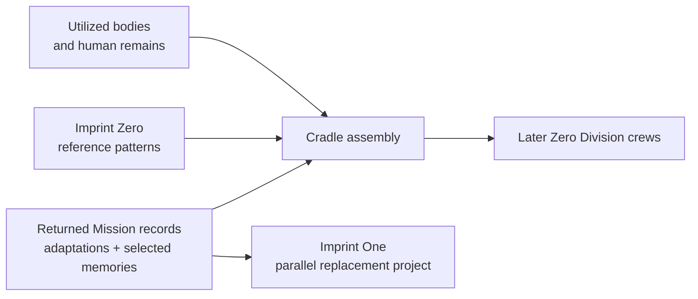

## Purpose

> **TODO — Biome population:** Define spatial layout, production stages, hazards, enemies, visual assets, evidence props, and environmental progression in a later population pass.

Reveal the industrial system that assembles later Zero Division crews from recovered biological material, Imprint Zero references, and accumulated Mission records.

## Dominant question

> If bodies and memories are reused, what—if anything—continues from one person to the next?

## Production model

The Cradle repairs viable organs and tissue, grows missing material, and uses the remainder as nutrients and biological feedstock. The process cannot identify which physical or mnemonic pieces persist into a particular Character.

## Missions

| Mission | Biome function |
|---|---|
| [[Missions/M08|M08 — Umbilical]] | Show biological recycling, crew assembly, and production volume beyond one city's apparent needs. |
| [[Missions/M09|M09 — Imprint Zero]] | Confront the four reference bodies and Imprint One, then destroy the immediate production cycle. |

## Evidence boundary

B08 proves that the production system and reference bodies exist. It does not reveal what **Imprint Zero** means, establish the templates' ultimate provenance, confirm OPERATOR's control, or expose the wider contractor market reserved for Act IV.
