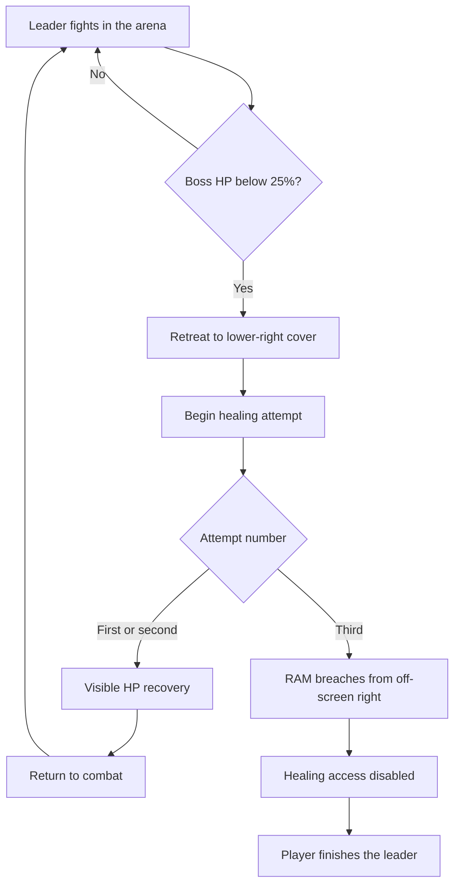

## Encounter role

> **Accepted — M03 direction:** The resident gang leader is the final Boss of [[Missions/M03|M03's occupied command center]]. The fight establishes repeated retreat-and-heal behaviour before RAM intervenes. This is not the earlier obsolete Zero Division unit.

“Tollkeeper” is a provisional label, not an approved personal or faction name. The leader has no authored campaign agency beyond this encounter; no separate NPC page is needed.

## Healing and RAM intervention

> **TODO — Exact cycle:** Confirm heal amount/rate/cap, retreat protection, interruptibility, attempt counting, and early defeat handling. The user-established threshold and third-attempt entrance below are accepted; the detailed interpretation remains a proposal until reviewed.

> **Accepted — Core beat:** When Boss HP drops **below 25%**, the leader retreats under cover and recovers HP. The healing spot is in the **bottom-right corner** of the room. RAM enters from the other side, **off-screen right**, on the leader's **third healing attempt**.

The threshold concerns the **Boss's** HP/Integrity, not the player's. Exactly 25% does not satisfy “below.”

The schema shows the **recommended normal sequence**, not a complete implementation state machine. Counter semantics and exceptional paths are unresolved; an interrupted first/second heal must not silently count as a completed heal.

| Detail | Recommended interpretation, not yet approved |
|---|---|
| First two retreats | Each produces a visible HP increase and returns the leader to combat. Recover above the retreat threshold so the next drop can trigger a distinct attempt; do not silently refill to full HP. |
| Counter increment | On entry into the healing action at the corner, not per frame below threshold or while approaching cover. |
| RAM timing | Third healing action begins, then RAM's breach interrupts it. Do not wait for a third completed refill or a fourth retreat. |
| Corner protection | Physical cover blocks ordinary frontal attacks while healing; no global scripted invulnerability. Exact flank access and interruption rules need review. |
| Breach result | Destroy cover/healing access; stop further recovery for this deployment. RAM does not automatically kill the leader. |
| Final phase | Selected Character keeps control and defeats the leader with their own baseline kit. No RAM-specific player input, Overdrive, or free switching. |
| Retry | Reset HP, attempt count, corner cover, and RAM event together. RAM entrance triggers once per deployment. |

### Early defeat and interrupted healing

> **TODO — Mandatory introduction guarantee:** The crew progression requires RAM to appear, but a vulnerable leader could be killed before a third attempt, and healing could be repeatedly interrupted. Choose a complete rule before implementation; do not add an invisible HP floor, resurrection, or unannounced invulnerability.

| Option | Consequence |
|---|---|
| **A · Readable protected retreat transitions** | Author telegraphed retreat protection and reachable damage windows that reliably preserve the first two observed recoveries. Must resolve burst damage crossing the threshold and lethal damage in one hit; physical cover alone does not guarantee this. |
| **B · Early-kill fallback entrance** | Preserve normal RAM timing on ordinary runs; if the leader dies early, RAM breaches during the aftermath. Avoids damage immunity, but changes the requested “RAM enters during the fight” beat and requires approval. |

No option is selected by this draft. The first/second recovery visibility and the third-attempt event must be tested with both ROOK and VECTOR, including burst damage and stun.

## Baseline combat

> **TODO — Attack specification:** Choose attacks, ranges, facing, telegraphs, recovery, contact/collision rules, stagger response, and damage under [[Gameplay/Gameplay Math|shared math]]. Do not infer accepted attacks from the provisional gang Enemy roster.

Proposed role: a tough, self-preserving gang leader who uses the room and private supplies to outlast the attacker. Fight pressure must remain legible during each retreat; no adds are currently proposed. Both Characters need ordinary evasion and reachable damage opportunities without their optional-route moves.

## Narrative and outcome

| Responsibility | Owner / boundary |
|---|---|
| Gang racket, seized controls, civilians and Mission return | [[Missions/M03|M03]] |
| During-fight speech | This page; exact wording deferred to gettext approval |
| Local outcome | Leader defeated; no further healing. Mission then releases the gang's traffic and electricity holds. |
| Evidence | The leader's occupation does not establish crew origin, OPERATOR's authority over the network, or hidden Ashfall Spire control functions. |
| Rewards | No Boss loot authored. RAM's availability and starter gear are crew progression, not a drop. |

## Visual and audio handoff

> **TODO — Boss presentation:** Review the leader's personal silhouette, retreat telegraph, healing device/action, HP-recovery feedback, and cover destruction against the arena blockout. The provisional composition lives on M03; no separate likeness is approved yet.

Make the HP increase visible and connect it spatially to the healing action. Healing must not read as a bug, regeneration everywhere in the room, or a phase health-bar replacement. RAM's entry needs an audible breach from the right and a readable heavy silhouette without spoiling his approach before the third attempt.
