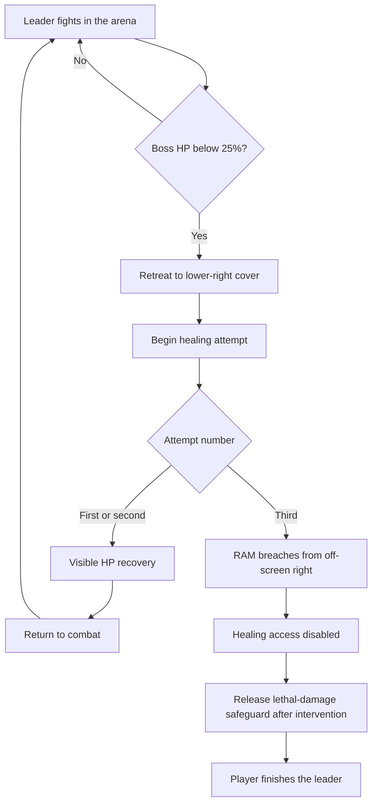

## Encounter role

> **Accepted — M03 direction:** The resident gang leader is the final Boss of [[Missions/M03|M03's occupied command center]]. The fight establishes repeated retreat-and-heal behaviour before RAM intervenes. This is not the earlier obsolete Zero Division unit.

**Tollkeepers** is the accepted faction name; the leader's personal name remains unresolved. The leader has no authored campaign agency beyond this encounter; no separate NPC page is needed.

## Healing and RAM intervention

> **TODO — Exact cycle:** Confirm heal amount/rate/cap, retreat speed, cover protection, interruptibility, and attempt counting. Early defeat prevention is settled below; remaining cycle details are proposals until reviewed.

> **Accepted — Core beat:** When Boss HP drops **below 25%**, the leader retreats under cover and recovers HP. The healing spot is in the **bottom-right corner** of the room. RAM enters from the other side, **off-screen right**, on the leader's **third healing attempt**.

The threshold concerns the **Boss's** HP/Integrity, not the player's. Exactly 25% does not satisfy “below.”

The schema shows the **recommended normal sequence**, not a complete implementation state machine. Counter semantics and exceptional paths are unresolved; an interrupted first/second heal must not silently count as a completed heal.

| Detail | Recommended interpretation, not yet approved |
|---|---|
| First two retreats | Each produces a visible HP increase and returns the leader to combat. Recover above the retreat threshold so the next drop can trigger a distinct attempt; do not silently refill to full HP. |
| Counter increment | On entry into the healing action at the corner, not per frame below threshold or while approaching cover. |
| RAM timing | Third healing action begins, then RAM's breach interrupts it. Do not wait for a third completed refill or a fourth retreat. |
| Corner protection | Physical cover blocks ordinary frontal attacks while healing. Retreat remains damageable; the accepted lethal-damage safeguard below is not general damage immunity. Exact flank access and interruption rules need review. |
| Breach result | Destroy cover/healing access; stop further recovery for this deployment. RAM does not automatically kill the leader. |
| Final phase | Selected Character keeps control and defeats the leader with their own baseline kit. No RAM-specific player input, Overdrive, or free switching. |
| Retry | Reset HP, attempt count, corner cover, and RAM event together. RAM entrance triggers once per deployment. |

### Lethal-damage safeguard

> **Accepted — Mandatory introduction guarantee:** A skilled player cannot kill the leader before the authored healing sequence and RAM intervention. The leader continues taking damage, including during retreat, but lethal damage is clamped at **1 HP** until RAM's intervention completes. This hidden last-HP safeguard preserves the illusion that the fleeing leader can be finished; it is not an invulnerable retreat phase.

| State / edge case | Required result |
|---|---|
| Before RAM's completed intervention | Hits still reduce HP down to the floor and produce normal hit feedback. No death, defeat reward, or Mission-completion event may fire. |
| Burst hit crosses the retreat threshold and would kill | Apply the floor before defeat evaluation, then start the low-HP retreat. A single lethal hit cannot bypass the healing sequence. |
| Leader reaches healing cover | Perform the authored recovery/attempt sequence; merely reaching cover does not remove the safeguard or permit skipping later attempts. |
| RAM completes the third-attempt intervention | Remove the floor when the healing-access break is committed. The player may now kill the leader normally; no automatic kill or unapproved HP refill. |
| Retry | Restore the floor with the rest of the Boss state; never carry the released safeguard into a new deployment. |

The floor is a safety net, **not an intended visible plateau**. Normal encounter tuning—including skilled play—should get the leader behind cover before it is reached. Do not signal an immunity phase, display a scripted protection icon, or fake further HP loss after reaching the actual floor. If the player can repeatedly attack an apparently dying leader stuck at 1 HP, the retreat staging has failed the intended illusion.

#### Retreat and interruption validation

> **TODO — Guarantee the route, not just survival:** Validate retreat speed/distance, damage exposure, stun/knockback, collision, corner blocking, and interrupted healing. The floor prevents death but does not itself guarantee reaching cover or completing two visible recoveries. Resolve those transitions without inventing global stun immunity or letting repeated interruption stall RAM's entrance indefinitely.

Test both ROOK and VECTOR with burst damage, repeated hits, and interruption near the threshold and during retreat. Stress tests must prove the safeguard catches lethal overshoot; ordinary and skilled-player tests should show that the floor is not exposed. Preserve the first two observed recoveries and the third-attempt RAM entrance; there is no early-kill aftermath fallback.

## Baseline combat

> **TODO — Attack specification:** Choose attacks, ranges, facing, telegraphs, recovery, contact/collision rules, stagger response, and damage under [[Gameplay/Gameplay Math|shared math]]. Do not infer accepted attacks from the provisional gang Enemy roster.

Proposed role: a tough, self-preserving gang leader who uses the room and private supplies to outlast the attacker. Fight pressure must remain legible during each retreat; no adds are currently proposed. Both Characters need ordinary evasion and reachable damage opportunities without Character-specific traversal requirements.

## Narrative and outcome

| Responsibility | Owner / boundary |
|---|---|
| Gang racket, seized controls, civilians and Mission return | [[Missions/M03|M03]] |
| During-fight speech | This page; exact wording deferred to gettext approval |
| Local outcome | Leader defeated; no further healing. Mission then releases the gang's traffic and electricity holds. |
| Evidence | The leader's occupation does not establish crew origin, OPERATOR's authority over the network, or hidden Ashfall Spire control functions. |
| Rewards | No Boss loot authored. RAM's availability and starter gear are crew progression, not a drop. |

## Visual and audio handoff

> **TODO — Boss presentation:** Review the leader's personal silhouette, retreat telegraph, healing device/action, HP-recovery feedback, and cover destruction against the arena blockout. The provisional composition lives on M03; no separate likeness is approved yet.

Make the HP increase visible and connect it spatially to the healing action. Healing must not read as a bug, regeneration everywhere in the room, or a phase health-bar replacement. RAM's entry needs an audible breach from the right and a readable heavy silhouette without spoiling his approach before the third attempt.
