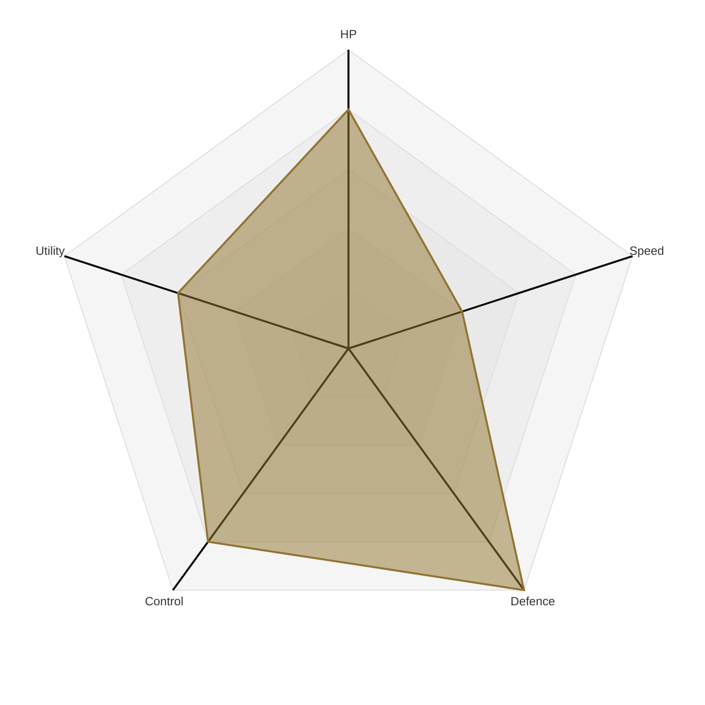

| | |
| -------------------------------------- | ---------------------------- |
|HP       |  ■ ■ ■ ■ □|
|SPEED    |  ■ ■ □ □ □|
|DEFENCE  |  ■ ■ ■ ■ ■|
|CONTROL  |  ■ ■ ■ ■ □|
|UTILITY  |  ■ ■ ■ □ □|

