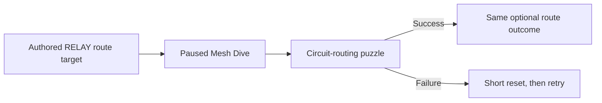

## Specializations

| ID | Display name | Machine relationship | Combat identity |
|---|---|---|---|
| `C41` | Wire RELAY | Integrate | Combine machine-derived weapons, movement, and systems with RELAY's biomechanical body. |
| `C42` | Network RELAY | Preserve | Command several small machines or one large machine within a fixed capacity. |
| `C43` | Null RELAY | Consume | Apply reusable fire-and-forget hacks that force machines to act, fail, or destroy themselves. |

## Appearance

This image is a body-design target rather than a canonical character sheet or final implementation. Both arms and both legs are fully biomechanical prostheses; the head and torso retain visible biological tissue, while cranial and spinal/back interfaces support hacking and machine integration. The campaign does not establish whether RELAY lost natural limbs, surrendered them, or was created without them. Ignore the image's text, logos, exact clothing, markings, cables, weapons, and proportions unless accepted separately on this page.

## Crew role and voice

> **Accepted** — RELAY is the crew's technical researcher and primary decoder of machine-held evidence, not its unquestioned leader or an authoritative narrator of hidden campaign truth.

| Concern | Direction |
|---|---|
| Technical role | Enter and research the Mesh across machines, terminals, security, cybernetics, institutional records, and virtual environments. |
| Narrative role | Extract and correlate evidence, identify relationships, and propose technical explanations. |
| Epistemic limit | Familiarity may suggest prior involvement but cannot prove RELAY designed a system or interpreted it correctly. |
| Crew role | Supply technical judgment while other Characters retain tactical, social, and moral authority. |
| Voice | Fast, precise, impatient with unaided biological communication, and visibly excited by unusual systems. |
| Double meaning | Phrase intense technical excitement with occasional sexual ambiguity without explaining which reading is correct or reducing every interaction to the same joke. |

The identity question is whether RELAY is uncovering institutional systems or recognizing work she once helped create.

### Mesh embodiment and intimacy

> **Accepted** — RELAY experiences technical, virtual, and physical intimacy as comparable full-sensory processes.

Her biomechanical body continuously integrates its sensors with her nervous system. A **Mesh Dive** extends that sensorium into an external machine, Controlled Unit, neural interface, or virtual environment. Direct Control, deep research, Discovery Hacks, and resistant-target minigames require a Mesh Dive; quick Null commands do not require sustained immersion.

External systems may produce pleasure, overload, discomfort, or aversion. Authored Mesh Dives therefore use one of four connection responses:

| Response | Presentation range |
|---|---|
| Pleasurable | Soft gasp, laugh, breath change, or restrained groan |
| Overwhelming | Broken speech, delayed response, or stronger involuntary reaction |
| Aversive | Hiss, recoil, disgust, or strained groan |
| Neutral or familiar | Short breath or no vocalization |

Strong responses belong to important connections rather than routine terminal use. Connection audiovisuals must remain distinct from damage feedback, and repeated interactions use restrained variants. Presentation remains suggestive rather than explicit; familiar crew interruptions treat the behaviour as known rather than shocking.

## Stat Tiers

> **Accepted** — RELAY is the crew's most fragile Character in every Specialization; survival comes from machine interactions rather than stronger base damage capacity or passive mitigation.

| Stat | C41 Wire | C42 Network | C43 Null |
|---|:---:|:---:|:---:|
| Integrity | 1 | 1 | 1 |
| Defense | 1 | 1 | 1 |
| Mobility | 3 | 2 | 4 |

See [[Characters/Overview#specialization-stat-matrix|Playable Crew]] for the canonical comparison and [[Gameplay/Gameplay Math|Gameplay Math]] for tier conversion.

## Moves and animations

> **TODO — RELAY animation coverage:** Define exact IDs, transitions, module attachment, Mesh Dive, Direct Control, Chassis entry/ejection, and Hack Program activation after profile prototypes establish scale and timing.

`●` means required and `—` intentionally unavailable. Profile pages own additional unit, module, and Chassis movement.

| Move / animation family | C41 | C42 | C43 |
|---|:---:|:---:|:---:|
| Idle, run, jump, fall, land | ● | ● | ● |
| Aim / Interface Projector fire | ● | ● | ● |
| Interact / Hack / Mesh Dive | ● | ● | ● |
| Hurt / defeat | ● | ● | ● |
| Overdrive | ● | ● | ● |
| Field Integration | ● | — | — |
| Chassis entry / ejection | ● | — | — |
| Command | — | ● | — |
| Direct Control transition | — | ● | — |
| Hack Program activation | — | — | ● |
| Innate slide, wall move, or dash | — | — | — |

## Shared movement

> **Accepted** — RELAY has ordinary run and jump but no additional Character-wide movement verb; **Hack** remains her sole signature route capability.

Wire Mobility integrations, Chassis Integrations, and Network Controlled Units may own profile-specific movement without creating new RELAY-only route gates. Null's Mobility Tier `4` represents faster ordinary positioning rather than an innate dash.

## Shared Hack

> **Accepted** — Wire, Network, and Null use Hack to open the same authored optional routes through equivalent interactions and outcomes.

Specialization differences apply to combat targets, not route eligibility. Safe route hacks use a fixed authored move budget rather than combat Access; failure resets after a short delay and never removes the route permanently. No route requires a particular Machine Profile, and required critical-path machinery remains usable by every valid Character configuration.

## Shared fallback

> **Accepted** — RELAY's biomechanical body contains a fixed **Interface Projector** rather than a crew-stash weapon.

The projector fires low-damage pulses through the shared eight-direction aiming lattice and helps build [[Gameplay/Mechanics#relay-compatible-encounters|Access]] on valid System Targets. Every RELAY Specialization sees coarse Access and its activation threshold; [[Machine Profiles/WI003|Sensor Array]] adds exact values, move count, decay timing, compatibility, resistance, weak points, and Blackout-chain prediction. Network retains it while issuing commands; Null uses it when no Hack Program has a valid target. Wire's Weapon integration replaces its primary-fire behaviour, while a Chassis supplies its own attack set.

## Machine arsenal ownership

> **Accepted** — Machine Profiles and all their outputs are RELAY-owned progression rather than crew-stash Equipment.

[[Machine Profiles/Overview|Machine Profiles]] owns stable IDs, acquisition, extraction, profile mappings, and cross-profile comparison. RELAY owns how each Specialization uses those outputs.

| Catalogue | ID | RELAY use |
|---|---|---|
| Machine Profile / Controlled Unit | `MP###` | Network roster entry |
| Wire Integration | `WI###` | Weapon, Mobility, Systems, or full Chassis configuration |
| Null Hack Program | `NH###` | Reusable compatibility-tagged destructive skill |

No entry receives an `EQ###` ID or transfers to another Character. The expected catalogue relationship is **Controlled Units > Wire Integrations > Hack Programs** because multiple machine archetypes may share modules and still more may share programs.

RELAY joins after [[Missions/M04|Production Halt]] with three Helix profiles: [[Machine Profiles/MP001|Fabricator]], [[Machine Profiles/MP002|Line Runner]], and [[Machine Profiles/MP003|Process Warden]]. Together they supply Wire's starting three-slot configuration, Network's eventual initial five-point roster, and Null's first two distinct programs.

## Skill structure

> **Accepted** — Every RELAY Specialization owns exactly three skills: shared Hack, one identity mechanic, and one unique Overdrive.

| Skill slot | C41 Wire | C42 Network | C43 Null |
|---|---|---|---|
| Signature verb | Hack | Hack | Hack |
| Identity mechanic | Field Integration | Direct Control | Destructive Hacks |
| Overdrive | Total Integration | Distributed Mind | Blackout |

The Interface Projector and Machine Profile selections remain loadout behaviour rather than additional skills.

## C41 — Wire

> **Accepted** — Wire is the middle ground: RELAY incorporates machine hardware into her own body rather than commanding or consuming the source machine.

### Integration slots

| Slot | Typical expression |
|---|---|
| Weapon | Arm weapon, melee limb, mounted gun, or tool |
| Mobility | Legs, propulsion, climbing system, charge, or recoil movement |
| Systems | Head, sensor, armour, backpack, shield, or utility hardware |

Modules from different profiles may be combined. Ordinary modules are not separately destructible; normal damage affects RELAY's Integrity, although an explicit Systems module may provide active shielding, blocking, or avoidance.

### Field Integration

Wire begins with her Hub-selected modules. Hacking an exposed or disabled compatible machine may replace the corresponding slot for the current Mission. The removed module remains owned but unavailable until the next deployment. A newly discovered module must remain installed through successful extraction to unlock its Machine Profile; replacing or abandoning it forfeits that discovery.

### Chassis Integration

A Chassis occupies all three slots and encloses RELAY in one cohesive machine body. It owns a separate external durability pool. At zero durability, the Chassis is destroyed for the remainder of the Mission and RELAY receives only a short transition-safe ejection into her pre-Chassis configuration. Owned Chassis return next deployment; a newly discovered Chassis must reach extraction intact.

### Overdrive — Total Integration

> **Accepted** — Wire's three installed modules expand into one standardized temporary combat frame without becoming a profile-specific Chassis.

The frame preserves all three module functions, reduces interference between their action recoveries, and adds separate external durability. Expiry or destruction restores the same three-module configuration. Duration, durability, transition rules, and recovery reductions require prototypes.

## C42 — Network

> **Accepted** — Network preserves machines as Controlled Units and fights primarily through their positioning, intrinsic behaviours, and direct operation.

### Capacity and commands

Network has provisional Command Capacity `5`:

$$
\sum \text{Command Cost of active units} \le 5
$$

Individual costs range from `1–5`, supporting several minimal units, mixed rosters, or one cost-`5` machine. The starter roster costs `1 + 2 + 2` and exactly fills capacity.

| Order | Universal meaning |
|---|---|
| Follow | Regroup around RELAY and use the unit's intrinsic combat behaviour. |
| Focus | Attack or interact with the marked target. |
| Hold | Defend the current position until recalled. |

A profile owns how its unit performs each order. Controlled Units may attack, use profile-compatible Encounter machinery, or operate ordinary physical mechanisms, but cannot perform Hack, open RELAY-gated routes, collect inaccessible permanent rewards, or substitute for another Character's route verb. RELAY's body must reach and hack her authored route interfaces.

Orders and Direct Control operate inside a finite Command Range intended to cover one normal Encounter rather than an entire Mission. Units stop or return at the boundary; Direct Control warns before the link breaks.

### Direct Control

The player may operate one Controlled Unit directly while RELAY remains stationary, vulnerable, and without autonomous movement. Other units continue their configured AI behaviour. Damage to RELAY ends Direct Control, and RELAY's defeat still fails the Mission.

### Unit loss and Salvage

A destroyed unit frees its Command Cost and remains unavailable until rebuilt at an authored restoration station. Every open-campaign Mission provides at least one, ordinarily near its midpoint or before its final Encounter; optional routes may add earlier or additional stations. A station may rebuild deployed-roster units while Salvage remains but cannot restore temporary local units that were never deployed. Restoration Stations cannot repair Wire Integrations or Chassis and cannot affect Null cooldowns. Network begins each Mission with zero Salvage, gains it from authored piles or dismantled eligible machines, and loses it on extraction or death. A local machine may be preserved as a Controlled Unit or dismantled for Salvage; endlessly respawning enemies cannot become a salvage farm.

A disabled hostile machine or newly controlled local unit may instead be dismantled for Salvage. Dismantling frees its Command Cost but forfeits physical extraction and any new Machine Profile unlock. Deployed or restored roster units never produce Salvage, and temporary or respawning machines may be explicitly non-salvageable.

A newly taken unit must survive successful extraction to unlock its Machine Profile. Owned profiles never suffer permanent unit loss.

### Overdrive — Distributed Mind

> **Accepted** — Distributed Mind coordinates the selected roster across the current Encounter without suspending Command Capacity or restoring destroyed units.

Command Range expands to the Encounter boundary; orders propagate instantly; units execute intrinsic behaviours concurrently; and Direct Control may jump directly between units. RELAY remains stationary and vulnerable while operating another body. Duration and command cadence require prototypes.

## C43 — Null

> **Accepted** — Null uses compatibility-tagged fire-and-forget programs to consume machine function without gaining a Controlled Unit or Integrated Module.

### Program loadout

Null selects exactly three learned Hack Programs at the Hub, one per activation slot. Each slot has an independent cooldown, so activating one does not lock the other two. One System Target may carry only one active Destructive Hack, and a consumed target cannot be hacked again. Applying a program irreversibly consumes the target's useful function through a forced action, corruption, shutdown, or explosion.

| Starting program | Function |
|---|---|
| [[Machine Profiles/NH001|`NH001` — Overload]] | Force a powered machine beyond safe output, then burn it out and create a local explosion. |
| [[Machine Profiles/NH002|`NH002` — Runaway Directive]] | Force a mobile machine forward until collision, shutdown, or explosion. |
| [[Machine Profiles/NH003|`NH003` — Cascade Virus]] | Apply machine damage-over-time that spreads once through valid contact or transmission. |

The first two programs come from RELAY's Helix profiles. [[Imprints/Relay Null|Null's Specialization Imprint]] teaches Cascade Virus so all three slots can be filled when Null unlocks.

Multiple profiles may teach the same program. Extracting a Network unit or Wire integration teaches any associated unknown program at the Hub. Null may instead complete a Discovery Hack to learn that program immediately and permanently without extraction or a random unlock roll. Success executes the newly learned program once against the discovery target. The paused interface then offers one immediate choice: replace one of the three equipped slots with the new program or keep the current loadout. A replaced program remains permanently owned but cannot be re-equipped until the Hub. If the new program is equipped, its slot begins ready; the automatic discovery-target execution does not start that slot's cooldown. This explicit discovery prompt is the only ordinary mid-Mission Null loadout change and may place a newly learned program immediately before an authored Boss use.

A known program against a standard compatible target requires only target selection and activation. Resistant targets retain an authored Access window and paused minigame. Programs consume targets rather than disappearing from the persistent arsenal.

### Overdrive — Blackout

> **Accepted** — Blackout turns individual Destructive Hacks into controlled cascade failures without granting control or bypassing protected targets.

Activation resets all three equipped program cooldowns. Each successful Destructive Hack chains once into a nearby compatible standard System Target, which executes the same effect. Resistant targets retain their hack windows and minigames, Boss protections remain unchanged, and required route infrastructure cannot be destroyed. Duration, chain range, and cooldown behaviour require prototypes.

## Combat hacking

> **TODO — Hacking prototype:** Validate board readability, move budgets, Access buildup, pause transitions, discovery signaling, failure recovery, and repeated-use pacing before accepting exact values.

Every paused hacking interaction uses one circuit-routing grammar. Difficulty varies through board size, source and destination count, locked or corrupted nodes, move limits, optional discovery nodes, and authored Boss layouts. The board never changes randomly while the player decides.

| Combat interaction | Requirement |
|---|---|
| Known Null program against a standard compatible target | Target and activate immediately |
| Null against a resistant or exceptional target | Reach minimum Access, choose a move budget, then complete the paused minigame |
| Discovery Hack | Reach minimum Access, choose a move budget, then complete the paused minigame |
| Network takeover | Disable the target or reach minimum Access, then complete the paused minigame |
| Wire integration | Disable the target or reach minimum Access, then complete the paused minigame |

At minimum Access, the player may begin immediately with one valid optimal solution or keep building toward maximum Access for mistake tolerance, alternate board routes, or optional discovery nodes. Access begins decaying after a short interruption without valid buildup. Starting a combat minigame consumes the accumulated value; failure closes the interface and leaves the target with no Access. [[Gameplay/Mechanics#relay-compatible-encounters|Mechanics]] owns the move-conversion formula, delayed-decay rule, and cross-Encounter System Target coverage.

Bosses do not follow whole-target acquisition or consumption. RELAY hacks authored components, weapons, adds, or temporary behaviour windows. Null cannot instantly shut down a Boss, Network cannot permanently control one, and Wire cannot enter its complete Chassis during the Encounter. A machine Boss may award a curated profile after defeat.

## Neural access boundary

> **Accepted** — RELAY can invasively access machine-readable neural-implant data but cannot download complete consciousness, unrecorded thoughts, or objectively truthful memory.

Reachable data may include credentials, communications, device logs, and cached sensory records. A resisting person must be restrained or expose a hack window, and forced access is presented as coercive interrogation rather than neutral research. Retrieved records may remain incomplete, altered, or misinterpreted.

The [[NPCs/Old Man|Old Man]] destroyed his communication interface. [[Missions/HS01#relay-deployment-variation|HS01]] owns RELAY's refusal to address him and the other crew members' ordinary questioning.

## Recruitment and Overdrive reveal

RELAY sealed herself inside Helix Foundry while following a clue toward Overdrive and trusted the crew to recover her. RAM reaches her during [[Missions/M04|Production Halt]], after which her Coffin fills the fourth Hub station and Wire becomes selectable.

RELAY then leads [[Missions/M05|The Four Trials]]. The player deploys primarily as RELAY, chooses the crew activation rooms in any order, and temporarily controls each Character through an unlimited-Overdrive trial.

## Representative Encounter

| Specialization | Freight Terminal replay |
|---|---|
| Wire | Use Arc Cutter to expose a machine, Runner Legs to cross firing lanes, and Sensor Array to read hack compatibility. |
| Network | Split Fabricator, Line Runner, and Process Warden through Follow, Focus, and Hold while deciding when Direct Control justifies leaving RELAY stationary. |
| Null | Use Overload, Runaway Directive, and Cascade Virus to turn sentries, security equipment, and crane machinery into disposable attacks. |

The critical route remains completable through shared movement and fallback combat. Hack opens only authored RELAY optional routes.

## Presentation requirements

> **TODO — RELAY presentation:** Replace Specialization portrait and sprite placeholders after profile scale, modular attachment, unit ownership language, Mesh Dive posture, and Chassis silhouette are validated.

- Preserve one readable biological core across every configuration.
- Make Weapon, Mobility, and Systems attachment points legible without tiny gadget detail.
- Distinguish allied Controlled Units from hostile machines through strong ownership feedback.
- Show RELAY stationary and vulnerable during Direct Control.
- Separate connection pleasure, overload, aversion, ordinary exertion, and damage feedback.
- Keep Wire integration, Network distribution, and Null consumption readable from silhouette and effects.
