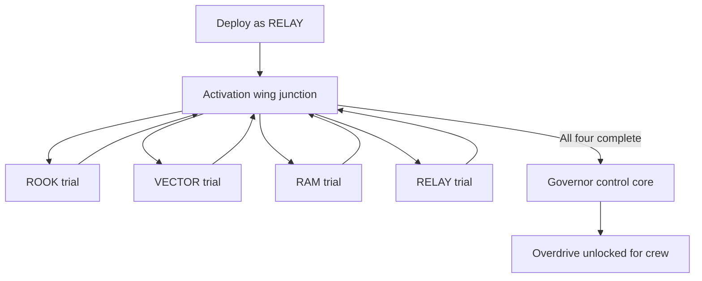

## Briefing

> **Accepted** — Return to the deeper [[World/Automated Fabrication Plant|Automated Fabrication Plant]] with [[Characters/Relay|RELAY]], enter its activation wing, and remove the limits suppressing the crew's Overdrive capability.

“Governor” refers both to a performance limiter and to institutional control. The crew initially understands the system as suppressed operational capability; its relationship to identity conditioning remains part of the larger mystery.

## Special deployment rule

> **Accepted** — The Mission deploys primarily as RELAY. Inside each activation room, RELAY becomes immobile while operating the system and control temporarily transfers to the relevant crew member.

These scripted handoffs are an explicit exception to ordinary one-Character deployment. They do not unlock free switching or companion AI.

## Mission structure

The activation wing branches from a central route. The player may choose the four trial rooms in any order.

## Trial contract

Each room:

1. presents a problem readable through that Character's default Specialization;
2. transfers control from RELAY to that Character;
3. grants unlimited Overdrive for the duration of the trial;
4. teaches movement, combat position, target priority, and risk changes;
5. ends only after the player demonstrates the transformed identity;
6. returns control to RELAY at the junction.

Candidate room languages:

- **ROOK:** hold a defensive lane while adapting between incoming threat types.
- **VECTOR:** cross a precision platforming and security sequence to reach an isolated control point.
- **RAM:** ram incoming containers, break walls, and redirect large projectiles.
- **RELAY:** complete the final network or machinery-control relationship without another crew member operating the system.

> **Open question** — Exact default Overdrive tutorial goals, checkpoint behavior, trial failure handling, and whether partial room completion persists after leaving the Mission.

## Local benefit

- Gives all four crew members access to their default Specialization's Overdrive.
- Opens the Plant's activation wing and associated infrastructure.
- Establishes that the crew can access capabilities OPERATOR did not initially disclose.

## Concealed purpose

Activating Overdrive empowers the crew while reconnecting a deeper control system. OPERATOR's command structure may gain access to fabrication, conditioning, or identity infrastructure at the same time.

The Mission should make empowerment and danger inseparable rather than presenting the unlock as a neutral upgrade terminal.

## Deployment and outcomes

- **Origin:** [[World/Hub|Hub]]
- **Target Zone:** [[World/Automated Fabrication Plant|Automated Fabrication Plant]]
- **Primary Character:** RELAY
- **Scripted Characters:** ROOK, VECTOR, RAM, and RELAY
- **Required Specialization:** each Character's default Specialization during its trial
- **Trial Overdrive:** unlimited
- **Success:** unlock [[Gameplay/Overdrive|Overdrive]] globally for every currently acquired Specialization
- **Later Specializations:** include their unique Overdrive by default
- **Failure or withdrawal:** return behavior and partial trial persistence remain unresolved

> **Needs evidence** — Prototype one trial and one control handoff before building the complete four-room Mission.
