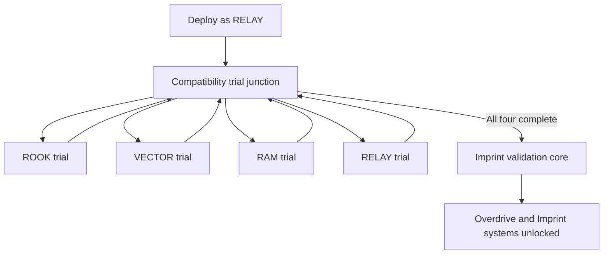

## Purpose

Complete four compatibility trials, assemble the full crew, and unlock Imprints as the campaign’s central progression system.

## Mission structure

RELAY enters the recovered Helix system and may approach the four crew-specific trials in any order. Control transfers are scripted within each trial.

