```mermaid
graph TD
    %% =====================================================
    %% ACT 1 — LINEAR INTRODUCTION
    %% =====================================================

    START([New Game])

    subgraph B01["B01 — Ashfall District"]
      M01["M01<br/>Cold Deployment"]
      HUB0.1["HUB0<br/>Meet VECTOR"]
      M02["M02<br/>Containment Doctrine"]
      HUB0.2["HUB0"]
      M03["M03<br/>No Survivors Logged"]
    end
    HUB0.3["HUB0<br/>Meet RAM"]
    subgraph B02["B02 — Helix Foundry"]
      M04["M04<br/>Production Halt"]
      HUB0.4["HUB0"]
      M05["M05<br/>The Four Trials"]
    end
    HUB1["HUB1<br/>Campaign Hub<br/>Choose Biome"]

    START --> M01
    M01 --> HUB0.1
    HUB0.1 --> M02
    M02 --> HUB0.2
    HUB0.2 --> M03
    M03 --> HUB0.3
    HUB0.3 --> M04
    M04 --> HUB0.4
    HUB0.4 --> M05
    M05 --> HUB1

    %% =====================================================
    %% ACT 2 — OPEN BIOME CAMPAIGN
    %% =====================================================

    subgraph B03["B03 — Mnemonic Basilica"]
        MA01["MA01<br/>Ghost Archive"]
        MA02["MA02<br/>Familiar Strangers"]
        MA03["MA03<br/>The Choir of Selves"]

        MA01 --> MA02
        MA02 --> MA03
    end

    subgraph B04["B04 — The Fallen Halo"]
        MB01["MB01<br/>Vertical Front"]
        MB02["MB02<br/>Dead Reinforcements"]
        MB03["MB03<br/>Halo Protocol"]

        MB01 --> MB02
        MB02 --> MB03
    end

    subgraph B05["B05 — Verdant Null"]
        MC01["MC01<br/>Burn the Garden"]
        MC02["MC02<br/>Voices Under Glass"]
        MC03["MC03<br/>Heartroot"]

        MC01 --> MC02
        MC02 --> MC03
    end

    subgraph B06["B06 — Sovereign Stack"]
        MD01["MD01<br/>Hostile Acquisition"]
        MD02["MD02<br/>Executive Immunity"]
        MD03["MD03<br/>Patent of Life"]

        MD01 --> MD02
        MD02 --> MD03
    end


    %% =====================================================
    %% FIRST HUB CONNECTIONS
    %% =====================================================

    HUB1 --> MA01
    HUB1 --> MB01
    HUB1 --> MC01
    HUB1 --> MD01


    %% =====================================================
    %% BIOME COMPLETION CHECK
    %% =====================================================

    MA03 --> CHECK
    MB03 --> CHECK
    MC03 --> CHECK
    MD03 --> CHECK

    CHECK{"All Biome Guardians defeated?"}

    CHECK -->|No| HUB1
    CHECK -->|Yes| HUB2


    %% =====================================================
    %% OPTIONAL SPECIAL-MISSION PATHS
    %% =====================================================

    MB02 -.->|Trace an earlier deployment signal| MS01
    subgraph B04
      MS01["MS01<br/>Black-Box Recovery"]
    end
    MS01 -.->|Cradle security codes recovered| MB03

    MC02 -.->|Follow the source-memory voices| MS02
    subgraph B05
      MS02["MS02<br/>Beneath the Skin"]
    end
    MS02 -.->|Return with forbidden knowledge| MC03

    MD02 -.->|Intercept the escaping architect| MS03
    subgraph B06
      MS03["MS03<br/>Golden Parachute"]
    end
    MS03 -.->|OPERATOR's altered directive exposed| MD03


    %% =====================================================
    %% OPTIONAL EARLY SECRET ENDING
    %% =====================================================

    CHECK_SE01{"Enter the Living Archive?"}
    MS02 -.->|Living passage revealed| CHECK_SE01
    CHECK_SE01 -.->|Enter| SE01
    CHECK_SE01 -.->|Turn back| MC03
    SECRET_ENDING([Secret Ending<br/>Communion])

    subgraph B99["B99 — The Living Archive"]
      SE01["SE01<br/>Become Many"]
    end
      SE01 -->|Join the Continuum| SECRET_ENDING



    %% =====================================================
    %% ACT 3 — SECOND HUB
    %% =====================================================

    HUB2["HUB2<br/>Guardian Nexus<br/>Final Assault Hub"]
    subgraph B07["B07 — The Empty Barracks"]
      M06["M06<br/>Welcome Home"]
      M07["M07<br/>Recall Exercise"]
    end
    subgraph B08["B08 — The Cradle"]
      M08["M08<br/>Umbilical"]
      M09["M09<br/>Imprint Zero"]
    end
    STANDARD_ENDING([Standard Ending<br/>Cycle Broken])

    HUB2 --> M06
    M06 --> M07
    M07 --> M08
    M08 --> M09
    M09 --> STANDARD_ENDING


    %% =====================================================
    %% SECRET ENDGAME ROUTE
    %% Branches from M07 and leads to a separate ending
    %% =====================================================
    HS01["HS01<br/>The Last Civilian"]
    SECRET_SPLIT{"Choose an investigation"}

    M07 -.->|Use recovered Cradle security codes| HS01

    subgraph B09["B09 — Republic of Dust"]
      HS01 -->|Two evidence trails uncovered| SECRET_SPLIT
    end




    %% =====================================================
    %% SECRET BRANCH A
    %% =====================================================

    SECRET_SPLIT -->|Trace the source memories| HA01

    subgraph B10["B10 — Genesis Vault"]
      HA01["HA01<br/>Donor Class"]
      HA02["HA02<br/>Composite Trials"]
      HA03["HA03<br/>The First Zero"]
    end

    HA01 --> HA02
    HA02 --> HA03
    HA03 -->|Take control of the crew's Imprints| SECRET_JOIN


    %% =====================================================
    %% SECRET BRANCH B
    %% =====================================================

    SECRET_SPLIT -->|Pursue OPERATOR's command network| HB01

    subgraph B09
      HB01["HB01<br/>Martial Law"]
    end
    subgraph B11["B11 — Cathedral of Command"]
      HB02["HB02<br/>Chain of Command"]
      HB03["HB03<br/>Perfect Soldier"]
      HB04["HB04<br/>Final Directive"]
    end

    HB01 -->|Follow the military network| HB02
    HB02 --> HB03
    HB03 --> HB04
    HB04 -->|Seize OPERATOR's infrastructure| SECRET_JOIN


    %% =====================================================
    %% SECRET BRANCHES REJOIN
    %% =====================================================

    subgraph B12["B12 — White Horizon"]
      SECRET_JOIN["HS02<br/>Outside Context"]
      SECRET_BOSS["HS03<br/>No Original"]
    end
    TRUE_ENDING([True Ending<br/>Imprint Zero])

    SECRET_JOIN -->|Reach the planetary archive| SECRET_BOSS


    SECRET_BOSS -->|Reject OPERATOR's definition of personhood| TRUE_ENDING



    %% =====================================================
    %% VISUAL STYLES
    %% =====================================================

    classDef intro fill:#dbeafe,stroke:#2563eb,color:#1e3a8a,stroke-width:2px;

    classDef hub fill:#fef3c7,stroke:#d97706,color:#92400e,stroke-width:3px;

    classDef biome fill:#dcfce7,stroke:#16a34a,color:#14532d,stroke-width:2px;

    classDef boss fill:#fee2e2,stroke:#dc2626,color:#7f1d1d,stroke-width:3px;

    classDef secret fill:#f3e8ff,stroke:#9333ea,color:#581c87,stroke-width:2px;

    classDef final fill:#ffe4e6,stroke:#be123c,color:#881337,stroke-width:3px;

    classDef choice fill:#ffedd5,stroke:#ea580c,color:#7c2d12,stroke-width:3px;

    classDef ending fill:#e0e7ff,stroke:#4338ca,color:#312e81,stroke-width:3px;

    classDef secretEnding fill:#fae8ff,stroke:#c026d3,color:#701a75,stroke-width:3px;


    %% =====================================================
    %% CLASS ASSIGNMENTS
    %% =====================================================

    class M01,M02,M03,M04,M05 intro;

    class HUB1,HUB0.1,HUB0.2,HUB0.3,HUB0.4,HUB2,CHECK,CHECK_SE01 hub;

    class MA01,MA02,MB01,MB02,MC01,MC02,MD01,MD02 biome;

    class MA03,MB03,MC03,MD03,M09,SECRET_BOSS boss;

    class MS01,MS02,MS03,SE01,HS01,HA01,HA02,HA03,HB01,HB02,HB03,HB04,SECRET_JOIN secret;

    class M06,M07,M08 final;

    class SECRET_SPLIT choice;

    class START,STANDARD_ENDING,TRUE_ENDING ending;

    class SECRET_ENDING secretEnding;
```

# OLD STUFF

This graph represents campaign progression, not physical geography.

## Early campaign graph

```mermaid
flowchart LR
    Start([New game]) --> Preset[Preselected ROOK + Baseline Rifle]

    subgraph Freight[Freight Terminal]
        M01[01 · Cold Deployment]
    end

    subgraph Flood[Flood-Control Works]
        M02[02 · Containment Doctrine]
        M03[03 · No Survivors Logged]
        Boss2[Second boss stabilization]
    end

    subgraph Factory[Automated Fabrication Plant]
        M04[04 · Production Halt]
        M05[05 · The Four Trials]
    end

    Preset --> M01
    M01 -->|First success| Hub1[Hub · VECTOR available]
    Hub1 -->|ROOK or VECTOR| M02
    M02 -->|First boss defeated| Hub2[Hub]
    Hub2 -->|ROOK or VECTOR| M03
    M03 --> Boss2
    Boss2 -->|RAM intervenes; player wins| Hub3[Hub · RAM available]
    Hub3 -->|RAM / Breacher required| M04
    M04 -->|RELAY extracted| Hub4[Hub · RELAY available]
    Hub4 -->|Deploy as RELAY| M05
    M05 -->|Four trials complete| Hub5[Hub · Overdrive available]
    Hub5 --> Future[Future campaign Mission]

    M01 -->|Introduction failure| M01
    M02 -. Failure or withdrawal .-> Hub1
    M03 -. Failure or withdrawal .-> Hub2
    M04 -. Failure or withdrawal .-> Hub3
    M05 -. Failure or withdrawal .-> Hub4
```

## Opening path

1. Start a new game with no Hub or loadout menu.
2. Deploy immediately as [[Characters/Rook|ROOK]] with the [[Equipment/Baseline Rifle|Baseline Rifle]].
3. Complete [[Missions/M01|Cold Deployment]] in the [[World/Freight Terminal|Freight Terminal]].
4. Restart inside the introduction on failure; the Hub is not available yet.
5. Reach the [[World/Hub|Hub]] after first success.
6. Unlock [[Characters/Vector|VECTOR]] as the second selectable Character.

## Flood-Control Works path

1. Select ROOK or VECTOR, one unlocked Specialization, and compatible equipment at the Hub.
2. Complete [[Missions/M02|Containment Doctrine]] and defeat the first boss.
3. Return to the Hub with the deeper [[World/Flood Control Works|Flood-Control Works]] Mission available.
4. Complete [[Missions/M03|No Survivors Logged]] as ROOK or VECTOR.
5. Reach the second boss's repair/stabilization state.
6. RAM breaks the stabilizer; the player completes the boss victory.
7. Return to the Hub with [[Characters/Ram|RAM]] available.

## Automated Fabrication Plant path

1. Receive RAM's report that RELAY is sealed inside a hostile factory bunker.
2. Deploy as RAM's default Breacher Specialization for [[Missions/M04|Production Halt]].
3. Enter the [[World/Automated Fabrication Plant|Automated Fabrication Plant]], open the bunker, and extract [[Characters/Relay|RELAY]].
4. Return to the Hub with RELAY available.
5. Deploy primarily as RELAY for [[Missions/M05|The Four Trials]].
6. Complete the four character-specific trial rooms in any order.
7. Unlock [[Gameplay/Overdrive|Overdrive]] globally and return to the Hub.

## Standard deployment and return

Ordinary Missions use the standard Hub loop:

1. Select an available Character, unlocked Specialization, compatible loadout, and Mission.
2. Deploy into its Zone.
3. Complete Encounters, routes, discoveries, and the objective.
4. Return to the Hub after success, death, or voluntary withdrawal.

Production Halt and The Four Trials are explicit Special Mission exceptions with advertised Character and Specialization requirements.

## Accepted persistence

- World discoveries, shortcuts, restored machinery, and unlocked routes belong to the shared campaign.
- Equipment and ordinary inventory belong to the shared crew stash.
- Item upgrades remain attached to the item.
- Innate abilities and character mastery remain character-owned.
- Changing Character does not create another world state.
- Character unlocks persist: ROOK → VECTOR → RAM → RELAY.
- Completing The Four Trials unlocks Overdrive for every acquired Specialization; later Specializations include their unique Overdrive.

## Unknown progression

> **Open question** — Which Mission and destination follow The Four Trials.

> **Open question** — Whether later Zones are selected directly from the Hub, connected physically, or use a limited hybrid.

> **Open question** — Exact death-cycle resource loss, Mission checkpoint behavior, and partial persistence inside Special Missions.
