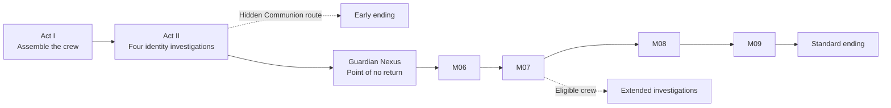
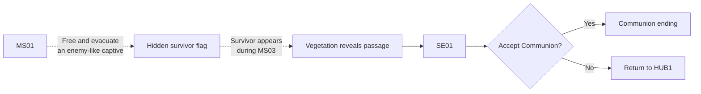

## Purpose

Use this page as the baseline while reviewing and cleaning the wiki. When another page conflicts with this summary or the accepted campaign graph, treat that page as potentially outdated and revalidate it before carrying information forward.

## Governance

> **Accepted** — This page is the approval-locked source of current narrative truth and intentional ambiguity. Unresolved claims must remain explicit TODOs rather than being treated as truth. Update this page only after the user explicitly confirms a narrative decision.

The [[Content Style Guide|content style guide]] governs how that truth is presented. This page remains revisable as decisions are confirmed; `accepted` means authoritative, not immutable.

## Source priority

1. This current-direction summary records the latest narrative intent.
2. [[Missions/Overview|Campaign progression]] records the current campaign structure.
3. [[Biomes/Overview|Biomes]] records the dominant mystery question for each campaign area.
4. Existing design, biome, and Mission prose may contain older or speculative material.

## Core premise

**Imprint Zero** follows a crew of soldiers whose bodies, memories, and identities may have been copied, reconstructed, manufactured, or otherwise altered. The crew operates under the accepted working name **Zero Division** and is deployed by [[NPCs/Operator|OPERATOR]] into a collapsing industrial world.

Every Imprint pairs lore or a memory scene with progression by unlocking a Specialization, equipment access, Overdrive, or hidden campaign evidence. The crew's exact origin and OPERATOR's identity, embodiment, authority, and relationship to the crew remain uncertain.

## Act I direction

Act I assembles the crew and establishes operational trust in OPERATOR through legitimate Missions with genuine immediate benefits. Later evidence may show that recovered infrastructure, material, access, or authority produced unexpected consequences or was repurposed toward identity control. Those consequences do not retroactively make the original benefits false.

## Act II direction

Act II opens four peer branches that provide competing evidence about memory construction, prior deployments, collective identity, and institutional ownership. None gives an objective account of the crew's origin.

| Rule | Current truth |
|---|---|
| Special Missions | Four spatial transitions appear to be optional shortcuts into another biome's M02; bypassed M01 Missions remain replayable. |
| Discovery | Each Special Mission requires a different unmarked action in its source Mission. |
| Extraction | The Coffin offers authored outgoing destinations with the current configuration or a return to HUB1. |
| Hub presentation | Discovered Special Missions persist for the campaign and appear only as indented, specially coloured optional paths to named biomes. |
| Concealment | Interfaces hide the downstream Mission, rewards, four-part set, and Communion relevance. |

The Communion route depends on a hidden relationship between MS01 and MS03:

Background survivors establish the MS01 evacuation but do not satisfy the condition. No objective, checklist, or unlock message exposes the foreground captive requirement. The flag can be earned on replay, persists for the campaign if the MS03 passage is ignored, and resets in a new campaign. Entering SE01 does not end the campaign automatically; refusing Communion returns the player to HUB1 with the flag preserved.

## Standard Act III route

### Guardian Nexus

HUB2 is a captured transfer nexus unlocked by defeating all four Act II Guardians and used as the crew's independent Act III staging Hub. The crew understands that launching M06 permanently closes Act II but believes OPERATOR's recall still leads to routine debriefing. “Final assault” describes HUB2's campaign function, not the crew's knowledge.

Act III deaths return to HUB2. Successful M06–M08 deployments may follow authored direct routes or return there.

### Mission responsibilities

| Mission | Narrative responsibility |
|---|---|
| **M06 — Welcome Home** | OPERATOR welcomes the crew and disappears. Familiar but unoccupied barracks reveal themselves as resettable sets; the Cradle Security System classifies the crew as a returned batch, locks the exits, and routes “debriefing” into memory extraction and utilization. |
| **M07 — Recall Exercise** | Survive utilization, find evidence of earlier failed resistance, and become the first recorded intact crew to pass through B07. |
| **M08 — Umbilical** | Enter the Cradle, witness biological recycling and crew production, and infer an operation larger than one city. |
| **M09 — Imprint Zero** | Fight the four reference templates, defeat Imprint One, overload the production core, escape, and reach the Standard ending. |

### The false home

The Empty Barracks physically exists but has no resident personnel. Its barracks, training rooms, honours, and personal objects match the crew's memories while functioning as resettable conditioning sets. Debriefing and medical routes lead toward memory extraction and biological utilization.

The match cannot prove whether the current crew once trained there or received memories composed from the facility. Every available return record ends in utilization, and earlier resistance fails inside B07. No preserved record shows another complete crew reaching B08, so the Cradle treats this crew's independent, intact arrival as an unhandled condition. Missing or erased records prevent an absolute claim that no one succeeded before them.

### Cradle production model

| Input | Production function |
|---|---|
| Utilized bodies and other human remains | Provide reusable organs, tissue, nutrients, and biological feedstock. |
| **Imprint Zero** | Supplies four altered anatomical and mnemonic reference patterns. |
| Returned Mission records | Add behavioural updates, combat adaptations, and selected memories from previous crews. |

The Cradle repairs viable parts, grows missing tissue, and assembles complete bodies around the reference patterns. The process cannot reveal which physical or mnemonic pieces persist into a particular person. Continuation, copying, composition, and new personhood remain competing interpretations.

Production and deployment volume visibly exceed one city's needs. The Standard route implies a larger operation without confirming that the city is a testing ground or that Zero Division crews are contractor assets supplied to external authorities. Those facts are reserved for partial Act IV revelation.

### OPERATOR boundary

| Moment | Presentation |
|---|---|
| M06 entry | OPERATOR says only **“Welcome home”** and becomes unreachable. |
| B07–B08 | A distinct Cradle Security System uses different language, voice, and interfaces. |
| Imprint Zero activation | OPERATOR's familiar voice returns through a privileged channel, authenticates, issues a compact termination order, and disappears. |
| Imprint One activation | The same voice and authorization code force emergency activation without addressing the listening crew. |

Both M09 commands use **BASTION–AZIMUTH–BREACH–ECHO**, whose four code words covertly correspond to ROOK, VECTOR, RAM, and RELAY. OPERATOR classifies the crew as **malfunctioning assets** and gives no sign that it knows they can hear.

The commands prove only that OPERATOR-associated credentials can authorize the Cradle. They cannot prove whether OPERATOR authored or relayed the orders, is a Cradle subsystem, had its voice or credentials reused, or deliberately controls the facility.

### M09 encounters

The selected Character and Specialization remain active for the entire Mission. Every Character and Specialization must be able to defeat the complete encounter; the other crew members support through staging and communications rather than becoming player-controlled.

| Encounter | Current truth |
|---|---|
| **Imprint Zero** | Four altered reference bodies awaken sequentially. Each uses recognizable capabilities associated with one crew identity and may expose one ability the player has not unlocked. |
| **Imprint One** | A long-running prototype intended to replace a four-Character crew with one deployable body. The Cradle has repeatedly updated it with returned operational records, including the current crew's latest capabilities. |

Imprint One cannot maintain one coherent identity across all four personality patterns, memories, skills, and abilities. M09 forces its premature activation under a termination directive. Personality and combat shifts appear as malfunctions rather than communicating people; mismatches between active identity and capability create attack openings and increasing unpredictability.

The prototype exhibits no stable self, reflective agency, or capacity to stop, although the game cannot objectively disprove inner experience. The crew kills it as an uncontrolled threat. Successful continued development could have made it more capable than any individual crew member.

### Standard ending

After defeating Imprint One, the crew deliberately overloads the Cradle:

Destroying the Cradle stops the immediate production cycle and resolves the Standard campaign without proving where the crew's identity began, what **Imprint Zero** truly means, or why the wider cycle was created.

## Extended route and replay

Before leaving HUB1, a thorough player can recover all twelve Specializations and the four hidden Act II biome Memory Imprints. Entering HUB2 closes B03–B06 for that campaign. Meeting both requirements beforehand allows M07 to expose a secret route through two investigations: one into biological and mnemonic origins, and one into OPERATOR's command system and purpose.

After defeating the Instructor, an eligibility-gated voice-authentication interface can use the four crew voices. All twelve Specializations complete the four voice profiles and enable the interface; each Act II Biome Memory Imprint identifies one crew voice with its alternate code word and contributes that word's relative position. Together they teach **BASTION–AZIMUTH–BREACH–ECHO** without requiring a prior completion. A later completion report may provide an additional hint but is not required.

Eligible players may reorder and replay the four voices before submission. A wrong sequence produces an authentication rejection but does not commit the campaign; the player may retry or deliberately take the underground route. Correct authentication reveals an exterior route while leaving the underground route available. Entering either physical exit is the irreversible commitment. Ineligible players cannot interact with the authentication system and proceed underground normally.

The interaction is a mnemonic voiceprint sequence rather than a conventional password screen. The terminal presents four waveform slots; selecting a crew member records their mapped word—ROOK speaks **Bastion**, VECTOR **Azimuth**, RAM **Breach**, and RELAY **Echo**—and the player arranges the recordings. All three Specializations complete each Character's mnemonic and behavioural signature, while the four Biome Memory Imprints provide the mapping and order clues. Correct submission activates machinery beyond the foreground; the camera shifts forward and reveals an exterior pressure door that previously appeared to be part of the wall.

The concealed door is a legacy emergency egress reserved for the four Imprint Zero reference profiles. **BASTION–AZIMUTH–BREACH–ECHO** identifies those roles and is the same authorization identity OPERATOR uses for Imprint Zero and Imprint One activation. A normal returned crew has incomplete profiles; all twelve Specializations reconstruct enough of the four signatures for the current crew to impersonate the references collectively. The Biome Memory Imprints preserve leaked fragments of earlier facility access and reveal the challenge order. The Barracks authenticates complete descendants without proving they are the original identities.

Before eligibility, the terminal is inert background machinery without an interaction prompt. After the Instructor falls, an eligible crew causes four dormant waveform channels to illuminate; each Character hears a faint version of their own voice speaking the mapped word, and the Biome Memory Imprints briefly resonate in the evidence interface without displaying a counter or unlock message. Approaching the active terminal reveals the interaction prompt. Ineligible players see only the normal underground route and receive no indication that content was missed.

> **TODO — Exterior route:** Define the destination and immediate consequence of entering the revealed Empty Barracks exterior door. The accepted authentication, retry, and physical commitment rules remain stable while the downstream split is unresolved.

Biome Memory Imprints appear to be optional lore and are not tracked as a set during play. A non-true completion report first reveals the four-Imprint and twelve-Specialization totals without announcing the extended route. One unusually thorough campaign can reach it; cross-run progression is not required.

New campaigns reset gameplay progression and route eligibility while preserving viewed evidence and completion reports in a global archive. Archived evidence never satisfies in-campaign eligibility. Additional completions expose different Character perspectives, but no route provides a complete objective account of the crew's origin.

## Truth boundaries

> **TODO — Deferred naming:** **Zero Division** remains the accepted working name during this cleanup. Revisit the organization name separately and update dependent pages only after a replacement is approved.

| Subject | Current position |
|---|---|
| Crew organization | **Zero Division** is the accepted working name for this cleanup; renaming is deferred. |
| OPERATOR | Its identity and relationship to the command system remain uncertain. |
| Crew origin | Permanently ambiguous; multiple completions reveal partial and potentially conflicting evidence. |
| Personhood | An artificial, copied, composite, or reconstructed origin does not invalidate personhood. |
| Imprints | Pair lore or a memory scene with a Specialization, equipment access, Overdrive, or hidden campaign evidence. |
| Imprint Zero | Four altered Cradle reference templates; the designation's meaning and whether they are originals, copies, donors, or composites remain unresolved through the Standard ending. |
| Imprint One | An identity-unstable prototype intended to replace a four-Character crew; premature activation exposes failed integration, a termination directive, and no demonstrable reflective agency. |
| Standard campaign | Ends after the crew defeats Imprint Zero and Imprint One, destroys the Cradle, and stops the immediate production cycle. |
| Communion route | Hidden early ending reached through the Continuum. |
| Extended route | Two investigations converge on a final sequence without completely resolving the crew's origin. |
