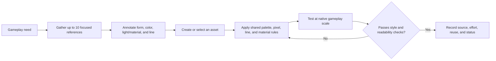

## Visual thesis

> **In progress** — The game should look like the player's **memory** of a great 16-bit action game, not a literal hardware reproduction. Nostalgic visual language establishes familiarity; modern composition, animation, effects, and usability make the experience feel fresh.

A screenshot should immediately communicate:

- a 16-bit lineage;
- a distinct and readable player character;
- an energetic action journey;
- an original world rather than imitation of a specific game.

## Four-axis style contract

Visual style is treated as a production contract: a small set of decisions and restrictions that any asset can be checked against. The representative encounter must resolve the open cells before this contract becomes final.

| Axis | Current direction | Test in the freight-terminal slice | Status |
|---|---|---|---|
| Form | Clear character and threat silhouettes against rectilinear, layered industrial spaces | Identify the player, each threat type, and the crane from silhouettes at gameplay scale | In progress |
| Color | Restrained charcoal, faded olive, aged ivory, and dull rust; sparse indicator colors carry gameplay meaning | Produce a palette sheet and verify player, threats, projectiles, hazards, and affordances remain distinct | Needs evidence |
| Light and material | Weak fluorescent light, haze, concrete, worn analog machinery, matte military hardware, and deep shadow | Check that atmosphere never hides a damaging object, route, or interaction | Needs evidence |
| Line and pixel treatment | Modern 16-bit-era pixel language; one consistent treatment must unify source assets and new work | Compare native-scale captures for mixed pixel density, edge treatment, and outline inconsistency | Unresolved |

## Provisional rules

These rules are deliberately testable. They become accepted only after a human-made gameplay mock-up proves them at the target resolution.

1. **Silhouette test:** the player, each enemy class, and each major hazard must be identifiable from a one-color silhouette at gameplay scale.
2. **Action-layer test:** the player, damaging objects, projectiles, and interactable affordances must remain distinguishable with the background desaturated.
3. **Palette test:** production assets use the approved palette and semantic indicator colors; palette additions require an explicit gameplay or biome purpose.
4. **Pixel-consistency test:** assets shown together use the approved pixel grid, pixel density, edge treatment, and outline rule; arbitrary scaling and mixed-resolution pixel work fail review.
5. **Material test:** machinery and architecture read as worn, functional, late-20th-century industrial hardware rather than pristine consumer technology.
6. **Motion test:** movement, hit response, particles, and camera feedback reinforce an action or state without obscuring the next threat.

### Hard restrictions

- No broad cyan-and-magenta or rainbow-neon wash.
- No glossy, pristine future-tech as the default material language.
- No decorative lights, haze, particles, or deep shadow that compete with gameplay signals.
- No unmodified catalogue asset that visibly breaks the shared palette, pixel, line, or material treatment.
- No direct reproduction of recognizable characters, machines, compositions, or environments from a reference.

Exact palette values, target resolution, pixel grid, outline treatment, and semantic indicator-color mapping remain unresolved; do not invent them per asset.

## Character readability

Each selectable character needs a recognizable silhouette and archetypal fantasy. Before reading text, the player should form a useful expectation that the characters play differently.

Visual familiarity must come from readable archetypes, proportions, poses, equipment, and motion—not from copying recognizable characters.

## Environment promise

Locations such as wastelands, forests, factories, trains, and industrial lifts should evoke the breadth and momentum of a remembered action-game journey. Their exact setting, sequence, and narrative purpose remain unresolved.

The broader aesthetic draws from late-20th-century cyberpunk: layered infrastructure, grime, machinery, institutional power, and uneasy human–technology boundaries. Avoid reducing cyberpunk to bright neon, consumer fashion, and generic futuristic city dressing.

### Cyberpunk aesthetic

Reference the atmosphere and material language of *Blade Runner*, *Universal Soldier*, and 1990s *Ghost in the Shell* without reproducing recognizable designs.

Prioritize:

- Late-20th-century techno-noir and old-school cyberpunk.
- Worn analog machinery and institutional military hardware.
- Restrained charcoal, faded olive, aged ivory, dull rust, and sparse indicator colors.
- Weak fluorescent light, rain, haze, concrete, and deep shadow.
- A modern interpretation of 16-bit action-game pixel art.

Avoid:

- Glossy, pristine, or luxurious futuristic surfaces.
- Saturated cyan-and-magenta lighting and rainbow neon.
- Fashion-led “neonpunk” standing in for cyberpunk.
- Decorative LED strips, holographic clutter, and excessively clean interfaces.
- Direct copies of recognizable characters, machines, or environments from reference works.

## Readability

> **Needs example** — Create one representative gameplay mockup proving visual hierarchy for the player, threats, projectiles, affordances, effects, and environment.

Review the mock-up in four passes:

| Pass | Image treatment | Must remain readable |
|---|---|---|
| Silhouette | One color per object, no interior detail | Character identity, enemy class, crane state |
| Grayscale | Remove hue | Player, threat, projectile, route, interactable |
| Native scale | No zoom or smoothing | Pixel density, edge treatment, small telegraphs |
| Motion | Normal gameplay capture | Attack anticipation, impact, recovery, and the next actionable threat |

## Starting asset library

> **Accepted** — The [CraftPix Cyberpunk Platformer collection](https://craftpix.net/sets/cyberpunk-platformer-asset-pixel-art/) is the starting visual and production scaffold for the representative encounter and early game development.

Assets may be selected, recoloured, recomposed, modified, replaced, or supplemented as the game establishes its own identity. The collection must not define the fiction, mechanics, full location catalogue, or final quality bar.

> **In progress** — The industrial freight terminal is the first location used to test how the collection supports the intended atmosphere and gameplay readability.

> **Needs image** — Create a focused mood board and a blockout screenshot after the assets are legally acquired through a private source workflow.

## Licensing and provenance

> **Accepted** — Licensed CraftPix source and modified files must not be committed to the public repository. CraftPix permits use and modification in commercial games but forbids redistribution of usable source or modified art files.

> **Accepted** — CraftPix forbids using licensed assets or derivatives for AI training, testing, validation, or improvement. Do not upload the art to AI services or ask coding agents to inspect or transform its visual content.

> **Accepted** — Keep licensed originals and modified derivatives under the git-ignored local directory `examples/demo/game/assets.private/craftpix/`. Do not place copies elsewhere in the repository.

> **TODO** — Record exact packs, license tier, acquisition date, purchase evidence, source archives, and intended packaging inside that private workflow. Confirm browser-game packaging with CraftPix support if distributed files remain directly extractable.

See the [CraftPix file license](https://craftpix.net/file-licenses/) and [[Production/References|References]].

## Asset-unification workflow

A mood board establishes feeling; a task board answers one specific question. Keep each task board to approximately ten references and annotate the principle being borrowed. References are not permission to trace or copy surface designs.

Purchased assets accelerate execution but do not determine the style. Recolouring alone is insufficient when form, pixel density, line treatment, material, or animation still conflicts with the contract. Code-driven motion, particles, camera feedback, and post-processing may provide polish, but must pass the same readability tests.

## Production constraints

> **TODO** — Derive asset scale, palette constraints, target resolution, animation budget, and reuse strategy from the representative encounter rather than adopting every source-pack convention.

Measure the time required to adapt representative character, enemy, environment, effect, and interface assets before approving the final style. Record those samples in [[Production/Content Budget|Content budget]] and asset provenance in [[Production/Asset Registry|Asset registry]].
