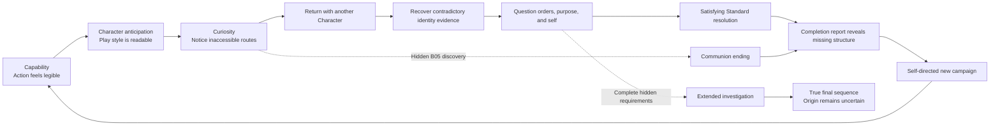
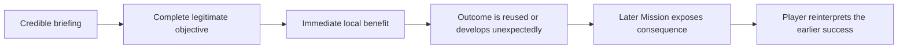
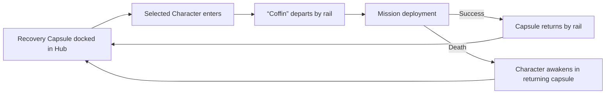

## Purpose

This page defines what the player perceives, feels, decides, and learns—from first control, through Character selection and Mission revisits, to ending discovery and replay. Mechanics, campaign topology, and narrative truth belong on their linked canonical pages.

## Experience thesis

> **Accepted** — The player first feels capable, then curious. Immediate action competence creates confidence; Character-specific opportunities and contradictory evidence create the desire to revisit, compare, and question.

**Familiarity without repetition** supports the first step as a presentation principle: the action language feels legible without making the journey predictable or derivative.

## Recognition before explanation

The cast should use strong, original archetypes and silhouettes. A player who has never seen these characters should still form an immediate expectation of each character's fantasy and possible play style.

The world should produce the same anticipatory recognition. A wasteland, forest, or factory can imply a larger action-game journey before exposition explains why the player is there.

## Character-choice anticipation

> **Accepted** — Character design, silhouette, equipment, and animation should imply a play style before the player reads the interface. Selection then exposes exact stats, equipped items, available equipment, skills, and the selected Specialization.

The Hub provides a safe place to test movement, attacks, skills, equipment changes, and the Character-owned optional-route verb before deployment. The player can compare what the design suggests with how the configuration actually feels, reducing the risk of an uninformed Mission choice without making the crew differ only through numbers.

## Character-gated discovery

> **TODO — Affordance sheet:** Show one optional gate for each Character before introduction, after introduction, and during an unavailable interaction; keep the hidden contents concealed.

> **Accepted** — Optional gates use a consistent Character-specific material, device, icon, or visual motif. After the relevant Character is introduced, the player should reliably understand whom to bring back without learning whether the route contains a shortcut, Imprint, equipment opportunity, or another reward.

| Player state | Intended reading |
|---|---|
| Required Character not introduced | “This is unusual, but I do not understand it yet.” |
| Required Character known | “I should return with that crew member.” |
| Wrong Character attempts access | Brief feedback confirms the gate without exposing its contents. |
| Correct Character opens access | The signature verb fulfills an expectation established by Character design and Hub testing. |

## Player experience arc

The game first creates confidence, then turns visible differences and incomplete evidence into curiosity. Replay should feel chosen by the player rather than assigned by a completion checklist.

## Narrative agency

> **Accepted** — The player knows from the opening that the crew's autobiographical identity is missing or unreliable. The mystery is not whether something is wrong, but what happened, whether an original person exists, which memories are real, and what the missions serve.

> **Accepted** — The crew begins with an “act first, ask later” orientation. Soldiering is its only stable identity. Crew members are physically capable of refusal, but operational conditioning makes questioning orders or selfhood feel improper, unsafe, and unlike themselves.

The player's first form of rebellion is therefore not defeating OPERATOR or an unseen command authority—it is recognizing that asking “why?” is possible.

> **Accepted** — Early Missions and OPERATOR's coordination feel legitimate. Objectives address real threats or needs, and success produces genuine immediate benefits. Questioning an order is morally difficult because abandoning it may hurt people who need its stated outcome.

Major reinterpretations follow unavoidable early Mission successes, giving every campaign a coherent causal spine. Later Missions reveal that restored infrastructure, recovered material, access, or authority from those successes produced consequences the crew did not expect or was repurposed toward the identity-control project. Optional routes may change context, witnesses, or interpretation, but do not erase the main consequence. The later revelation must preserve both truths: the crew helped in the moment and also enabled something larger.

### Narrative evidence pattern

> **TODO — Worked example:** After the relevant Mission is revalidated, add one complete example connecting its framing, environmental evidence, actionable Memory Imprint, and crew interpretations.

Missions reveal story through evidence encountered during play. The layers are tools, not a mandatory four-step formula; use only those that create a meaningful contradiction, decision, or progression result.

| Layer | Question answered | Use |
|---|---|---|
| Institutional framing | What does OPERATOR or another authority claim is happening? | Establish the objective and its credible immediate benefit. |
| Environmental evidence | What do the location, occupants, and consequences suggest happened? | Support, complicate, or contradict the framing without reducing every Mission to a simple lie. |
| Memory Imprint | What identity evidence does the player recover? | Pair the lore or memory scene with its explicit progression result. |
| Crew interpretation | How do crew members understand the same evidence differently? | Include when disagreement changes understanding, trust, or later action—not as a required debrief. |

## Opening experience

> **Accepted** — A new game gives control almost immediately. The operation feels routine: objectives and familiar crew voices arrive over radio during safe movement, while unreliable autobiographical identity is treated as an established condition rather than a fresh amnesia reveal. The player learns action before a terminal briefly displays ROOK under another designation marked killed in action. The clue remains in the background, receives no spoken reaction from the crew or OPERATOR, and may be overlooked. The Hub becomes the first quiet narrative pause. Arrival remains player-controlled, connects radio voices to physically present crew, and exposes direct selection shortcuts without a forced tour.

## Coffin lifecycle

> **Accepted** — Four docking stations represent the complete crew, one station per Character. The selected Specialization's Coffin remains docked; other unlocked variants are stored off-screen and arrive by rail when selected. HUB0 and HUB1 are states of the same physical space. HUB0 first shows ROOK and VECTOR's default Coffins docked with two empty stations; RAM adds the third and RELAY the fourth, and M05 transitions the space into its full Act II function without relocating the crew. A Character may be active elsewhere in the Hub while their selected Capsule remains docked, or sleep inside its closed Capsule.

M01 begins directly without a Coffin departure; ROOK's returning Capsule introduces the system at HUB0. After that exception, deployment and return use the same physical lifecycle. The selected Character enters the Coffin belonging to their selected Specialization, it leaves the Hub, and its station remains empty during the Mission. After success or death, the same Capsule arrives from off-screen and docks; death specifically reveals the Character awakening inside.

Recovery is visually concrete but causally unexplained. The Coffin returns closed, docks, opens pneumatically, and the Character wakes or exits. Do not show fabrication, medical reconstruction, scanning, replacement bodies, or explanatory system text. Crew dialogue may treat recovery as familiar, but must not establish whether the event is sleep, resurrection, reconstruction, replacement, or something else.

## Deployment and extraction variety

> **TODO — Delivery storyboard:** Show arrival and extraction beats for each delivery method, including safe-state timing, Coffin orientation, opening, Character control handoff, Character entry, and departure.

> **Accepted** — Coffin delivery varies by Mission for visual rhythm and environmental fit. A Mission may choose randomly among authored compatible variants, but every variant is mechanically equivalent: the same start or exit position, safe-state duration, control timing, and lack of tactical advantage or damage. M01 remains the explicit no-arrival exception.

| Delivery method | Visual beat |
|---|---|
| Hard drop | Coffin falls from above and lands heavily before opening. |
| Track unloader | A carrier enters from off-screen and rotates the Coffin upright. |
| Ground hatch | A gate opens and raises the Coffin vertically from below. |
| Spider-droid carrier | Walking machinery delivers and releases the Coffin. |
| Installed rail | Mission infrastructure carries the Coffin directly into position. |

Mission completion reverses the experience: an authored or randomly selected compatible carrier delivers the Coffin, the Character enters, and the Capsule departs. Variation is presentation only and must not change rewards, timing requirements, or ending eligibility.

Extraction routing is a campaign-wide Coffin system, but each Mission authors its available destinations and may offer only its current Hub. Direct routes are uncommon during the controlled Act I introduction, central to Act II, and available selectively during Act III. M01 remains the direct-start exception and extracts to HUB0.

In Act II, successful extraction offers the completed Mission's authored direct successors and HUB1. Hidden Mission-specific actions may add a Special Mission to this local choice. Direct continuation preserves the current Character, Specialization, and equipment; returning to HUB1 enables reconfiguration and adds every discovered Special Mission to the Hub pool. A discovered Special Mission remains unlocked for the current campaign even if another exit is chosen or the player later dies. Extraction and Hub lists distinguish these Missions with indentation and a consistent special color, describing them only as a **shortcut** or **optional path** to the destination biome. The exact downstream Mission and reward remain concealed. They never say “secret,” present the four Missions as a set, or hint at Communion access.

## Coffin Specialization selection

> **Accepted** — Every Recovery Capsule uses the same compact coffin-like shell, dimensions, rail interface, docking points, and pneumatic opening. A central illuminated emblem identifies the Character and remains unchanged across that Character's three variants. Decoration and controlled color identify the Specialization; only one variant occupies that Character's docking station.

Initially, the selection interface shows only the available baseline configuration; it does not show named locked slots or a `1/3` count. When the first additional Specialization unlocks, one previously decorative Coffin element gains color and activating the docking station offers two Coffin choices. Selecting another Specialization sends the current Capsule away and delivers the chosen variant by rail. The player is allowed to infer the third option before a non-true ending report explicitly reveals the twelve-Specialization total.

## Failure and recovery

> **Accepted** — Failure should be understandable and invite a meaningful next response. M01 restarts directly because the Hub has not yet been introduced. After HUB0 unlocks, death returns the deployed Character to their personal Recovery Capsule—their “Coffin” in crew slang in the current Hub and resets the failed Mission to its beginning.

There is no additional resource or progression penalty. The player may immediately retry, change Character or configuration, test a new approach in the Hub, or choose another available Mission. The intended feeling is determination and reconsideration—not confusion, irreversible loss, or pressure to grind statistics.

## Representative play

> **Needs evidence** — The action loop is described, but one playable encounter must prove its decisions, feedback, and character-specific variation.

## Mastery

> **TODO — Playtest evidence:** Define observable success measures for each milestone and validate them with players rather than elapsed-time assumptions alone.

> **Accepted** — Mastery grows through meaningful campaign milestones, not an arbitrary target number of hours.

| Milestone | Expected player growth |
|---|---|
| First 10 minutes | Read basic threats and execute core movement and attacks with confidence. |
| HUB1 arrival | Understand the full crew, test configurations, and choose a Character and Specialization intentionally. |
| Mid-Act II | Exploit Character strengths, recognize optional gates, and plan Mission revisits. |
| First ending | Complete demanding encounters and recognize that campaign evidence is incomplete. |
| Later campaigns | Compare Character perspectives, optimize configurations, and deliberately investigate missing structure. |

Difficulty should remain fair and learnable. Improvement comes from threat reading, execution, route knowledge, Character understanding, and configuration choices—not only numerical progression.
