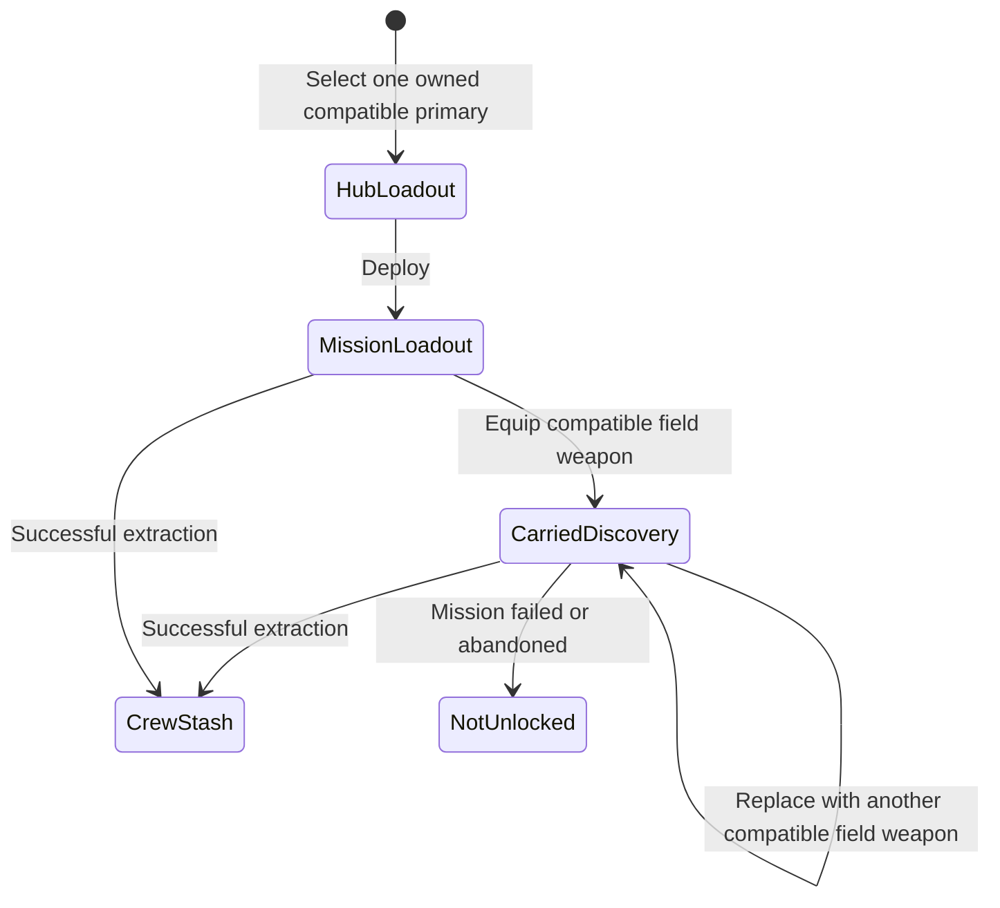

## Ownership model

> **Accepted** — Weapons, armour, consumables, currencies, and key items belong to a shared crew stash and transfer freely at the Hub.

- Upgrades applied to a weapon or armour item remain attached to that item.
- Innate moves, personal skills, and character mastery remain character-owned.
- World discoveries, shortcuts, and routes remain campaign-owned.
- [[Gameplay/Overdrive|Specializations]] define compatible weapon and armour classes; restrictions follow from play-style requirements rather than item ownership.
- Compatible equipment may substantially vary damage, cadence, range, projectile behavior, or technology while preserving the Specialization's defining commitments.
- Each Specialization has a primary Weapon Family containing multiple individual Equipment items; the selected gun is configurable rather than identical to the Specialization itself.

## Mission acquisition and persistence

- Replacing a carried weapon never removes a previously owned item from the crew stash.
- A compatible field weapon may be used immediately but becomes permanently Hub-selectable only after successful extraction.
- Completing a weapon's [[Gameplay/Blueprints|Output Blueprint]] adds it to the shared stash, but it cannot be equipped until a Hub visit.
- If its only compatible Specialization is still concealed, the completed unlock persists but remains hidden from ordinary Equipment selection until that Specialization unlocks.
- Mission failure or abandonment loses the unextracted discovery, not previously owned Equipment.
- An [[CONTEXT#equipment-imprint|Equipment Imprint]] reveals an acquisition source or path; it does not directly place the item in the stash.
- A Specialization's initial three-item set is the exception: it enters the crew stash with that Specialization so the newly unlocked configuration is immediately playable. Later alternatives use ordinary Equipment acquisition.

## Accepted categories

### Weapons

> **Deferred — ROOK weapon catalogue:** `EQ001` is the only currently required ROOK Equipment item. Additional rifles and the canonical shotgun and paired-pistol items may be added after the wider equipment and campaign structure is clear. Compatibility and default-loadout relationships remain owned by [[Characters/Rook|ROOK]].

> **Accepted** — A Weapon Family has no fixed item count. New Equipment may expand a family without changing its Specialization identity or existing item IDs.

| ID | Item | Status |
|---|---|---|
| `EQ001` | [[Equipment/EQ001|Baseline Rifle]] | Accepted |
| `EQ002` | [[Equipment/EQ002|Kunai]] | In progress |
| `EQ003` | [[Equipment/EQ003|Active Camouflage Module]] | In progress |
| `EQ004` | [[Equipment/EQ004|Climbing Claws]] | In progress |
| `EQ005` | [[Equipment/EQ005|Katana]] | In progress |
| `EQ006` | [[Equipment/EQ006|Phase Shifter]] | In progress |
| `EQ007` | [[Equipment/EQ007|Flash Charges]] | In progress |
| `EQ008` | [[Equipment/EQ008|Sniper Rifle]] | In progress |
| `EQ009` | [[Equipment/EQ009|Resonance Beacon Rounds]] | In progress |
| `EQ010` | [[Equipment/EQ010|Targeting Optics]] | In progress |
| `EQ011` | [[Equipment/EQ011|Tower Shield]] | In progress |
| `EQ012` | [[Equipment/EQ012|Armored Gauntlet]] | In progress |
| `EQ013` | [[Equipment/EQ013|Kinetic Stabilizer]] | In progress |
| `EQ014` | [[Equipment/EQ014|Minigun]] | In progress |
| `EQ015` | [[Equipment/EQ015|Proximity Mines]] | In progress |
| `EQ016` | [[Equipment/EQ016|Grounding Anchors]] | In progress |
| `EQ017` | [[Equipment/EQ017|Two-Handed War Hammer]] | In progress |
| `EQ018` | [[Equipment/EQ018|Kinetic Tether]] | In progress |
| `EQ019` | [[Equipment/EQ019|Commitment Servos]] | In progress |
| `EQ020` | [[Equipment/EQ020|Adaptive Chain Sickles]] | In progress |
| `EQ021` | [[Equipment/EQ021|Conductor Whip]] | In progress |
| `EQ022` | [[Equipment/EQ022|Dorsal Tendrils]] | In progress |

## Character-owned tools

> **Accepted** — Fixed Character tools are part of their owning Character's setup rather than crew-stash Equipment. They receive neither Equipment IDs nor Equipment pages. [[Characters/Rook#common-tools|ROOK's grenades and combat knife]] follow this rule.

> **Accepted** — [[Machine Profiles/Overview|Machine Profiles]] are shared research records rather than Equipment. RELAY's Controlled Units, Integrated Modules, Chassis Integrations, and Hack Programs receive no `EQ###` IDs. Physical Equipment unlocked from any Machine Profile receives an `EQ###` ID and follows shared stash rules.

## Hack Modules

> **Accepted** — Hack Modules are Null-compatible Equipment that modify field combat Mesh Dives and Program Execution without changing safe route boards or Research Terminal boards.

Individual items may add board moves, raise the Execution Threshold, extend connection range, delay Access decay, identify Discovery Node rewards or expose additional board information, or reduce authored corrupted-node penalties. Each item owns its explicit modifiers. Capacity, slot count, and cell layout remain deferred.

## Unknown categories

> **TODO** — Armour, consumables, currencies, key items, secondary weapons, and special weapons do not yet have enough accepted rules for dedicated pages.

> **Deferred — Equipment Capacity:** Test unrestricted slot- or cell-based loadouts before introducing a campaign-wide point budget.

## Equipment-page rule

> **Accepted** — Equipment uses one category-neutral `EQ###` sequence. Category remains separate metadata so later reclassification does not change identity.

Canonical Equipment filenames use the lowercase stable ID: `equipment/eq001.md`, `equipment/eq002.md`, and so on. Wiki links target that ID rather than the item's display name.

Every accepted equipment item receives one stable ID and one canonical page containing:

- gameplay role;
- ownership and transfer;
- input and resource behavior;
- equipment category and intrinsic use constraints;
- acquisition and persistence;
- upgrades and constraints;
- representative use;
- required evidence and presentation.

Character pages reference item IDs for default loadouts, compatibility, and Specialization-specific interactions. They do not duplicate intrinsic equipment values. [[Gameplay/Gameplay Math|Gameplay Math]] owns the shared equations that resolve those item values against player, enemy, and Boss inputs.
