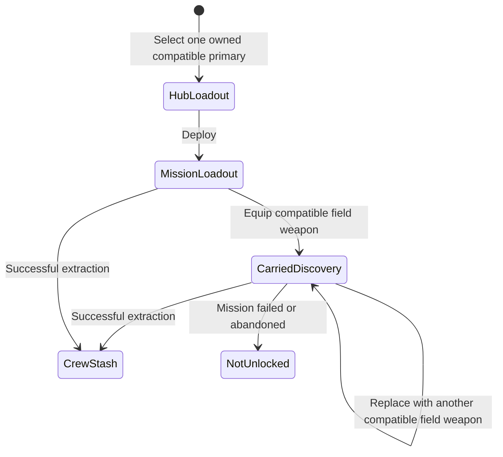

## Ownership model

> **Accepted** — Weapons, armour, consumables, currencies, and key items belong to a shared crew stash and transfer freely at the Hub.

- Upgrades applied to a weapon or armour item remain attached to that item.
- Innate moves, personal skills, and character mastery remain character-owned.
- World discoveries, shortcuts, and routes remain campaign-owned.
- [[Gameplay/Overdrive|Specializations]] define compatible weapon and armour classes; restrictions follow from play-style requirements rather than item ownership.
- Compatible equipment may substantially vary damage, cadence, range, projectile behavior, or technology while preserving the Specialization's defining commitments.
- Each Specialization has a primary Weapon Family containing multiple individual Equipment items; the selected gun is configurable rather than identical to the Specialization itself.

## Mission acquisition and persistence

- Replacing a carried weapon never removes a previously owned item from the crew stash.
- A compatible field weapon may be used immediately but becomes permanently Hub-selectable only after successful extraction.
- Mission failure or abandonment loses the unextracted discovery, not previously owned Equipment.
- An [[CONTEXT#equipment-imprint|Equipment Imprint]] reveals an acquisition source or path; it does not directly place the item in the stash.

## Accepted categories

### Weapons

> **TODO — ROOK weapon catalogue:** Assign stable IDs and canonical item pages to the unresolved initial and alternative weapons. Compatibility and default-loadout relationships remain owned by [[Characters/Rook|ROOK]].

> **Accepted** — Each ROOK Weapon Family begins with three weapons: one always-available initial item and two alternatives acquired through research or successful field recovery. More may be added later without changing the family structure.

| ID | Item | Status |
|---|---|---|
| `EQ001` | [[Equipment/Baseline Rifle|Baseline Rifle]] | Accepted |

## Unknown categories

> **TODO** — Armour, consumables, currencies, key items, secondary weapons, and special weapons do not yet have enough accepted rules for dedicated pages.

## Equipment-page rule

> **Accepted** — Equipment uses one category-neutral `EQ###` sequence. Category remains separate metadata so later reclassification does not change identity.

Every accepted equipment item receives one stable ID and one canonical page containing:

- gameplay role;
- ownership and transfer;
- input and resource behavior;
- equipment category and intrinsic use constraints;
- acquisition and persistence;
- upgrades and constraints;
- representative use;
- required evidence and presentation.

Character pages reference item IDs for default loadouts, compatibility, and Specialization-specific interactions. They do not duplicate intrinsic equipment values. [[Gameplay/Gameplay Math|Gameplay Math]] owns the shared equations that resolve those item values against player, enemy, and Boss inputs.
