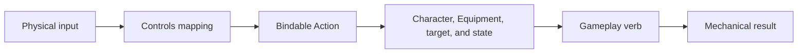

## Ownership

> **Accepted** — An **Action** names bindable player intent. A **gameplay verb** is the contextual implementation produced by the active Character, Specialization, Equipment, target, and state. [[Gameplay/Controls|Controls]] owns how a device produces an Action, while the verb's owning content page and [[Gameplay/Mechanics|Mechanics]] own its result.

Content pages reference these Actions instead of controller buttons, keyboard keys, stick thresholds, or mouse gestures.

## Action catalogue

| Action | Player intent | Resolution owner | Status |
|---|---|---|---|
| **Move** | Supply movement direction or magnitude. | [[Gameplay/Mechanics#ground-movement|Ground movement]] and Character movement rules | Accepted |
| **Jump** | Begin or continue a jump where the current state permits it. | [[Gameplay/Mechanics#jump-and-air-control|Jump and air control]] | Accepted |
| **Directional Attack** | Attack with the equipped primary weapon using supplied directional intent. | Equipment item and [[Gameplay/Mechanics#directional-attack|Directional Attack]] | Accepted |
| **Aim Lock** | Request stationary or constrained directional aiming where the current Character and Equipment permit it. | [[Gameplay/Mechanics#directional-attack|Directional Attack]] | In progress |
| **Interact** | Act on the selected or nearby contextual world target. | Owning Mission, Character, Machine Profile, or world-system page | Accepted |
| **Character Action** | Invoke a Character- or Specialization-owned active verb exposed by the current configuration. | Owning Character or Specialization section | In progress |
| **Equipment Action** | Invoke an active verb supplied by equipped hardware or a selected Equipment slot. | Owning Equipment page | In progress |
| **Overdrive** | Request activation of the selected Specialization's Overdrive. | [[Gameplay/Overdrive#overdrive-behavior|Specializations and Overdrive]] | Accepted |

### Move

Supplies locomotion intent. Mechanics and the active Character state determine whether that becomes running, air control, climbing, or another valid movement.

### Jump

Requests a jump and may continue supplying held intent for variable height. Mechanics owns buffering, coyote time, and air control.

### Directional Attack

> **Accepted** — Directional Attack is control-agnostic. It carries attack intent and direction to the equipped primary weapon.

The Equipment item decides whether continued intent produces automatic fire, a melee sequence, a charge, a burst, or no repeated action. It also owns legal redirection points, recovery, range, cadence, and resource use. Exact directional resolution remains open until control and combat prototypes establish it.

### Aim Lock

Requests constrained directional aiming. Exact movement restrictions, valid states, and control mapping remain unresolved.

### Interact

Requests an action from a valid contextual world target. The target's owning page defines its response and eligibility.

### Character Action

Invokes a Character- or Specialization-owned action exposed by the current configuration. Exact slot structure remains unresolved.

### Equipment Action

Invokes a gameplay verb supplied by equipped hardware. Exact slot count, selection, and whether some Equipment uses contextual Interact or Character Action instead remain unresolved.

### Overdrive

Requests activation of the selected Specialization's Overdrive when its shared activation conditions permit it.

## Contextual actions

Interact, Character Action, and Equipment Action may resolve into different gameplay verbs according to the active Character, Specialization, Equipment, target, and state. A consuming page should link to the shared Action while documenting only its local verb and result.

Examples include RELAY's Hack, RAM's Breach, Network's commands, and Phase Shift. Gameplay verbs are not separate physical-control commitments unless the Controls page later assigns them dedicated Actions.

## Unresolved catalogue

> **TODO — Action prototype:** Validate whether Character Action needs numbered slots or more semantic actions, how many Character and Equipment Action slots are required, and whether menus, target selection, dodge-like movement, or companion commands need distinct Actions.
