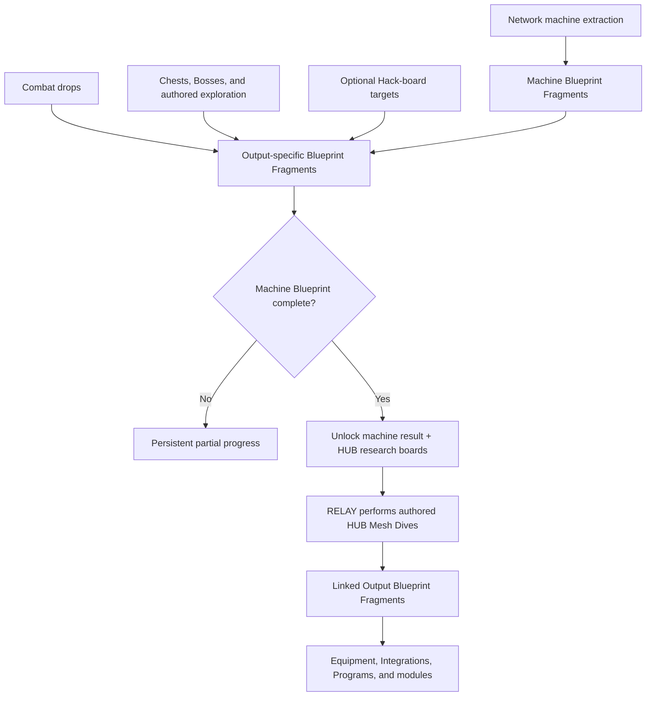

## Ownership

> **Accepted** — Blueprint Fragments are the main shared discovery path for producible gameplay rewards. Any deployed Character may contribute progress for any Character or Specialization.

This page owns fragment progression, direct unlocks, and the HUB Research Terminal. [[Machine Profiles/Overview|Machine Profiles]] owns source-machine compatibility and linked output mappings. Equipment and Character pages own the unlocked item's behaviour and compatibility.

## Reward boundary

> **Accepted** — Blueprints unlock producible gameplay rewards, not authored story progression.

| Allowed Blueprint rewards | Excluded progression |
|---|---|
| Equipment and weapons | Characters and Specializations |
| Wire Integrations | Overdrive |
| Hack Programs and Hack Modules | Memory Imprints |
| Network machine patterns | Mission access and required keys |
| Future upgrades, consumable recipes, or cosmetics | Ending evidence and route prerequisites |

Random drops, optional pickups, and Hub research therefore cannot block campaign narrative or ending eligibility.

## Blueprint types

| Type | Fragment result | Completion result |
|---|---|---|
| **Machine Blueprint** | Advances the machine track inside one `MP###` record | Unlocks the machine result and its Hub Mesh Dive research boards; Network may deploy it only when control-compatible |
| **Output Blueprint** | Advances one specific reward | Immediately unlocks its Equipment item, Wire Integration, Hack Program, module, or other authored output |

A **Blueprint Fragment** is always tied to one specific Machine Blueprint or Output Blueprint. It is not fungible currency. Requirements may be `1/1`, `1/3`, or another authored count.

## Discovery flow

## Activation

> **Accepted** — M05 introduces Mesh Dive boards through its Overdrive-module access trials, then activates the Research Terminal and Blueprint system when HUB0 transitions into HUB1.

Before M05 completion, Blueprint Fragments do not spawn, drop, accumulate invisibly, or appear in interfaces. RELAY's M04 starter arsenal exists as authored starting gear rather than pre-terminal Blueprint rewards; activation imports those three Helix source records as completed starter research. M01–M04 cannot be revisited after completion, and M05 has no ordinary Blueprint loot: its four order-flexible Overdrive-module boards use fixed solvable budgets, unlimited short-reset retries, and no Discovery Nodes. Normal field discovery and Hub Mesh Dive research begin in Act II.

## Field sources

- Any Character may recover Blueprint Fragments from eligible enemy drops, chests, Boss rewards, or authored exploration.
- Enemy fragments may appear as generic physical pickups whose world appearance does not reveal their contents or create a seen-state record. Collection banks and identifies them immediately, while uncollected drops disappear when the Encounter resets or the Mission ends.
- Collection feedback names the target Blueprint and updated progress. An output tied exclusively to a concealed Specialization uses neutral wording until that Specialization unlocks; an explicitly authored mystery fragment may remain unidentified until terminal analysis.
- Discovery Nodes, chests, Boss awards, and authored world pickups bank immediately when completed or collected.
- Banked Blueprint progress survives death, abandonment, extraction, and direct Mission continuation.
- Authored optional pickups may require one Character's signature route verb, including RAM-only Breach walls, VECTOR-only Wall Run routes, ROOK-only Combat Slide passages, or RELAY-only Hack locks.
- These Character requirements may gate fragments needed to complete optional Output Blueprints and the campaign's `100%` collectible state; they never gate critical-path completion.
- A visible or discovered inaccessible pickup relies on player observation and memory as the reason to replay with the required Character.
- The game does not track whether the camera or a visibility ray merely passed over an uncollected pickup, and it creates no automatic marker for one.
- Only collection records the fragment. Once collected, it remains banked even if the player immediately abandons the Mission.
- RELAY receives deliberate fragment opportunities through optional Hack-board targets for any Character or Specialization.
- Every source-machine Hack board visibly contains one Discovery Node for each incomplete Blueprint track in that archetype's ordinary loot table.
- Node rewards are unidentified by default. Known Profile information may reveal a broad category; a suitable Hack Module may reveal the exact Blueprint and progress before moves are committed.
- Reaching a node identifies and banks its reward.
- Each field instance awards at most one fragment per eligible track, so multi-fragment requirements may still require several machines.
- Completed tracks are omitted from later boards rather than shown as empty nodes. Unique authored world pickups never appear as creature-board nodes.
- A board's required endpoint produces its immediate field result; optional nodes award their listed fragments.
- Reaching a Discovery Node banks its fragment immediately, even if no moves remain for the normal endpoint.
- Banked nodes cannot award duplicates on retry; the target then follows its ordinary incomplete- or failed-Hack recovery, and remaining objectives may be attempted later.
- Limited moves may therefore force a choice between the endpoint and optional discoveries.
- Each eligible source archetype has an authored Blueprint loot table available to every Character.
- One ordinary enemy defeat awards at most one random fragment from its incomplete eligible Blueprint tracks; completed tracks no longer consume drop rolls.
- Bosses, chests, authored rewards, Network extraction, and Discovery Nodes may grant multiple fragments under their own rules.
- Every eligible defeat advances a source-specific bad-luck streak that raises drop probability until a fragment is guaranteed.
- The streak persists globally through death, abandonment, Mission changes, and campaigns. An ordinary random or guaranteed enemy drop resets it; Discovery Nodes, chests, Boss rewards, and unique pickups do not.
- Exact probability and streak values remain hidden from the player.
- RELAY's Discovery Nodes remain the precise non-random way to target authored fragment rewards.
- Exact random rates, guarantee thresholds, weighting, and collection feedback require loot prototypes.

## Wire extraction

> **Accepted** — Extracting with an unknown compatible Wire Integration still installed completes that specific `WI###` Output Blueprint.

An unknown Chassis must remain intact through extraction. Replacing, ejecting, abandoning, or losing the unknown Integration forfeits this extraction reward, while Blueprint Fragments already banked from Discovery Nodes remain safe. Wire extraction does not complete the source Machine Blueprint or unrelated outputs.

## Network extraction

> **Accepted** — Bringing an eligible Controlled Unit through successful extraction awards only its Machine Blueprint fragments, never its internal Output Blueprints automatically.

An intact extracted unit grants every missing fragment and completes its Machine Blueprint. A damaged surviving unit grants a condition-based subset, never fewer than one; a destroyed unit cannot be extracted. Temporary local units cannot use Restoration Stations before extraction. Exact damage bands and partial-fragment counts remain unresolved.

## Research Terminal

> **Accepted** — M05 activates a persistent Research Core. HUB1, HUB2, and HUB3 each provide a physical Research Terminal connected to that Core as the single interface for Blueprint progress, completed unlocks, Machine Profiles, and Hub Mesh Dive research.

Hub transitions never remove collected progress or unlocked research boards; each terminal may use a different physical presentation without changing functions. Any player-controlled Character in the Hub may enter the terminal, inspect progress and unlocks, and select an available research board. Starting the minigame hands execution to RELAY for the Mesh Dive without changing the player's selected Hub Character or deployment configuration; control returns to the initiating Character afterward.

Completing a Machine Blueprint immediately unlocks its machine result and persistent access to that Profile's authored Hub boards. RELAY performs those dives to recover every output intrinsic to that machine archetype without searching for another field instance. Machine completion does not grant linked outputs automatically, and Hub research does not substitute for unique authored world pickups. Research Terminal boards use fixed authored constraints and ignore field Hack Module modifiers, so players may instead seek the source in a Mission with an optimized Null configuration.

Each Machine Profile's Hub research set contains enough finite, one-time Discovery Nodes to complete every machine-intrinsic linked Output Blueprint. Multi-fragment tracks use distinct nodes distributed across one or more authored boards; boards may unlock sequentially.

Boards may be retried after failure. Discovery Nodes bank fragments immediately; collected nodes remain removed and never produce duplicates. Completed boards may remain replayable for practice but provide no further loot. A machine reconstruction may appear during the interface, but it is presentation rather than a separate specimen, cost, timer, or progression state.

## Production cost

> **Accepted** — Completing a Blueprint produces its first usable result without requiring another currency or material.

Non-consumable outputs do not require duplicate production.

| Blueprint completed during a Mission | Availability |
|---|---|
| Hack Program | Null receives the immediate replace-or-ignore prompt; an equipped program begins ready |
| Currently installed Wire Integration | Becomes permanently owned and remains installed |
| Other Wire Integration | Unlocks immediately; selectable at the next Hub visit |
| Equipment | Unlocks immediately; selectable at the next Hub visit |
| Control-compatible Machine Blueprint | Unlocks the unit pattern; selectable in Network's next Hub roster |
| Any Machine Blueprint | Unlocks its Research Terminal boards for the next Hub visit |

Mission-local Salvage remains dedicated to rebuilding destroyed Network units during deployment. Mission-local Salvage remains dedicated to rebuilding destroyed Network units during deployment. A separate production economy may be added only if playtesting demonstrates a need.

## Network compatibility

Completing a Machine Blueprint does not guarantee a Network unit. A control-compatible profile becomes available for Network production and roster selection when its Machine Blueprint completes. The completed pattern is reproducible: Network may deploy multiple instances, each paying the full Command Cost. Boss-derived or narratively unique profiles may explicitly impose a one-copy limit. An incompatible machine remains available only as a Research Terminal profile and Hub Mesh Dive source. Terminal research state is separate from destructible deployed copies.

## Persistence across campaigns

> **Accepted** — Blueprint Fragments, completed Blueprints, discovered Machine Profiles, and Blueprint-produced unlocks persist globally across campaigns.

A new campaign still exposes no Blueprint drops or interfaces before M05. Research Terminal activation reconnects the global archive; compatible produced Equipment becomes available as its Character and Specialization unlock. Story state, Character and Specialization unlocks, Mission state, and true-route requirements continue to reset. Global Blueprint completion cannot satisfy an in-campaign Memory Imprint, Specialization, or ending prerequisite.

## Unique field collectibles

> **Accepted** — Authored world pickups are unique collectible placements distinct from repeatable enemy drops and machine-intrinsic Hub research.

Some Output Blueprint fragments may be field-only and require a Character-specific optional route. Completing the same Blueprint through another source does not mark that placement collected. Picking it up still advances `100%` world-collectible completion without creating a duplicate item.

A collected authored placement is globally complete and does not reappear in later campaigns. Its fragment and completion credit persist even though Mission routes and Character access reset. Random enemy drops and repeatable Hub challenges are not unique world placements and do not count individually.

## Completion visibility

> **Accepted** — During an active campaign, Mission maps and reports do not reveal uncollected Blueprint totals, unseen pickups, hidden rooms, or pickup locations.

The Research Terminal lists only discovered Blueprint tracks and may show progress such as `2/3` without identifying where missing fragments exist. Hidden outputs receive no placeholder, locked slot, lifetime `x/y` count, or full-Profile completion announcement. Opening a board reveals only its currently available unidentified Discovery Nodes. Reaching any campaign ending reveals the full Blueprint statistics alongside the game's total completion result. That first ending permanently unlocks a completion ledger for future campaigns; it shows full category totals and historical collection statistics without revealing exact pickup locations, hidden-room entrances, or puzzle solutions.

## Presentation

> **TODO — Research interface:** Define fragment feedback, partial counts, concealed outputs, machine selection, board replay, completion state, and cross-Character reward messaging without revealing locked Specializations prematurely.
