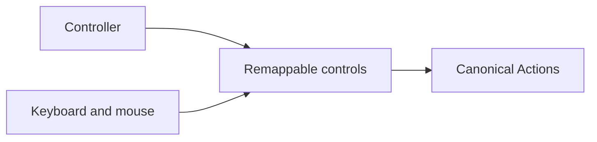

## Ownership

> **TODO — Control prototype:** Establish default controller and keyboard/mouse mappings only after the Action catalogue and representative combat controls are playable.

> **Accepted** — This page owns physical bindings, device-specific gestures, thresholds, remapping, and accessibility alternatives. [[Gameplay/Actions|Actions]] owns semantic player intent; other gameplay and content pages must not hard-code buttons.

## Mapping table

| Action | Controller default | Keyboard/mouse default | Status |
|---|---|---|---|
| [[Gameplay/Actions#move|Move]] | Unresolved | Unresolved | Prototype required |
| [[Gameplay/Actions#jump|Jump]] | Unresolved | Unresolved | Prototype required |
| [[Gameplay/Actions#directional-attack|Directional Attack]] | Unresolved | Unresolved | Prototype required |
| [[Gameplay/Actions#aim-lock|Aim Lock]] | Unresolved | Unresolved | Prototype required |
| [[Gameplay/Actions#interact|Interact]] | Unresolved | Unresolved | Prototype required |
| [[Gameplay/Actions#character-action|Character Action]] | Unresolved | Unresolved | Prototype required |
| [[Gameplay/Actions#equipment-action|Equipment Action]] | Unresolved | Unresolved | Prototype required |
| [[Gameplay/Actions#overdrive|Overdrive]] | Unresolved | Unresolved | Prototype required |

## Requirements

- PC remains the initial platform target.
- Controller and keyboard/mouse must expose equivalent gameplay Actions even when their physical gestures differ.
- Gameplay bindings must be remappable.
- Menus must communicate Actions and current bindings without making content documentation device-specific.
- Exact direction count, analogue thresholds, mouse interpretation, simultaneous-action rules, and accessibility alternatives remain unresolved.
