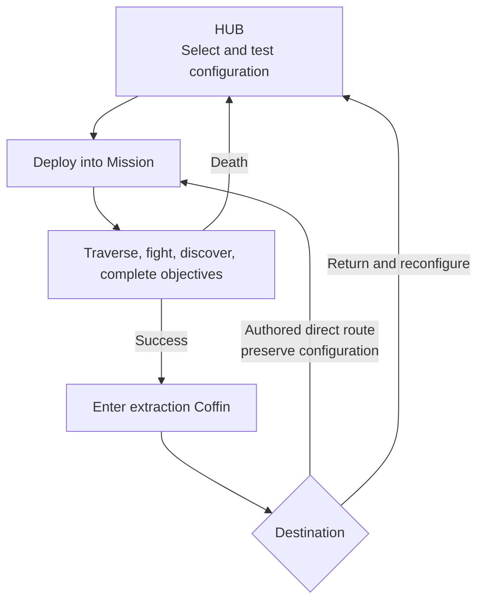

## Moment-to-moment loop

> **In progress** — This loop describes the intended foundation but still needs a representative playable example.

1. **Read:** identify terrain, enemies, projectiles, openings, and possible routes.
2. **Choose:** decide how to advance, evade, position, and attack with the selected character.
3. **Execute:** combine movement, platforming, [[Gameplay/Actions#directional-attack|Directional Attack]], optional [[Gameplay/Actions#aim-lock|Aim Lock]], and weapons under pressure.
4. **Resolve:** defeat or bypass the threat, absorb feedback, and gain space or access.
5. **Reframe:** encounter a changed pattern, traversal problem, route, or set-piece phase.

Dense projectile sequences increase execution pressure but should preserve readable decisions. They are an intensity peak within the loop, not a replacement for it.

## Encounter rhythm

Authored encounters may shift emphasis between traversal, combat, discovery, and spectacle. A moving train or attacked lift is a container for the same core verbs under unusual spatial pressure.

## Character transformation

> **TODO — Comparative example:** Resolve the same representative encounter with materially different Character and Specialization configurations.

See [[Characters/Overview|Playable Crew]] for roster rules, [[Characters/Rook|ROOK]] for the current baseline, and [[Gameplay/Overdrive|Specializations and Overdrive]] for deployment configurations.

The selected Character and Specialization must alter how the player reads, chooses, or executes within this loop. Cosmetic differences and small statistical changes are insufficient. After its campaign reveal, Overdrive temporarily exaggerates or inverts the selected Specialization rather than merely increasing damage.

## Opening exception

> **Accepted** — A new game skips the Hub and menus. [[Characters/Rook|ROOK]], the [[Equipment/EQ001|Baseline Rifle]], and the [[Missions/M01|introduction Mission]] are preselected so the player begins in action. First success unlocks a player-controlled Hub arrival. Character, equipment, and destination interfaces become immediately available through physical stations and direct shortcuts; no forced tour interrupts control. The initial Hub roster contains ROOK and one contrasting playable character.

## Standard macro loop

> **Accepted** — The authored campaign returns the player to a prepared decision after success or failure.

Successful extraction offers only authored outgoing destinations from the completed Mission plus the Hub. Hidden source actions may add a Special Mission to that choice. Once discovered, the Special Mission remains unlocked in the current campaign and appears in the Hub pool on return. Failure always returns to the Hub and resets the failed Mission without resource loss.

The player cannot ordinarily swap Characters or Specializations during a deployment. The scripted character trials in [[Missions/M05|The Four Trials]] are an explicit exception, not a general switching mechanic. The exact spatial and fictional relationship between the hub and campaign locations remains unresolved.

## Failure and recovery

> **Accepted** — After HUB0 unlocks, death returns the deployed Character to their personal Recovery Capsule (“Coffin”) in the current Hub. The failed Mission resets to its beginning, but no currency, equipment, Imprint, upgrade, or other campaign resource is lost. M01 restarts directly as the sole pre-Hub exception.

Recovery should reopen meaningful authored choices: retry, change Character or configuration, test another approach, or choose another available Mission. See [[Gameplay/Progression|Progression]].
