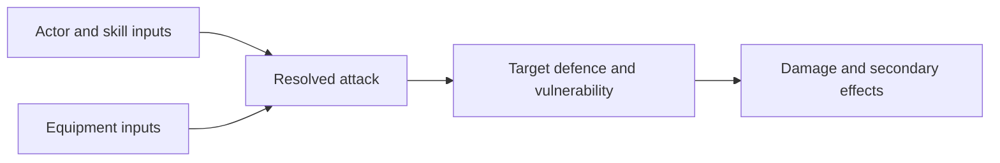

## Ownership

> **Accepted** — Combat equations are global. Character, Specialization, equipment, enemy, and boss pages provide inputs and authored exceptions; they do not reproduce the shared formulas.

| Owner | Supplies |
|---|---|
| Gameplay Math | Global equations, variable definitions, units, order of operations, clamping, rounding, benchmarks, and worked verification cases |
| Character / Specialization | Intrinsic stats and explicit skill or move modifiers |
| Equipment | Base attack values, cadence, projectile count, penetration, resources, and item-specific effects |
| Named modifier | Explicit Character, Specialization, skill, move, or state changes applied to otherwise stable Equipment output |
| Enemy / Boss | Durability, defence, vulnerabilities, attacks, resistances, and explicit Encounter exceptions |

## Design influence

One Page Rules: Grimdark Future is a structural reference rather than a formula to copy directly. Its useful separation is:

| OPR layer | Imprint Zero adaptation |
|---|---|
| Quality | Replaced primarily by deterministic player execution and authored handling |
| Defense | Deterministic defence or mitigation input |
| Tough | Integrity or durability input |
| Weapon range and attacks | Range, cadence, burst, and projectile inputs |
| AP | Penetration input |
| Special rules | Moves, skills, tags, and explicit exceptions |
| Point cost | Internal comparison budget and benchmark, not necessarily player-facing currency |

The real-time model must preserve readable causality. A hit should not secretly fail because of an invisible attack or defence roll.

> **Accepted** — The same unmodified Equipment attack deals the same raw damage regardless of which Character or Specialization uses it. Output changes only through an explicit named skill, move, state, or modifier.

## Input schema

> **TODO — Combat inputs:** Confirm the minimum actor, attack, defence, movement, resource, and effect inputs after choosing the damage and defence model. Do not assign provisional constants merely to complete a table.

> **Accepted** — Each Specialization supplies canonical `1–5` Integrity, Defense, and Mobility Stat Tiers. Shared equations map those tiers into runtime values; Character pages do not duplicate the resulting calculations.

| Tier input | Required runtime output |
|---|---|
| Integrity | Damage capacity before failure |
| Defense | Passive damage mitigation and stagger resistance after a hit lands |
| Mobility | Movement speed and any later accepted movement values |

Active avoidance, blocking, invulnerability, and directional armour remain explicit moves, skills, states, or target rules rather than hidden Defense calculations.

## Internal Specialization budget

> **Accepted** — The budget is a production balancing check, not a player-facing value, currency, or runtime mechanic.

\[
\text{IntegrityTier} + \text{DefenseTier} + \text{MobilityTier} + \sum \text{AbilityCost} = 12
\]

| Current ROOK allocation | Internal cost |
|---|---:|
| Combat Slide skill | 1 |
| Overdrive | 2 |
| Remaining Stat Tiers and any additional priced abilities | 9 |

ROOK cannot exceed Tier `4` in any stat, leaving Tier `5` durability profiles available to more specialized Characters such as RAM.

| Current VECTOR allocation | Internal cost |
|---|---:|
| Wall Run skill | 1 |
| Identity passive | 1 |
| Overdrive | 2 |
| Integrity, Defense, and Mobility Stat Tiers | 8 |

Ghost allocates `1/2/5`, Phase `2/1/5`, and Hunter `2/2/4` across Integrity, Defense, and Mobility. Each totals `12` after ability costs. Any additional priced skill would reduce the points available to Stat Tiers.

## Damage pipeline

> **TODO — Damage model:** Define deterministic hit resolution, penetration, mitigation, critical or weak-point behaviour, minimum damage, stagger, invulnerability windows, and the order in which modifiers apply.

## Movement pipeline

> **TODO — Movement model:** Define the Mobility-tier mapping, base speed, acceleration, deceleration, air-control inputs, external movement modifiers, units, and clamping. Move availability remains controlled by the overview matrix rather than inferred from Mobility.

The minimum accepted relationship is:

\[
\text{RunSpeed} = \text{BaseRunSpeed} \times \text{MobilityMultiplier}(\text{MobilityTier})
\]

## Shared outputs

> **TODO — Output metrics:** Define formulas and standard scenarios for movement values, burst damage, sustained damage, effective durability, stagger pressure, control uptime, and resource efficiency.

Outputs are balancing and verification tools. They must not collapse movement, route access, readability, or execution difficulty into one misleading universal score.

## Verification cases

> **TODO — Worked cases:** Add one baseline player-versus-enemy case, one enemy-versus-player case, one armoured target, one rapid low-damage weapon, one slow high-penetration weapon, and one boss exception after the equations are accepted.

Every worked case must identify source values by stable Character, Specialization, Equipment, Enemy, or Boss ID so changing one canonical input exposes downstream effects.

## Sources

- [One Page Rules point-calculator documentation](https://army-forge.onepagerules.com/studio/docs/point-calc)
- [Grimdark Future core rules](https://onepagefan.wiki/index.php/Grimdark_Future_Core_Rules)
- [Grimdark Future special rules](https://wiki.onepagerules.com/index.php/Grimdark_Future_Special_Rules)
