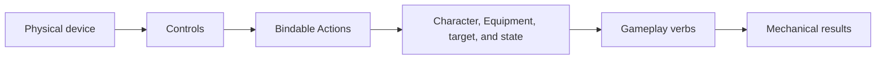

## Interaction model

| Layer | Canonical owner | Responsibility |
|---|---|---|
| Physical mapping | [[Gameplay/Controls|Controls]] | Bindings, device gestures, remapping, and accessibility alternatives |
| Player intent | [[Gameplay/Actions|Actions]] | Control-independent bindable Actions |
| Contextual verb | Character, Equipment, or target page | Local implementation such as Hack, Breach, Focus, or Phase Shift |
| Shared response | [[Gameplay/Mechanics|Mechanics]] | Cross-cutting movement, combat, camera, and damage rules |
| Numerical resolution | [[Gameplay/Gameplay Math|Gameplay Math]] | Shared equations and value conversion |

Content pages link to Actions and document only the gameplay verbs and results they own. They do not assign physical buttons.
