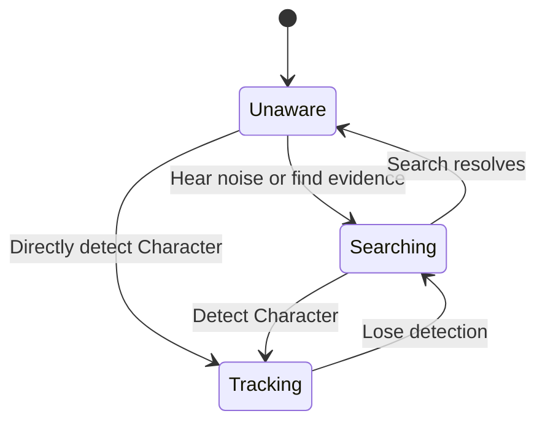

Canonical content pages own character, enemy, weapon, and item specifications. This page owns only rules that cross those boundaries.

## Action resolution

[[Gameplay/Actions|Actions]] owns the canonical player-intent glossary, while [[Gameplay/Controls|Controls]] owns physical input mappings. This page owns shared mechanical responses. Character and Equipment pages own only their local interpretation of an Action.

## Deployment

> **Accepted** — At the Hub, the player selects one [[Characters/Overview|crew member]], one of that character's unlocked [[Gameplay/Overdrive|Specializations]], and compatible equipment for the deployment. Character and Specialization switching ordinarily occurs only at the Hub after death or voluntary return.

The scripted activation trials inside [[Missions/M05|The Four Trials]] are the sole accepted exception: control temporarily passes from the Systems Specialist to another crew member inside each trial room. This does not permit general mid-Mission switching.

Each Character and Specialization combination must transform shared verbs through movement, attack geometry, range, risk, defence, resources, or route access. Cosmetic and minor statistical variation are insufficient.

## Ground movement

> **Accepted** — Baseline movement uses one digital run speed with very quick acceleration and immediate or near-immediate reversal. There is no analogue walk, sprint, or stamina state.

All supported control schemes must produce equivalent movement timing. Exact speed and acceleration require playtesting.

## Jump and air control

> **Accepted** — The baseline uses one variable-height jump, moderate horizontal air control, faster fall than rise, and short coyote-time and jump-buffer windows.

Double jump, wall jump, ledge grab, and air dash are absent from the baseline. See [[Characters/Rook|ROOK]] for character-specific limits.

## Directional Attack

> **Accepted** — [[Gameplay/Actions#directional-attack|Directional Attack]] carries control-independent attack intent and direction to the equipped primary weapon.

The Equipment item owns cadence, continuation, legal redirection, recovery, attack geometry, and resource use. Exact directional resolution and physical mappings remain open pending [[Gameplay/Controls|control prototypes]].

[[Gameplay/Actions#aim-lock|Aim Lock]] may provide a constrained alternative where the active Character and Equipment allow it. Its movement restrictions and valid states remain unresolved.

## Enemy directional envelopes

> **Accepted** — Each [[Enemies/Overview|enemy]] receives an authored directional firing envelope. Directional limitations create readable safe spaces and meaningful combinations.

Exact directional resolution remains coupled to the shared Directional Attack prototype. High and low horizontal shots may remain separate authored lanes.

## Enemy awareness

> **Accepted** — Enemy awareness of a Character uses three states. Stun and disorientation are separate control effects and do not replace awareness state.

| State | Enemy behaviour | Ghost Ambush eligible |
|---|---|:---:|
| Unaware | Has no evidence of the Character | Yes |
| Searching | Investigates noise or a last known position without current target lock | Yes |
| Tracking | Currently detects and targets the Character | No |

[[Equipment/EQ003|Active Camouflage]] breaks Tracking into Searching rather than erasing awareness. An Ambush creates noise, moves nearby enemies into Searching, and normally causes a surviving struck target to Track Ghost. Breaking detection moves Tracking into Searching; unresolved search eventually returns to Unaware.

## Camera

> **Accepted** — Smooth side-follow with horizontal and vertical dead zones, gradual movement-based look-ahead, slight upward framing bias, authored level bounds, backward repositioning support, and no forced scrolling in the baseline.

Aiming alone does not move the baseline camera. Explicit Equipment such as [[Equipment/EQ010|Targeting Optics]] may apply an authored aiming-camera override. Exact values require [[Gameplay/Representative Encounter|blockout evidence]].

## Damage and integrity

> **Accepted** — The baseline uses a small segmented integrity bar, provisionally five segments. Standard attacks remove one; heavy hazards may remove two. Ordinary threats do not cause one-hit deaths.

Damage produces immediate visual/audio feedback, a brief hit reaction, and short post-hit invulnerability. Exact values remain tunable.

## RELAY-compatible encounters

> **TODO — Access tuning:** Prototype minimum and maximum Access, delayed-decay timing, Access-per-effect values, move conversion, and hack-window presentation.

> **Accepted** — RELAY compatibility is guaranteed at the Encounter level rather than by making every enemy hackable.

A System Target may be a robot body, cybernetic implant or prosthesis, equipped weapon or shield, authored neural connection, or environmental machine. Truly unconnected organisms remain unhackable. Encounters containing them must provide recurring compatible systems or environmental targets that sustain Null's intended combat loop; RELAY's primary-weapon damage cannot be treated as the sole solution to an otherwise incompatible Mission.

> **Accepted** — Every open-campaign Mission contains at least one authored Network restoration station, ordinarily near its midpoint or before its final Encounter. Optional routes may add earlier or additional stations. A station may rebuild destroyed units from the deployed roster while Mission-local Salvage remains; it does not restore temporary local units that were never deployed. Restoration Stations are Network-exclusive: they cannot repair Wire Integrations or Chassis and cannot affect Null Hack Program cooldowns.

Every RELAY Specialization sees a coarse Access meter and its minimum activation threshold on compatible resistant targets. Wire's Sensor Array may expose exact Access, available minigame moves, decay timing, compatibility and resistance tags, authored weak points, and predicted Blackout chains.

Compatible resistant targets display an Access meter. Compatible primary-weapon hits and explicit unit, integration, control, or environmental effects build Access; stunning or disabling a compatible standard target may grant maximum Access immediately. After reaching minimum Access, the player may begin hacking or continue building toward the maximum for a larger move budget. Access waits through a short interruption and then decays gradually. Starting the minigame consumes the accumulated value, Access freezes while that paused interface is active, and failure leaves the target with none.

For accumulated Access $A \ge A_{min}$, the move budget uses the provisional relationship:

$$
M(A) = \operatorname{clamp}\left(M_{min} + \left\lfloor\frac{A-A_{min}}{A_{step}}\right\rfloor,\ M_{min},\ M_{max}\right)
$$

| Variable | Meaning |
|---|---|
| $A_{min}$ | Minimum Access required to begin hacking |
| $A_{step}$ | Additional Access required for one extra move |
| $M_{min}$ | Move budget when hacking begins at minimum Access |
| $M_{max}$ | Maximum move budget granted at full Access |

> **Accepted** — At minimum Access, every required hacking board has at least one solution within $M_{min}$. Every displayed field Discovery Node is individually reachable at maximum Access by any RELAY Specialization without a Hack Module. Additional Access and Null modules provide error tolerance, alternate routes, or multi-node efficiency; the interface never permits a mathematically impossible required attempt.

Access applies only to combat System Targets. Safe route locks and authored machinery open directly into fixed-budget boards that always permit at least one valid solution. Their failure resets after a short delay without permanently removing the route; every RELAY Specialization receives the same board and budget.

## Null Program Execution

> **Accepted** — Null converts sufficiently simple Hack endpoints into immediate **Program Execution** without changing their Access requirement.

A provisional base Execution Threshold treats a board as simple when its required effect has one endpoint and an optimal solution under `10` moves. Null-compatible Hack Modules may raise the field threshold, add combat-board moves, extend connection range, delay Access decay, expose board information, or reduce authored corrupted-node penalties. Exact base and modifier values require prototypes.

| Board state | Null result |
|---|---|
| Incomplete Discovery Nodes remain and endpoint is below threshold | Choose immediate Program Execution or optional Mesh Dive for fragments |
| No Discovery Nodes remain and endpoint is below threshold | Program Execution only; redundant Mesh Dive is hidden |
| Endpoint exceeds threshold, has multiple required targets, or uses exceptional constraints | Mesh Dive required |
| Boss or protected subsystem | Uses the same test plus any authored minimum-complexity exception |

The threshold ignores optional Discovery Nodes. Standard-target execution remains immediate; resistant targets still require minimum Access before either result. Wire and Network receive no Program Execution shortcut. Program Execution never skips safe route boards or Research Terminal boards. Hack Module modifiers apply only to field combat Mesh Dives; Hub research remains fixed and identical across RELAY Specializations.

## Environmental exposure

> **Accepted** — Ambient exposure and active damaging hazards are separate concepts.

RAM's sealed powered armour ignores atmospheric radiation, acid rain, smoke, contaminated air, and environmental heat. This protection does not prevent damage from authored active hazards such as flame jets, acid pools, crushing machinery, explosions, or attacks; it grants no additional route verb beyond [[Characters/Ram#shared-route-capability|Breach]]. Other Characters may require authored shelter or protective procedures where the campaign foregrounds ambient exposure.

## Equipment ownership

> **Accepted** — Weapons, armour, consumables, currencies, and key items belong to the shared [[Equipment/Overview|crew stash]]. Item upgrades stay with the item; innate abilities and mastery stay with the character; discoveries and shortcuts stay with the campaign.

Specializations define compatible weapon and armour classes. Equipment may alter a compatible kit but must not erase the Specialization's defining movement, risk, range, or combat commitments.

## Specializations and Overdrive

[[Gameplay/Overdrive|Specializations and Overdrive]] owns the three-layer configuration model, global reveal, transformation rules, activation Mission, and twelve-Specialization compatibility requirement. Meter gain, activation input, duration, and cancellation remain unresolved cross-cutting mechanics.

## Memory Imprints

[[Imprints/Overview|Memory Imprints]] must change both understanding and action. Their acquisition, assignment, capacity, compatibility, transfer, persistence, and loss remain unresolved.
