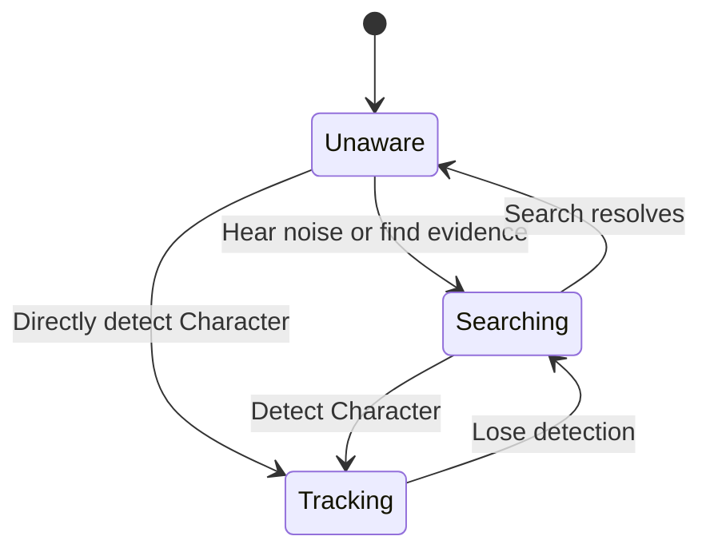

Canonical content pages own character, enemy, weapon, and item specifications. This page owns only rules that cross those boundaries.

## Shared action verbs

- **Move:** control spacing, approach threats, and navigate terrain.
- **Jump:** cross geometry, evade, and reach routes.
- **Aim and fire:** apply pressure while managing position and exposure.
- **Character ability:** invoke the selected character's innate action.
- **Explore:** notice routes, sealed interactions, and later opportunities.

See [[Characters/Rook|ROOK]] for the accepted baseline implementation.

## Deployment

> **Accepted** — At the Hub, the player selects one [[Characters/Overview|crew member]], one of that character's unlocked [[Gameplay/Overdrive|Specializations]], and compatible equipment for the deployment. Character and Specialization switching ordinarily occurs only at the Hub after death or voluntary return.

The scripted activation trials inside [[Missions/M05|The Four Trials]] are the sole accepted exception: control temporarily passes from the Systems Specialist to another crew member inside each trial room. This does not permit general mid-Mission switching.

Each Character and Specialization combination must transform shared verbs through movement, attack geometry, range, risk, defence, resources, or route access. Cosmetic and minor statistical variation are insufficient.

## Ground movement

> **Accepted** — Baseline movement uses one digital run speed with very quick acceleration and immediate or near-immediate reversal. There is no analogue walk, sprint, or stamina state.

Keyboard and gamepad must produce equivalent movement timing. Exact speed and acceleration require playtesting.

## Jump and air control

> **Accepted** — The baseline uses one variable-height jump, moderate horizontal air control, faster fall than rise, and short coyote-time and jump-buffer windows.

Double jump, wall jump, ledge grab, and air dash are absent from the baseline. See [[Characters/Rook|ROOK]] for character-specific limits.

## Aiming and firing

> **Accepted** — Player and enemy fire use the same eight-direction gameplay lattice. Continuous-angle aiming is rejected.

The primary gamepad binding quantizes right-stick direction and begins firing beyond its threshold. Returning to neutral stops firing input. Weapon cadence remains equipment-specific; see [[Equipment/EQ001|Baseline Rifle]].

Grounded aim-lock is an optional alternative that plants the character and redirects fire. Keyboard may support directional-fire keys, quantized mouse-directed fire, and aim-lock, but every scheme must produce the same eight gameplay directions.

> **Open question** — Airborne aim-lock and default keyboard bindings.

## Enemy directional envelopes

> **Accepted** — Each [[Enemies/Overview|enemy]] receives an authored subset of the eight-direction lattice. Directional limitations create readable safe spaces and meaningful combinations.

High and low shots are separate lanes within horizontal fire, not separate aim directions.

## Enemy awareness

> **Accepted** — Enemy awareness of a Character uses three states. Stun and disorientation are separate control effects and do not replace awareness state.

| State | Enemy behaviour | Ghost Ambush eligible |
|---|---|:---:|
| Unaware | Has no evidence of the Character | Yes |
| Searching | Investigates noise or a last known position without current target lock | Yes |
| Tracking | Currently detects and targets the Character | No |

[[Equipment/EQ003|Active Camouflage]] breaks Tracking into Searching rather than erasing awareness. An Ambush creates noise, moves nearby enemies into Searching, and normally causes a surviving struck target to Track Ghost. Breaking detection moves Tracking into Searching; unresolved search eventually returns to Unaware.

## Camera

> **Accepted** — Smooth side-follow with horizontal and vertical dead zones, gradual movement-based look-ahead, slight upward framing bias, authored level bounds, backward repositioning support, and no forced scrolling in the baseline.

Aiming alone does not move the baseline camera. Explicit Equipment such as [[Equipment/EQ010|Targeting Optics]] may apply an authored aiming-camera override. Exact values require [[Gameplay/Representative Encounter|blockout evidence]].

## Damage and integrity

> **Accepted** — The baseline uses a small segmented integrity bar, provisionally five segments. Standard attacks remove one; heavy hazards may remove two. Ordinary threats do not cause one-hit deaths.

Damage produces immediate visual/audio feedback, a brief hit reaction, and short post-hit invulnerability. Exact values remain tunable.

## Equipment ownership

> **Accepted** — Weapons, armour, consumables, currencies, and key items belong to the shared [[Equipment/Overview|crew stash]]. Item upgrades stay with the item; innate abilities and mastery stay with the character; discoveries and shortcuts stay with the campaign.

Specializations define compatible weapon and armour classes. Equipment may alter a compatible kit but must not erase the Specialization's defining movement, risk, range, or combat commitments.

## Specializations and Overdrive

[[Gameplay/Overdrive|Specializations and Overdrive]] owns the three-layer configuration model, global reveal, transformation rules, activation Mission, and twelve-Specialization compatibility requirement. Meter gain, activation input, duration, and cancellation remain unresolved cross-cutting mechanics.

## Memory Imprints

[[Imprints/Overview|Memory Imprints]] must change both understanding and action. Their acquisition, assignment, capacity, compatibility, transfer, persistence, and loss remain unresolved.
