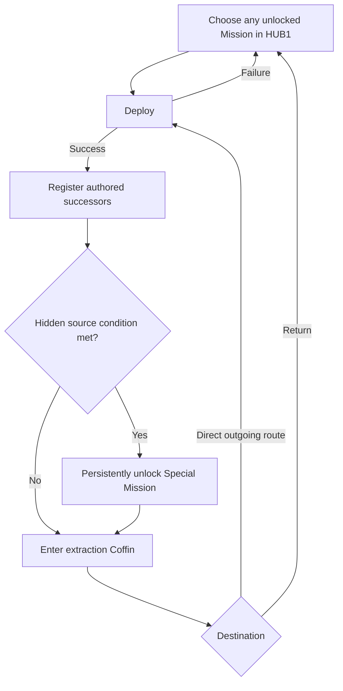

## Leading structure

> **Accepted** — The game uses an **authored campaign** rather than procedural levels or fully randomized runs. Zones, Encounters, and major set pieces are deliberately composed and remain stable enough for players to learn and master.

Replay value should come from:

- materially different [[Characters/Overview|playable characters]] and [[Gameplay/Overdrive|Specializations]];
- [[Imprints/Overview|Memory Imprints]] that change both knowledge and capability;
- alternate routes and persistent shortcuts;
- discoveries that change later attempts;
- equipment, weapon, or skill choices;
- mastery of known encounters;
- selected post-death choices.

## Memory Imprints

> **Accepted** — Memory Imprints connect discovery to progression. They expose evidence about identity and institutional purpose while granting techniques, knowledge, interactions, or route access.

The canonical Imprint page owns unresolved capacity, assignment, transfer, compatibility, and in-campaign loss rules.

## Character, Specialization, and Overdrive progression

> **Accepted** — Each of four Characters has three Hub-selected Specializations. A Character becomes available with a default Specialization; two additional Specializations unlock through later campaign play. Selecting a Specialization changes normal stats, skills, weapon and armour compatibility, and play style for the entire Mission.

> **Accepted** — Overdrive remains concealed at the start of the campaign. [[Missions/M05|The Four Trials]] later reveals and unlocks it once for the entire crew through four character-specific trials. After that global reveal, every unlocked Specialization has its unique Overdrive, and newly acquired Specializations include theirs without another Overdrive-specific unlock.

The early Character sequence is accepted: ROOK at new game, VECTOR at the first Hub, RAM after [[Missions/M03|No Survivors Logged]], and RELAY after [[Missions/M04|Production Halt]]. Acquisition methods for the eight non-default Specializations remain unresolved. See [[Gameplay/Overdrive|Specializations and Overdrive]] for accepted boundaries.

## Hub preparation

> **Accepted** — Before deployment, Character selection exposes stats, equipment, skills, and the selected Specialization. The Hub provides a safe, repeatable space to test movement, attacks, skills, equipment changes, and the Character-owned optional-route verb without consuming campaign resources or beginning a Mission.

Visual design, silhouette, carried equipment, and animation should imply the broad play style before the player reads exact values. Coffin stations own Character and Specialization selection; a separate equipment area owns loadout changes; HUB1's central route terminal owns Mission selection.

## Mission compatibility

> **Accepted** — M01–M05 form a controlled crew introduction and may restrict or switch the playable Character. M01 begins with one Character, later Missions expand the available roster, M04 features its required new Character, and M05 deliberately breaks the normal deployment rule by switching across the full crew.

> **Accepted** — From HUB1 onward, every Mission's critical path is completable by every Character and unlocked Specialization. Character-owned signature verbs may gate only optional routes, shortcuts, Imprints, Specializations, equipment access, and other rewards. Every Specialization of that Character retains the route-access verb. An inaccessible optional route should use a consistent Character-specific affordance: mysterious before that Character's introduction, recognizable afterward, and confirmable through brief wrong-Character feedback without revealing its contents.

## Successful extraction routing

> **Accepted** — Extraction routing is one campaign-wide Coffin system with authored destinations per Mission.

| Campaign phase | Typical extraction destinations |
|---|---|
| Act I | HUB0, preserving controlled roster and system introductions |
| Act II | Authored direct successors, discovered optional paths, or HUB1 |
| Act III | Authored direct successors or HUB2 where appropriate |
| M01 | Controlled exception: begins directly, extracts to HUB0 |

A Mission may offer only its Hub and is not required to branch. Direct continuation always preserves Character, Specialization, and equipment; returning to a Hub enables reconfiguration.

## Act II Mission availability

> **TODO — Special-route conditions:** Define distinct hidden requirements inside MB02, MC02, and MD01 that unlock their outgoing Special Missions without using objective markers or a shared checklist. MA01 uses its accepted unstable memory-replay traversal and transit-rerouting action.

> **Accepted** — HUB1 initially offers MA01, MB01, MC01, and MD01. At successful extraction, the Coffin offers only the completed Mission's authored outgoing destinations plus HUB1. Direct continuation preserves Character, Specialization, and equipment; reconfiguration requires returning to HUB1.

MA01, MB02, MC02, and MD01 each contain a different hidden action that unlocks MS01, MS02, MS03, and MS04 respectively. Once its condition is satisfied on a successful run, the Special Mission remains unlocked for that campaign even if the player chooses another exit, later dies, or postpones returning to HUB1. Returning registers it in the Hub Mission pool. A new campaign resets these unlocks.

Special Missions unlock cross-biome M02 shortcuts: MS01 → MC02, MS02 → MA02, MS03 → MD02, and MS04 → MB02. The destination M01 may be bypassed for progression but remains available and replayable.

Player-facing extraction and Hub lists distinguish discovered Special Missions through indentation and a consistent special color, labeled only as a **shortcut** or **optional path** followed by the destination biome. They do not reveal the exact downstream Mission or reward. Do not call them secret, connect them visually as a set, or hint that any contributes to an ending. `MS01`–`MS04` are documentation IDs, not player-facing route classifications.

> **Accepted** — Completing the fourth Act II Guardian returns the player to HUB1 with M06 available; it does not automatically advance the campaign. The player may continue replaying Act II Missions. Launching M06 requires explicit confirmation that entering HUB2 and B07 permanently closes B03–B06 and their undiscovered rewards for the current campaign.

All Specialization Imprints and all four biome Memory Imprints required for the extended route must be recovered before M06 begins. Eligibility is established before M06 even though the hidden access appears later in M07.

## Introduction exception

> **Accepted** — The new game begins directly in [[Missions/M01|Cold Deployment]] with preselected character and equipment. Failure restarts inside the introduction; the Hub and standard death cycle unlock only after first success. The player is not told that Overdrive exists during the introduction.

## Recovery Capsule lifecycle

> **Accepted** — Each Character has three Specialization-specific Recovery Capsule variants, called “Coffins” by the crew. Four rail-connected Hub docking stations represent the full roster, one station per Character, with only the selected Specialization's Coffin docked. The deployed Character enters that Capsule; it leaves the Hub and returns by rail after success or death. A death return shows the Character awakening inside before Hub control resumes.

HUB0 initially shows ROOK and VECTOR's default Coffins in two stations with two stations empty. RAM's arrival fills the third; RELAY's fills the fourth. When not deployed, a Character may be active in the Hub while their selected Capsule remains docked, or sleep inside its closed Capsule.

Recovery remains causally unexplained: the Coffin returns closed, docks, opens pneumatically, and the Character wakes or exits without fabrication effects, medical explanation, or replacement-body evidence.

Locked Specialization choices are absent from the selection UI. Each Coffin carries an illuminated central Character emblem and adjacent decorative elements that gain color as additional Specializations unlock. Once a second Specialization is available, activating the station offers the unlocked Coffin variants; changing Specialization physically swaps Capsules by rail. No `1/3` counter appears before the ending report reveals the twelve-Specialization total.

## Death and Mission retry

> **Accepted** — M01 death restarts M01 directly because the Hub has not yet been introduced. After HUB0 unlocks, death returns the deployed Character to their personal Recovery Capsule, called a “Coffin” by the crew in the current Hub. The failed Mission resets to its beginning.

Death removes no currency, equipment, Imprint, Character progression, or other campaign resource. Campaign rewards already registered remain acquired. From the Hub, the player may retry, change Character or Specialization, alter equipment, test the new configuration, or choose another available Mission.

“Roguelite” is not a canonical term for this structure. Death reopens authored decisions without randomizing or replacing the campaign.

## Checkpoints and shortcuts

Persistent shortcuts are preferred over a dense chain of invisible restart checkpoints because they turn progress into learned and changed world structure. However, forcing long repeated traversal can undermine action-platformer pacing.

Fast travel is not assumed. It remains an option only if the final world structure needs it and if it can be presented without erasing spatial meaning.

## Resources and persistence

> **Accepted** — The [[Equipment/Overview|crew stash]] shares weapons, armour, consumables, currencies, and key items. Item upgrades remain attached to the item; innate abilities and personal mastery remain character-owned. Specializations constrain compatible weapon and armour classes rather than creating separate inventories.

Death does not remove shared resources or acquired upgrades.

## Difficulty and mastery

Challenge should grow through new patterns, spatial demands, enemy combinations, route decisions, and character mastery—not only larger health or damage values.

## Completion and discovery report

> **Accepted** — The Standard ending resolves the immediate campaign conflict and must feel like a satisfying standalone completion. Deeper routes add evidence and interpretation rather than repairing an intentionally incomplete ending.

> **Accepted** — One unusually thorough campaign can reach the extended true route by satisfying its in-campaign requirements. Cross-run progression is not required, but a blind first completion is expected to miss evidence and motivate another campaign.

The game does not expose biome Memory Imprints as a four-part route checklist during play. They should initially read as optional lore. Both the Standard and early Communion endings reveal the same results-report structure, placing ordinary performance statistics beside previously hidden completion totals.

| Report field | Purpose |
|---|---|
| Completion time | Familiar performance context |
| Enemies defeated | Familiar performance context |
| Bullets fired and accuracy | Familiar performance context |
| Biome Memory Imprints found out of 4 | First explicit evidence that the lore forms an incomplete set |
| Specializations unlocked out of 12 | Shows that substantial crew development remains |

Performance statistics are informational only. Completion time, enemy count, shots, accuracy, score, difficulty, and similar metrics never affect ending or hidden-route eligibility. Only the twelve in-campaign Specializations and four biome Memory Imprints establish access.

The report does not announce a true ending or explain how the missing discoveries interact. A Communion completion may show much lower campaign completion than the Standard ending; that contrast is intentional. The report's purpose is to let the player infer that the campaign contains a larger pattern and choose to investigate it.

### Persistence across campaigns

| Reset for a new campaign | Preserve globally |
|---|---|
| Character availability and campaign sequence | Viewed memory and lore scenes |
| Specializations and Equipment Imprints | Character-specific variants already witnessed |
| Acquired equipment and campaign resources | Previous ending reports and performance statistics |
| Biome Memory Imprints and hidden-route eligibility | Completed-ending record |

HUB1's evidence archive separates **Current operation** evidence from visibly archival **Prior records**. Both allow individual review, but neither exposes route counters or eligibility before a non-true ending report. The global archive helps the player compare evidence across completions but never satisfies an in-campaign requirement. Each attempt at the extended route must recover its required Specializations and biome Memory Imprints within that campaign. Additional completions expose alternative Character perspectives, routes, discoveries, and interpretations without producing one objectively complete explanation of the crew's origin.

### Repeat-campaign presentation

> **Accepted** — Every new campaign retains the complete M01–M05 crew-introduction sequence and grants no automatic Character or Specialization unlocks. After the player has reached an ending at least once, tutorial prompts may be disabled, viewed scenes and dialogue may be skipped, and loading or transition friction should be minimized.
