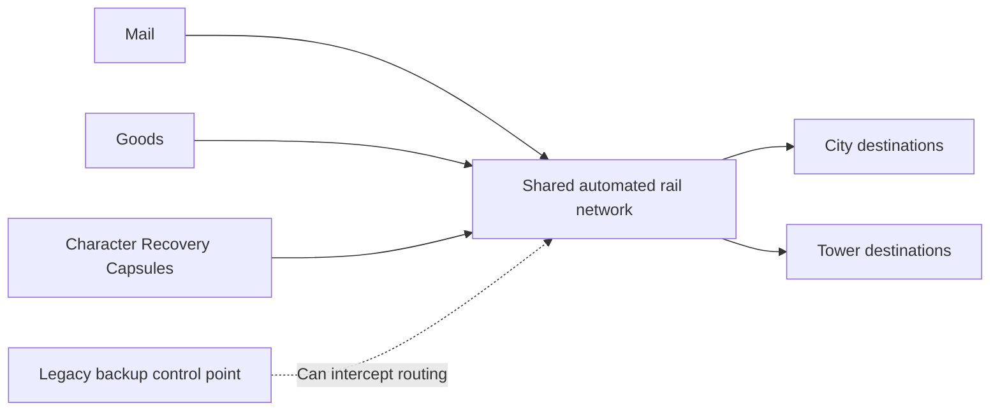

## Shared infrastructure

> **Accepted — Setting:** The same rail delivery network carries Character Coffins, mail, and goods around the city and tower. Routine routing was automated long before M03; the former command center remained available as a backup control point.

| Ownership | Boundary |
|---|---|
| This page | Shared cargo/transport premise and legacy backup control relationship |
| [[Gameplay/Progression#recovery-capsule-lifecycle|Recovery Capsule lifecycle]] | Character docking, deployment, return, death recovery, and campaign routing |
| [[Missions/M03#occupation-and-faction|M03]] | Gang occupation, toll racket, electricity controls, and local restoration |
| Individual Missions | Physical arrival and departure staging, safe docks, compatible routes |

A shared network does not establish universal access, ownership by OPERATOR, or one faction's ability to intercept every delivery. Electricity distribution is not Coffin cargo.

## Open infrastructure questions

> **TODO — Network scope:** Define backup authority limits, branching/dispatch interfaces, cargo carriers, and safe Capsule routing through contested districts only when their Missions require them. Clarify the tower name without revealing hidden B12 controls during Act I.

Do not add player freight trading, train driving, delivery errands, interception minigames, or new death penalties merely because civilian cargo shares the rails.
