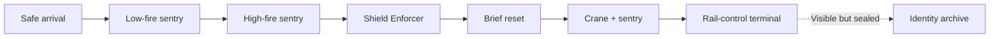

## Context

- **Location:** Freight Terminal
- **Mission:** [[Missions/M01|Cold Deployment]]
- **Character:** [[Characters/Rook|ROOK]]
- **Weapon:** [[Equipment/EQ001|Baseline Rifle]]
- **Enemies:** [[Enemies/Horizontal Sentry|Horizontal Sentry]] and [[Enemies/Shield Enforcer|Shield Enforcer]]

Those pages own content specifications. This page owns encounter order, combinations, exclusions, and evidence.

## Purpose

> **Accepted** — Prove shared action fundamentals before implementation expands into train spectacle, bosses, broad progression, VECTOR's contrasting pass, Memory-route gameplay, or the complete death cycle.

The flat pass should take approximately three to five minutes on a successful first attempt and remain cheap to rebuild.

## Validation passes

1. **Flat baseline:** one streamlined route and accepted threats.
2. **Route pass:** one compact upper/lower fork that rejoins before the objective.
3. **Memory pass:** a relevant [[Imprints/Overview|Memory Imprint]] opens a maintenance route into the sealed archive.

Do not build a later pass before the previous pass is satisfying.

## Flat-baseline graph



## Beat sequence

1. **Safe arrival:** give control immediately; test running, variable-height jumping, and firing without damage pressure while the objective and crew voices arrive over radio.
2. **Low-fire sentry:** teach jumping over a horizontal projectile.
3. **High-fire sentry:** teach combat sliding beneath a horizontal projectile.
4. **Shield Enforcer:** provide room to jump over its charge, reverse, and attack the exposed rear.
5. **Brief reset:** reveal the rail-control objective from safety.
6. **Crane and sentry:** combine a fixed low–high pattern with the cycling cargo container.
7. **Rail-control terminal:** complete the Mission while the ordinary interface briefly displays ROOK under an unknown designation marked killed in action. Give the record no camera emphasis, pause, or spoken reaction; continue the completion flow so the clue is easily overlooked.

Each beat teaches or combines one demand. No optional enemy, collectible, dialogue sequence, or route complexity belongs in the flat pass.

## Cargo-crane hazard

> **Accepted** — An overhead crane periodically lowers a cargo container into the lane. A warning beacon and floor shadow telegraph descent. The lowered container blocks movement and enemy fire; raising it restores the sentry's line of sight.

The player can wait, attack from temporary cover, or cross during the opening. Descent may remove two provisional integrity segments.

## Camera and restart

Use the cross-cutting [[Gameplay/Mechanics|camera and integrity rules]]. Reaching zero integrity restarts the flat Encounter from its entrance; this is a validation rule, not the final campaign death cycle.

## Explicit exclusions

- No boss or moving-train sequence
- No large enemy roster
- No complete upgrade economy
- No elaborate death-and-recovery implementation
- No opening menu, long cinematic, or production-scale narrative sequence
- No CraftPix requirement for the first geometric blockout

## Playable geometric blockout

> **Needs evidence** — A throwaway no-asset browser prototype now implements the seven flat-baseline beats, ROOK controls, integrity, sentries, Shield Enforcer, crane, camera, terminal, and opening radio sequence.

Run it with:

```sh
cd examples/demo/game
make prototype
```

Prototype source and the evidence checklist live in `examples/demo/game/prototype-freight-terminal/`. Values and implementation are not design truth until playtesting validates them.

## Evidence required

> **Needs evidence** — Tune movement, jump, camera, projectile timing, enemy spacing, integrity, feedback, and duration through play.

The flat baseline passes only when:

1. ROOK is satisfying without special progression;
2. each threat teaches a readable response;
3. combined pressure creates a decision rather than noise;
4. the player can explain what hurt them and what they would try next.

Later passes additionally require:

- upper and lower routes with different tactical value;
- VECTOR materially transforming the space through precision and mobility;
- one Memory Imprint that changes both understanding and action.

## Art and licensing

Use geometric placeholders first. Private CraftPix integration follows [[Design/Art Direction|Art Direction]] and remains outside AI inspection.

> **Needs image** — Add a human-created blockout screenshot after visual integration begins.
