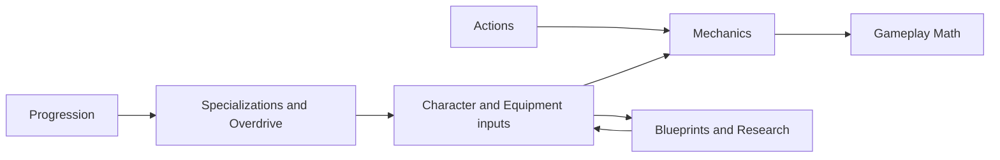

## System ownership

| System page | Canonical responsibility |
|---|---|
| [[Gameplay/Mechanics|Mechanics]] | Shared movement, combat, camera, damage, and cross-content interaction rules |
| [[Gameplay/Gameplay Math|Gameplay Math]] | Equations, tiers, modifiers, rounding, and clamping |
| [[Gameplay/Blueprints|Blueprints and Research]] | Shared loot fragments, direct unlocks, Research Terminal, and HUB Mesh Dive research |
| [[Gameplay/Progression|Progression]] | Deployment, persistence, death-cycle, Hub, and campaign advancement rules |
| [[Gameplay/Overdrive|Specializations and Overdrive]] | Configuration layers, Specialization selection, and Overdrive boundaries |

Individual content pages supply local inputs and exceptions rather than duplicating shared rules from this group.
