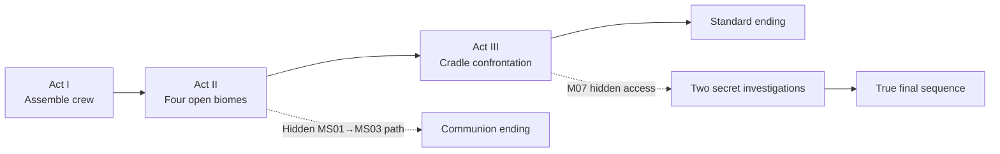

Review this page after every accepted design or cleanup iteration. It records only the decisions needed to understand and protect the game; linked pages own detail and evidence.

## Pitch

> **Imprint Zero** — *You know how to fight. Not who you are.*

A modern 16-bit side-scrolling action platformer about a crew of soldiers with reliable combat conditioning and unreliable identities. Run, jump, shoot, and discover routes through an authored industrial campaign. Character choice changes how each challenge is played; recovered Memory Imprints change both capability and understanding.

## Product at a glance

| Concern | Direction |
|---|---|
| Player experience | Readable but demanding run-and-gun combat, platforming, route discovery, and atmospheric mystery delivered through play |
| Crew | Four persistent characters, each with three full-Mission Specializations and a unique combat identity |
| Progression | Authored Missions, equipment, Specializations, and Memory Imprints; new campaigns reset gameplay while preserving viewed evidence globally |
| Hub and retry | Safely test configurations; death returns the selected Specialization's rail-delivered “Coffin” without resource loss |
| Format | PC-first, single-player, one deployed character; gamepad-led controls with fully remappable keyboard support |
| Scope | Compact 3–5 hour first completion; replay reveals character variation, hidden evidence, and alternative endings |
| Presentation | A modern memory of 16-bit action games filtered through worn, late-20th-century industrial cyberpunk |

## Campaign shape

The extended route requires all crew Specializations and one hidden biome Memory Imprint from each Act II biome before launching M06 closes those Missions. During play, biome Imprints appear only as lore. Standard and Communion ending reports first reveal the `x/4` and `x/12` totals without announcing a true ending; performance statistics never affect access.

## Design pillars

| Pillar | Production test |
|---|---|
| Action mastery comes first | Baseline movement and combat remain readable, responsive, and satisfying without progression or narrative rewards. |
| Character choice transforms play | After the introduction, every critical path supports every Character and Specialization; Character signature verbs gate only optional routes and rewards. |
| Discovery changes understanding and progression | Every Imprint pairs lore or a memory scene with a Specialization, equipment access, Overdrive, or hidden campaign evidence. |

## Narrative direction

OPERATOR deploys the crew into a collapsing industrial world, but its identity, embodiment, authority, and relationship to the command system remain uncertain. Early Missions produce genuine immediate benefits; later Missions reveal their unexpected consequences or institutional reuse. Evidence suggests the crew's bodies, memories, and identities may have been copied, reconstructed, manufactured, or otherwise altered.

No ending completely proves the crew's origin. The Standard ending must satisfy on its own; additional completions provide partial and potentially conflicting perspectives. An artificial, copied, composite, or reconstructed origin does not invalidate personhood.

## Current validation target

> **TODO — Representative proof:** Demonstrate one freight-terminal encounter with ROOK, then show how VECTOR and one Memory Imprint materially transform its decisions and route.

Validate action, readability, character contrast, and the visual style contract before expanding production. The next design question is whether the representative encounter expresses a game worth completing—not how much speculative content can be documented.

See [[Current Direction|Current direction]], [[Missions/Overview|Campaign progression]], [[Gameplay/Representative Encounter|Representative encounter]], and [[Design/Art Direction|Art direction]].
