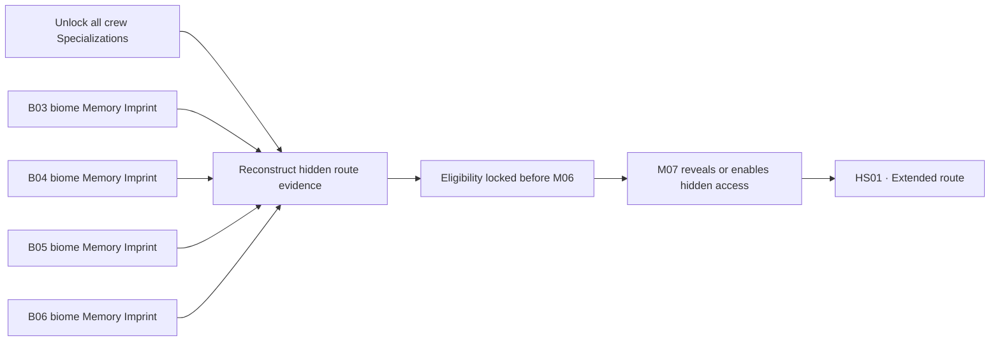

## Design role

> **Accepted** — Every Memory Imprint combines a narrative payload with a progression result. It adds lore through a memory or cutscene and changes what becomes available to the player.

An Imprint cannot exist only as passive lore or a context-free key. Its memory may be incomplete, subjective, or misleading, but its progression result must be explicit.

A shared Imprint preserves the same underlying evidence across Characters while foregrounding a memory fragment, interpretation, or reaction specific to the deployed Character. This creates replay perspective without requiring four unrelated versions of every scene. Biome Memory Imprints contain material relevant to the whole crew, but the recovering Character determines what the scene emphasizes.

| Imprint role | Progression result | Narrative requirement |
|---|---|---|
| Specialization Imprint | Directly unlocks one authored Specialization | Reveals memory or lore relevant to that Character and configuration |
| Equipment Imprint | Reveals a blueprint, source, shop item, crafting path, or other opportunity; equipment must still be acquired | Explains or complicates the equipment's origin and institutional purpose |
| Biome Memory Imprint | Contributes hidden evidence required for the M07 route; grants no direct combat power | Provides distinct memories relevant to every crew member |
| Overdrive Imprint | M05 exception that reveals and activates the concealed Overdrive system | Connects each crew member to the recovered system through a memory or cutscene |

## Character identity

> **Accepted** — Memory Imprints expand a character without replacing that character’s innate movement and combat identity.

The same Imprint may eventually interact differently with different crew members, but no transfer or compatibility rule is accepted yet.

## Known Imprints

At least sixteen Imprints are currently defined:

- four [[Imprints/Overdrive|Overdrive Imprints]] recovered during M05 — The Four Trials;
- eight Specialization Imprints distributed across B03–B06, unlocking two additional Specializations for each crew member;
- four biome Memory Imprints, one hidden in each of B03–B06.

The number and distribution of Equipment Imprints remain unresolved. See [[Gameplay/Overdrive|Specializations and Overdrive]] for configuration behavior.

## Campaign relationship

Imprints support:

* reinterpretation of known Zones;
* optional routes and sealed interactions;
* evidence about the crew’s unreliable identity;
* progression without procedural world replacement;
* new choices at the Hub.

## Extended-route prerequisites

> **Open question — Route synthesis:** Does synthesis reveal a location or phrase, create a combined Imprint capability, alter M07 directly, or require both knowledge and a specialized action?

> **In progress** — Access to the extended true-ending route from M07 requires both complete crew development and hidden memory evidence from every open Act II biome. These requirements must be complete before leaving HUB1 and starting M06; entering HUB2 makes B03–B06 unavailable for the remainder of that campaign.

The four **biome Memory Imprints** are separate from the eight Imprints that unlock additional Specializations. Each biome Imprint must reveal memories relevant to every crew member rather than functioning as a generic key or passive collectible.

During the campaign, biome Memory Imprints are presented as optional lore. The interface must not expose a four-part set, completion counter, or true-route purpose. A non-true ending's results report first reveals how many were found out of four, allowing the player to infer that the memories form a larger pattern.

| Requirement | Current rule | Unresolved detail |
|---|---|---|
| Crew development | Unlock all three Specializations for all four crew members | Exact acquisition and validation flow |
| Hidden evidence | Recover one biome Memory Imprint from each of B03–B06 | Location, challenge, and crew-specific memories |
| Route synthesis | Combine the four biome memories with the completed crew capabilities | Whether this produces knowledge, a passphrase, a capability, or a hybrid |
| M07 response | Prior Act II discoveries alter or unlock hidden access during M07 | Exact world change, interaction, and failure feedback |

## Freight Terminal candidate

> **TODO** — Define the first concrete exploration Imprint only after the flat [[Gameplay/Representative Encounter|Freight Terminal encounter]] works.

Its later validation must:

* reveal why the sealed identity archive matters;
* open a maintenance route or meaningful interaction;
* change how the player understands the introduction Mission;
* preserve [[Characters/Rook|ROOK’s]] innate identity.

## Unknown rules

> **Open question** — Exact acquisition flow, capacity, assignment, transfer, compatibility, and in-campaign loss.

> **Needs example** — Document one complete Imprint from discovery through narrative revelation and mechanical use.
