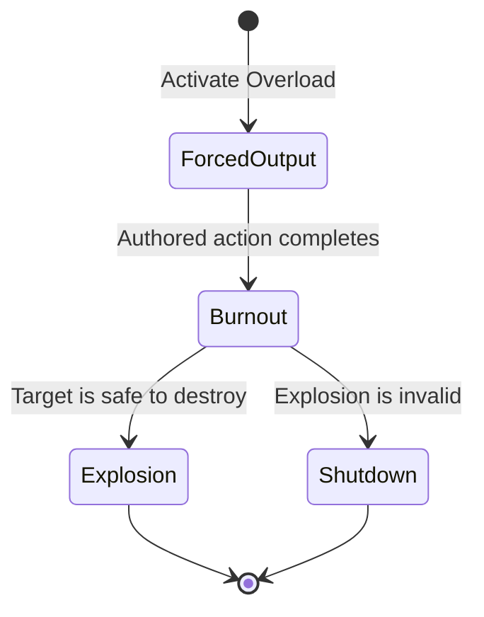

## Compatibility

| Field | Value |
|---|---|
| Required target tag | Powered System |
| Referencing profiles | [[Machine Profiles/MP001|MP001]], [[Machine Profiles/MP003|MP003]] |
| Starting state | Owned when RELAY joins after M04 |

## Effect

> **Accepted** — Overload forces a compatible machine beyond safe output, then consumes its useful function through burnout and an authored local explosion or shutdown.

The forced-output action comes from the target rather than granting RELAY direct control.

## Constraints

- Known standard targets use immediate target-and-activate input.
- Resistant targets require Access and the paused hacking minigame.
- Boss subsystems use authored results rather than whole-target destruction.
- Required route infrastructure cannot be destroyed.
- Exact forced-output duration, explosion radius, damage, and cooldown require prototypes.

## Required evidence

> **TODO — Overload prototype:** Validate target telegraphing, forced-output readability, safe exclusions, explosion timing, and Blackout chaining.
