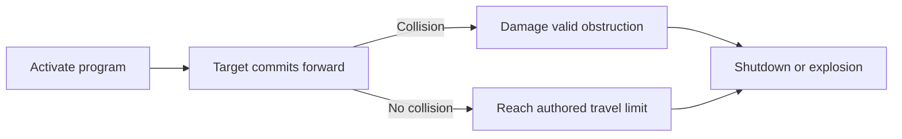

## Compatibility

| Field | Value |
|---|---|
| Required target tag | Mobile System |
| Referencing profiles | [[Machine Profiles/MP002|MP002 — Line Runner]] |
| Starting state | Owned when RELAY joins after M04 |

## Effect

> **Accepted** — Runaway Directive forces a compatible mobile machine forward without turning or voluntary stopping, then consumes it through shutdown or explosion.

Forward follows the target's current authored facing when activated.

## Constraints

- Eligible simple endpoints use Null's immediate Program Execution.
- Resistant targets still require Access; endpoints above the Execution Threshold require Mesh Dive.
- Collision cannot break non-reactive world geometry or substitute for RAM's Breach.
- Boss movement remains authored.
- Exact travel limit, impact, explosion, and cooldown require prototypes.

## Required evidence

> **TODO — Runaway prototype:** Validate facing communication, collision priority, damage attribution, route-boundary safety, and Blackout chaining.
