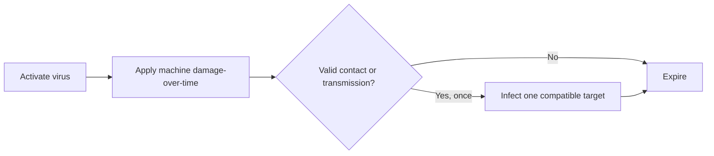

## Compatibility

| Field | Value |
|---|---|
| Required target tag | Connected System |
| Referencing profiles | Future profiles |
| Starting state | Permanently learned when [[Imprints/Relay Null|Null]] unlocks |

## Effect

> **Accepted** — Cascade Virus applies damage-over-time and spreads once through valid physical contact or authored system transmission.

Its intrinsic spread and Blackout's one additional program chain do not recurse from secondary targets.

## Constraints

- Known standard targets use immediate target-and-activate input.
- Resistant targets require Access and the paused hacking minigame.
- Boss spread points and results remain authored.
- Required route infrastructure cannot be infected.
- Exact duration, tick rate, transmission choice, and cooldown require prototypes.

## Required evidence

> **TODO — Cascade prototype:** Validate transmission readability, non-recursive chaining, target selection, damage pacing, and interaction with Blackout.
