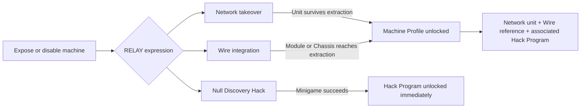

## Ownership

> **Accepted** — Machine Profiles are RELAY-owned progression rather than crew-stash Equipment.

[[Characters/Relay|RELAY]] owns how Wire, Network, and Null use the arsenal. This catalogue owns profile acquisition, profile-to-output relationships, and cross-profile comparison. Source [[Enemies/Overview|Enemy]] pages continue to own hostile behaviour and combat inputs; a Machine Profile owns only RELAY's recovered expression of that machine.

Machine Profiles, Controlled Units, Integrated Modules, Chassis Integrations, and Hack Programs receive no `EQ###` IDs and cannot be equipped by another Character.

## Profile structure

| RELAY Specialization | Profile relationship |
|---|---|
| Network | Defines one distinct Controlled Unit configuration and its Command Cost. |
| Wire | References one Integrated Module in a fixed slot or one Chassis Integration. |
| Null | References one Hack Program; multiple profiles may teach the same program. |

Multiple machine archetypes may share one Integrated Module, and still more may share one Hack Program. The intended catalogue relationship is therefore:

$$
\text{Controlled Units} > \text{Integrated Modules} > \text{Hack Programs}
$$

A duplicate module or program remains a valid profile association but is not announced as a new unlock.

## Acquisition

- A newly controlled Network unit must survive to successful extraction.
- A newly integrated Wire module must remain installed through successful extraction.
- A newly entered Chassis Integration must reach extraction intact.
- Every qualifying machine brought out may unlock; recovery is not limited to one profile per Mission.
- A successful Discovery Hack executes its Hack Program once against the discovery target and teaches it permanently without extraction or a random roll.
- Immediately after success, Null may replace one equipped program with the discovery or keep the current three; replaced programs remain owned but cannot be re-equipped until the Hub, and a newly equipped discovery begins ready.
- Recovering a later profile still unlocks its Network and Wire expressions when its associated module or program is already known.

## Starting profiles

> **Accepted** — RELAY brings three Helix Foundry profiles into the Hub after M04: Fabricator, Line Runner, and Process Warden.

The three starting profiles collectively supply Wire's initial Weapon, Mobility, and Systems modules. They also provide three future Network units and two Null Hack Programs, demonstrating shared program associations from the first complete RELAY arsenal.

## Stable IDs

> **Accepted** — Machine Profiles use `MP###`, Wire Integrations use `WI###`, and Null Hack Programs use `NH###`.

A Controlled Unit inherits its Machine Profile ID rather than receiving a redundant unit ID. `WI###` covers both ordinary Integrated Modules and Chassis Integrations, with type stored separately.

## Catalogue

### Controlled Units

| `MP###` | Source machine | Command Cost | Wire output | Null program | Status |
|---|---|---:|---|---|---|
| [[Machine Profiles/MP001|`MP001` — Fabricator]] | Helix assembly and cutting machine | 1 | [[Machine Profiles/WI001|`WI001` — Arc Cutter]] | [[Machine Profiles/NH001|`NH001` — Overload]] | In progress |
| [[Machine Profiles/MP002|`MP002` — Line Runner]] | Helix material-transport machine | 2 | [[Machine Profiles/WI002|`WI002` — Runner Legs]] | [[Machine Profiles/NH002|`NH002` — Runaway Directive]] | In progress |
| [[Machine Profiles/MP003|`MP003` — Process Warden]] | Helix inspection and security machine | 2 | [[Machine Profiles/WI003|`WI003` — Sensor Array]] | [[Machine Profiles/NH001|`NH001` — Overload]] | In progress |

### Integrated Modules and Chassis

| `WI###` | Type | Slot | Referencing profiles | Status |
|---|---|---|---|---|
| [[Machine Profiles/WI001|`WI001` — Arc Cutter]] | Integrated Module | Weapon | `MP001` | In progress |
| [[Machine Profiles/WI002|`WI002` — Runner Legs]] | Integrated Module | Mobility | `MP002` | In progress |
| [[Machine Profiles/WI003|`WI003` — Sensor Array]] | Integrated Module | Systems | `MP003` | In progress |

### Hack Programs

| `NH###` | Program | Compatible targets | Referencing profiles | Status |
|---|---|---|---|---|
| [[Machine Profiles/NH001|`NH001` — Overload]] | Force a machine to exceed safe operating limits and burn out | `MP001`, `MP003` | In progress |
| [[Machine Profiles/NH002|`NH002` — Runaway Directive]] | Force a mobile machine forward until collision or shutdown | `MP002` | In progress |
| [[Machine Profiles/NH003|`NH003` — Cascade Virus]] | Apply machine damage-over-time that spreads once through valid contact or transmission | Future profiles | In progress |
