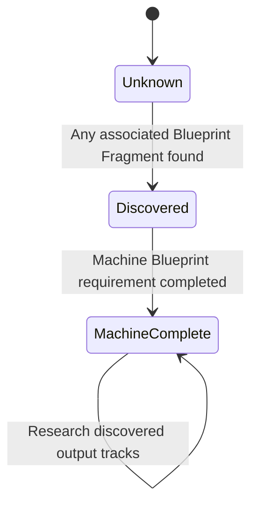

## Ownership

> **Accepted** — A Machine Profile is a shared campaign research record rather than a RELAY-owned unlock package.

[[Gameplay/Blueprints|Blueprints and Research]] owns fragments, direct unlocks, the Research Terminal, and shared acquisition. This catalogue owns source-machine compatibility and profile-to-output mappings. Source [[Enemies/Overview|Enemy]] pages own hostile behaviour. Character and Equipment pages own unlocked output behaviour.

Controlled Units, Wire Integrations, and Hack Programs remain RELAY-owned capabilities. Physical `EQ###` Equipment belongs to the shared crew stash even when a Machine Profile supplies its Output Blueprint.

## Profile structure

| Profile relationship | Cardinality | Eligibility |
|---|---:|---|
| Machine Blueprint | `1` | Completing its fragment track unlocks the machine result and Hub research boards. |
| Network Controlled Unit | `0–1` | Source has a compatible autonomous machine and control architecture. |
| Wire Integrations | `0–many` | Source contains physically compatible hardware. |
| Null Hack Programs | `0–many` | Source exposes writable functions with authored destructive results. |
| Equipment and other outputs | `0–many` | Source supports a distinct producible reward for any crew member. |

> **Accepted** — No optional output category is mandatory. A source receives an `MP###` page only when its machine unlock or linked outputs create persistent gameplay value.

Multiple profiles may reference the same Integration, Hack Program, Equipment item, or other Output Blueprint. Duplicate associations remain valid but do not create duplicate items.

## Blueprint loot-table rule

> **Accepted** — Each Machine Profile canonically owns its source-archetype Blueprint loot table.

| Required field | Responsibility |
|---|---|
| Output ID | Identifies the Machine Blueprint or linked producible reward. |
| Required fragments | Defines that track's completion requirement. |
| Enemy-drop eligible | Determines whether ordinary defeats may roll the fragment. |
| Field Discovery Node | Determines whether source-machine Hack boards expose it. |
| Hub research node | Determines whether Research Terminal boards expose it after Machine Blueprint completion. |
| Notes | Records exceptional conditions or concealed compatibility. |

Mission pages own unique authored pickup placements and Boss or chest bundles. [[Gameplay/Blueprints|Blueprints and Research]] owns shared drop, persistence, completion, and board rules.

## Discovery states

A discovered Profile displays only known information and fragment progress. Concealed outputs receive no placeholder, count, or completion announcement. **Machine complete** describes only the Machine Blueprint; the interface exposes no full-Profile research state before the post-ending ledger.

## Acquisition relationship

- Any Character may contribute [[Gameplay/Blueprints|Blueprint Fragments]] through combat, drops, chests, Boss rewards, or authored exploration.
- RELAY may collect fragments by routing through optional Discovery Nodes inside field or Hub hacking boards.
- Network extraction awards Machine Blueprint fragments only. Unit condition changes the award, but successful extraction always grants at least one.
- Completing a Machine Blueprint immediately unlocks its machine result and persistent authored Hub research boards; it does not unlock linked outputs.
- RELAY may use those boards to recover remaining linked fragments.
- Network may produce and deploy the completed machine pattern only when this Profile marks it control-compatible.

## Starting profiles

> **Accepted** — RELAY brings Fabricator, Line Runner, and Process Warden gear and records from M04 without exposing the Blueprint system early. M05 activation imports them as completed starter research.

Together they provide Wire's first owned Integrations, Network's initial five-point compatible roster, Null's first two programs, and RELAY's starter primary weapons. Wire initially equips Runner Legs and Sensor Array while leaving Arc Cutter Hub-selectable so Adaptive Chain Sickles remain in their default form.

## Stable IDs

> **Accepted** — Machine Profiles use `MP###`, Wire Integrations use `WI###`, Null Hack Programs use `NH###`, and physical Equipment uses the shared `EQ###` sequence.

The Machine Blueprint track lives inside its `MP###` record rather than receiving another ID. A Controlled Unit inherits its source Profile ID when one exists. `WI###` covers ordinary Integrated Modules and Chassis Integrations, with type stored separately.

## Catalogue

### Machine Profiles

| `MP###` | Source machine | Network / Cost | Wire outputs | Null programs | Equipment outputs | Status |
|---|---|---|---|---|---|---|
| [[Machine Profiles/MP001|`MP001` — Fabricator]] | Helix assembly and cutting machine | Fabricator / `1` | [[Machine Profiles/WI001|`WI001`]] | [[Machine Profiles/NH001|`NH001`]] | [[Equipment/EQ020|`EQ020`]] | In progress |
| [[Machine Profiles/MP002|`MP002` — Line Runner]] | Helix material-transport machine | Line Runner / `2` | [[Machine Profiles/WI002|`WI002`]] | [[Machine Profiles/NH002|`NH002`]] | [[Equipment/EQ021|`EQ021`]] | In progress |
| [[Machine Profiles/MP003|`MP003` — Process Warden]] | Helix inspection and security machine | Process Warden / `2` | [[Machine Profiles/WI003|`WI003`]] | [[Machine Profiles/NH001|`NH001`]] | [[Equipment/EQ022|`EQ022`]] | In progress |

### Wire Integrations

| `WI###` | Type | Slot | Referencing profiles | Status |
|---|---|---|---|---|
| [[Machine Profiles/WI001|`WI001` — Arc Cutter]] | Integrated Module | Weapon | `MP001` | In progress |
| [[Machine Profiles/WI002|`WI002` — Runner Legs]] | Integrated Module | Mobility | `MP002` | In progress |
| [[Machine Profiles/WI003|`WI003` — Sensor Array]] | Integrated Module | Systems | `MP003` | In progress |

### Hack Programs

| `NH###` | Program | Compatible targets | Referencing profiles | Status |
|---|---|---|---|---|
| [[Machine Profiles/NH001|`NH001` — Overload]] | Force unsafe output followed by burnout | Powered System | `MP001`, `MP003` | In progress |
| [[Machine Profiles/NH002|`NH002` — Runaway Directive]] | Force committed forward movement until collision or shutdown | Mobile System | `MP002` | In progress |
| [[Machine Profiles/NH003|`NH003` — Cascade Virus]] | Apply machine damage-over-time with one controlled spread | Connected System | Future profiles | In progress |
