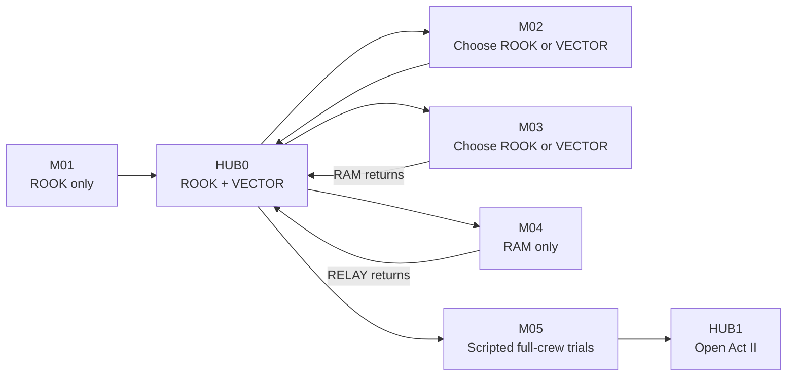

## Campaign flow

Character selection occurs in HUB0 and remains fixed during M02–M04. M01 begins directly without Hub selection; M05 uses authored control transfers rather than free switching.

## Mission progression

| Mission | Playable availability | Experiential role | Narrative shift |
|---|---|---|---|
| [[Missions/M01|M01 — Cold Deployment]] | ROOK only | Begin in action; teach baseline movement and combat | A routine terminal briefly lists ROOK under another designation as killed in action; nobody reacts. |
| [[Missions/M02|M02 — Containment Doctrine]] | ROOK or VECTOR | Introduce Hub selection and Character-owned optional-route differences | The apparent outbreak is connected to corrupted Imprint data. |
| [[Missions/M03|M03 — No Survivors Logged]] | ROOK or VECTOR; RAM appears as scripted support | Reinforce Character identity and introduce RAM's breaching verb | An obsolete organizational unit complicates the crew's history; RAM returns and becomes available. |
| [[Missions/M04|M04 — Production Halt]] | RAM only | Apply breaching and destruction through Helix Foundry | RAM recovers RELAY; manufactured bodies resemble crew templates without proving their origin. |
| [[Missions/M05|M05 — The Four Trials]] | Scripted transfers among all four Characters | Complete four trials in any order; reveal Overdrive and Imprint progression | An external system recognizes compatibility between the crew and stored Imprints. |

## Act invariants

- OPERATOR and the Missions initially feel legitimate; success produces genuine immediate benefits.
- Identity evidence complicates the operation without making OPERATOR an obvious liar or resolving the crew's origin.
- M01–M05 are controlled Character-availability exceptions. From HUB1 onward, every critical path supports every available Character and Specialization.
- Four readable Coffin docking stations show roster growth: two occupied after M01, RAM's third after M03, and RELAY's fourth after M04.
- Detailed rooms, encounters, dialogue, and timing belong to individual Mission pages; biome identity belongs to [[Biomes/B01|B01]] and [[Biomes/B02|B02]].
