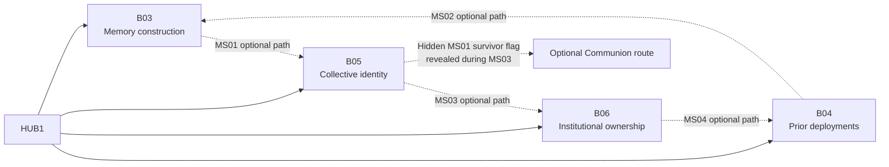

## Campaign shape

The full crew is available from HUB1. Every critical path supports every Character and unlocked Specialization; Character-owned verbs gate optional access only. Successful extraction offers authored outgoing destinations or HUB1, and direct continuation preserves the current configuration.

## Branches

| Biome | Dominant question | Main Missions | Transitional Special Mission |
|---|---|---|---|
| [[Biomes/B03|B03 — Mnemonic Basilica]] | How can identity be edited or assembled? | [[Missions/MA01|MA01]]–[[Missions/MA03|MA03]] | [[Missions/MS01|MS01]] → B05 |
| [[Biomes/B04|B04 — The Fallen Halo]] | What preceded the current deployments? | [[Missions/MB01|MB01]]–[[Missions/MB03|MB03]] | [[Missions/MS02|MS02]] → B03 |
| [[Biomes/B05|B05 — Verdant Null]] | Can identities coexist without erasure? | [[Missions/MC01|MC01]]–[[Missions/MC03|MC03]] | [[Missions/MS03|MS03]] → B06 |
| [[Biomes/B06|B06 — Sovereign Stack]] | Who claims ownership of manufactured soldiers? | [[Missions/MD01|MD01]]–[[Missions/MD03|MD03]] | [[Missions/MS04|MS04]] → B04 |

Each Special Mission is unlocked by a different unmarked action in its source Mission. Player-facing interfaces present it only as an optional path or shortcut to a named biome. The exact downstream Mission, reward, four-part pattern, and Communion relevance remain concealed.

## Narrative function

Act II moves from the fact that crew records conflict toward competing explanations of what identity means. Memories may be extracted or edited; related units may have deployed before; the Continuum claims plurality can preserve individuals; institutions classify reusable people as assets. These are evidence lenses, not four conclusive revelations.

| Boundary | Rule |
|---|---|
| Crew origin | Clone, synthetic, composite, reconstructed, and legal-continuation accounts may overlap or conflict; none becomes objective truth. |
| OPERATOR | Remains useful and operationally familiar while evidence complicates its knowledge and authority; do not establish that it designed the project, changed its own directive, or acts as one entity. |
| Early consequences | Later evidence may reframe unavoidable earlier successes without making their immediate public benefit false. |
| Communion | MS01's hidden survivor action changes MS03; the revealed SE01 passage and final Communion choice remain optional. |
| Progression | Specialization Imprints, equipment access, Overdrive, and biome Memory Imprints are owned by [[Gameplay/Progression|Progression]], not assigned here. |

Detailed prerequisites and extraction routing are owned by [[Missions/Overview|Campaign progression]]. Mission pages own objectives and evidence; biome pages own their dominant mystery; [[Missions/Secret Ending|Communion]] owns the early-ending route.
