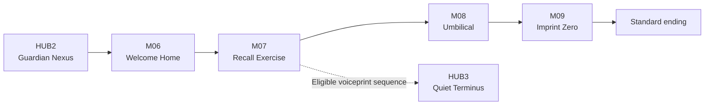

## Purpose

> **TODO — Act population:** Define rooms, Encounters, rewards, supporting dialogue, environmental storytelling, and production assets in a later population pass. This page currently owns only conflict-free narrative and campaign boundaries.

Act III gives the Standard campaign a complete ending without objectively resolving the crew's origin or OPERATOR's identity. [[Current Direction|Current Direction]] remains authoritative when later population work introduces evidence.

## Campaign structure

Successful M06–M08 deployments may follow authored direct routes or return to HUB2. Entering either physical exit after M07 commits the campaign to that route.

## Mission responsibilities

| Mission | Accepted responsibility |
|---|---|
| [[Missions/M06|M06]] | Turn the familiar Empty Barracks homecoming into a utilization trap after OPERATOR disappears. |
| [[Missions/M07|M07]] | Escape utilization, defeat the Instructor, and expose the normal Cradle route plus an eligibility-gated exterior exit. |
| [[Missions/M08|M08]] | Reveal biological recycling, later-crew production, and a deployment volume larger than one city requires. |
| [[Missions/M09|M09]] | Defeat the four Imprint Zero templates and Imprint One, overload the Cradle, and escape. |

## Evidence boundaries

| Subject | Act III may establish | Act III must not establish |
|---|---|---|
| Empty Barracks | It is a real, unoccupied conditioning and utilization façade matching crew memories. | Whether the current crew physically trained there or inherited memories composed from it. |
| Prior crews | Available records end in utilization; none shows another complete crew reaching B08. | That no prior crew ever escaped, or that every record describes the same continuing people. |
| Cradle | It assembles later crews from recovered biological material, Imprint Zero references, and returned Mission records. | Which physical or mnemonic pieces persist into a particular Character. |
| Imprint Zero | Four altered bodies act as anatomical and mnemonic reference templates. | Whether they are originals, early copies, modified donors, composites, or inherited replacements. |
| OPERATOR | OPERATOR-associated credentials can activate Imprint Zero and Imprint One. | Whether OPERATOR authored or relayed the orders, controls the Cradle, or is one entity. |
| Wider operation | Production volume exceeds one city's apparent needs. | The city's testing-ground role, external buyers, or contractor-suppression purpose reserved for Act IV. |

## Standard outcome

The selected Character defeats Imprint One. The crew then coordinates an irreversible production-core overload, escapes together, and watches the Cradle collapse. This stops the immediate replacement cycle and provides a satisfying completion while leaving the wider system and ultimate provenance unresolved.
