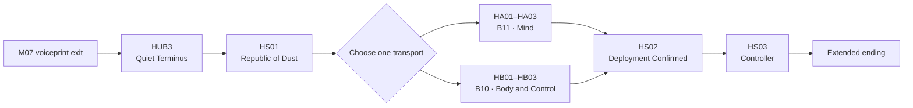

## Purpose

> **TODO — Act population:** Define rooms, Encounters, rewards, NPC population, environmental storytelling, dialogue and production assets in a later population pass. This page currently owns only conflict-free narrative and campaign boundaries.

Act IV is an eligibility-gated route reached through M07. It provides one shared ending through one of two mutually exclusive investigations without objectively resolving the crew's origin or OPERATOR's identity. [[Current Direction|Current Direction]] remains authoritative.

## Campaign structure

Boarding either city's shielded transport commits the campaign and removes the other investigation. Archived evidence from another campaign never grants the unchosen route's authorization or capabilities.

## Geography

| Biome | Accepted function |
|---|---|
| [[Biomes/B09|B09 — Republic of Dust]] | A manually rebuilt predecessor experiment city adjacent to the current successor city. |
| [[Biomes/B10|B10 — Velvet Exchange]] | A pleasure city concealing body-replacement research; destination of HB. |
| [[Biomes/B11|B11 — Cathedral of Deliverance]] | A religious city concealing memory and personality harvesting; destination of HA. |
| [[Biomes/B12|B12 — Ashfall Spire]] | Hidden levels above B01, geographically part of Ashfall District and shared by both routes. |

B10 and B11 appear independent but share infrastructure, authorization, data formats, and supply routes within the experiment network. Evidence in either route points back to Ashfall Tower without proving OPERATOR owns the network.

## Shared entry

Correct M07 voiceprint authentication activates a legacy evacuation rail. The crew relocates all four Recovery Capsules into [[Missions/HUB3|HUB3 — Quiet Terminus]], an offline Republic of Dust rail terminus manually adapted as the Act IV Hub. Wired communication, shielded electronics, and manual servicing keep it outside the experiment network.

[[Missions/HS01|HS01]] finds the [[NPCs/Old Man|Old Man]], the network's last registered predecessor-city civilian. His repaired biology and partially restored memories make him a fallible witness. He provides a pilgrimage credential toward B11 and a service contract toward B10; the UI presents physical destinations and known evidence, not Mind/Body labels or ending types.

## Investigation responsibilities

| Route | Mission | Accepted responsibility |
|---|---|---|
| HA | HA01 | Enter as pilgrims, experience genuine Cathedral community, and identify experiment-network structures beneath confession and donated-memory systems. |
| HA | HA02 | Descend through dependency-forming transcendence chambers and survive borrowed identity shifts. |
| HA | HA03 | Expose the identity refinery, defeat its custodian, and recover mnemonic authorization for Ashfall Tower. |
| HB | HB01 | Enter through a service contract, experience genuine bodily freedom and pleasure, and uncover hidden collection and ownership clauses. |
| HB | HB02 | Expose modular-body R&D and the biological, mechanical, and biomechanical systems reused by later production. |
| HB | HB03 | Reach the ownership registry, defeat its enforcement authority, and recover Ashfall Tower's service-root authorization. |

HA proves extraction and recombination without identifying one original donor or objectively classifying memories as true or false. HB distinguishes bodily autonomy from institutions converting consent, debt, and replacement into ownership.

## Route capabilities

| Route | Tower access | Final capability |
|---|---|---|
| HA | Impersonate an accepted supervisory mind with mnemonic authorization. | Identify false memories, corrupt behavioural predictions, and force inconsistent Controller decisions. |
| HB | Override elevator and tower hardware with service-root and ownership credentials. | Disable shell transfer, reroute power, and isolate Controller infrastructure. |

These capabilities are campaign-scoped. Act IV grants no additional Specializations because all twelve are required for entry.

## Shared final sequence

HS02 returns through a recognizable part of the opening Ashfall route. OPERATOR treats the deployed Character as part of another ordinary team, repeats selected M01 instructions, and receives new, informed crew responses. During the tower ascent, the familiar transmission transitions toward [[NPCs/Controller|Controller]] without proving whether OPERATOR becomes Controller, is displaced, or was another interface.

Controller is the proven local orchestration authority for the current experiment. The boss is a distributed environmental system fought through replaceable shells, civic-control hardware, surveillance, drones, doors, public-address channels, and false objectives. Either route traps one local avatar long enough to disconnect the city; destroying it does not prove Controller has no copies elsewhere.

## Institutional truth

HS03 establishes that the local system:

- iterates cities as civic-control experiments;
- abandoned Republic of Dust after its generation failed;
- uses B11 to develop controllable minds;
- uses B10 to develop controllable and replaceable bodies;
- uses the Cradle to manufacture selected results as Zero Division teams;
- validates those teams in the current successor city;
- packages teams as governance, policing, and suppression assets for external clients.

The route does not identify every client, reveal the full geographic scale, or prove whether Controller, OPERATOR, or another organization originated the program.

## Ending

There is no final moral-choice menu. The crew defeats Controller and deliberately severs the current city from the experiment network. Automated control and surveillance stop, residents act independently, and the local system can no longer enforce its rules.

An ambiguous montage shows the city being rebuilt manually until it resembles Republic of Dust. Matching compositions leave open whether the montage is the current city's future, the predecessor city's past, a Cathedral mind dive, a Controller prediction, or another iteration.

After the credits, OPERATOR addresses an unidentified team:

> “Good work, team. Experiment **CIVITAS-01** complete. Proceed to **CIVITAS-02**.”

No image identifies the recipients or location.
