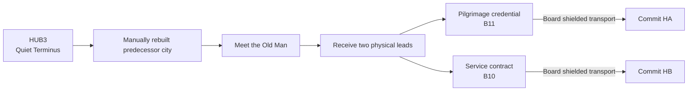

## Purpose

> **TODO — Mission population:** Define the predecessor-city route, residents, Old Man scenes, staging areas, Encounters, rewards, dialogue, and offline Hub presentation later.

Enter Republic of Dust, meet the experiment network's last registered predecessor-city civilian, and choose one of two concealed investigations.

## Accepted sequence

Both immediate staging areas may be inspected before commitment. Boarding either city's transport removes the other route for that campaign. The interface shows destination evidence without Mind/Body labels, ending types, or route rewards.

## Old Man boundary

The Old Man literally survived the predecessor experiment through repaired organs, replacement parts, and partial memory restoration. His continuity remains uncertain. He remembers B10 and B11 as apparently independent attraction cities and provides useful evidence without authoritatively explaining their shared organization or OPERATOR.
