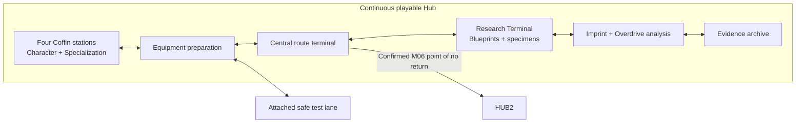

## Purpose

> **Accepted** — HUB1 is the fully assembled Act II state of the same physical space used by HUB0. M05 activates existing infrastructure without relocating the crew or changing the architecture and floor plan. The central route terminal, Research Terminal, Imprint and Overdrive analysis interfaces, and evidence archive become functional; lighting and visible data flow connect systems that appeared dormant during HUB0.

Serve as the Act II campaign Hub where the assembled crew prepares and chooses among the four open biome routes.

## Spatial model

> **Accepted** — HUB1 is one compact, continuous side-scrolling space with no loading transitions between functions. The four Coffin stations anchor the roster, the route terminal is visually central, and a short test lane attaches directly to the preparation area. Imprint analysis and evidence review occupy quieter edges without becoming separate rooms.

The schema shows functional adjacency, not a final floor plan. All four rail-connected Character docking stations are now filled. Each station holds the Coffin variant belonging to that Character's selected Specialization; changing Specialization swaps variants by rail.

## Mission selection

> **Accepted** — One central route terminal owns Hub deployment selection. It presents the four main biome branches as peers and distinguishes completed, available, and unavailable destinations. Discovered Special Missions are indented beneath their source, use the accepted special color, and show only **Optional path — [destination biome]**; the exact downstream Mission, reward, set relationship, and Communion relevance remain hidden.

Coffin stations remain dedicated to Character and Specialization selection. Equipment preparation remains a separate physical area.

## Character preparation

> **Accepted** — Selection exposes Character stats, equipment, skills, and Specialization. A safe, repeatable test space lets the player try movement, attacks, skills, equipment changes, and the Character-owned optional-route verb before deployment.

## Evidence archive

> **Accepted** — The archive separates **Current operation** evidence recovered in this campaign from **Prior records** viewed in previous campaigns. Prior records are visibly archival and never satisfy current-campaign eligibility.

Both views allow individual evidence review but conceal route logic: no biome Memory Imprint `x/4` counter, Specialization `x/12` counter, true-route checklist, or eligibility indicator appears before a non-true ending report reveals the totals.

## Progression

HUB1 unlocks after [[Missions/M05|M05]]. Completed Missions remain replayable. After success, the player may continue directly through an authored outgoing route with the current configuration or return here to reconfigure. Main Missions unlock authored same-biome successors; hidden actions in MA01, MB02, MC02, and MD01 can persistently unlock MS01–MS04. Returning adds discovered Special Missions to the Hub pool. Those Missions can unlock another biome's M02 before its M01 is complete; a bypassed M01 remains available. After all four Guardians are defeated, M06 becomes available at the route terminal but does not start automatically. The player may continue Act II until confirming a warning that entry into [[Missions/HUB2|HUB2]] closes B03–B06 and any undiscovered rewards for that campaign. The warning does not reveal hidden Mission, biome Memory Imprint, Specialization, or route totals.
