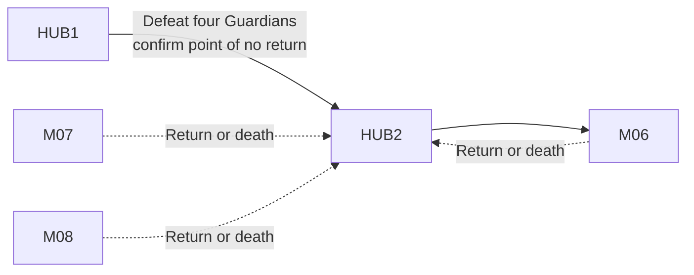

## Purpose

> **TODO — Hub population:** Define the physical layout, stations, presentation changes, supporting dialogue, and final assets in a later population pass.

Serve as the crew's independent Act III staging Hub after all four Act II Guardians are defeated. Guardian Nexus is a captured transfer nexus, not the Empty Barracks or the Cradle.

## Campaign function

The crew knows that launching M06 permanently closes B03–B06 but still understands OPERATOR's recall as a routine return for debriefing. “Final assault” describes HUB2's campaign function, not the crew's knowledge.

The four Recovery Capsule docking stations retain the Character and Specialization selection lifecycle established in earlier Hubs. Act III deaths return the deployed Character here without resource loss.
