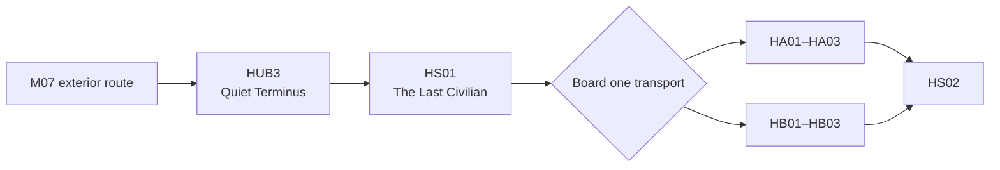

## Purpose

> **TODO — Hub population:** Define the compact rail-terminus layout, resident adaptations, Capsule servicing, interfaces, dialogue, visual assets, and route-specific presentation later.

Serve as the crew's offline Act IV staging Hub after the authenticated M07 exterior route relocates all four Recovery Capsules from Guardian Nexus.

## Campaign function

Republic of Dust residents manually adapted the disconnected evacuation and maintenance terminus. Wired communication, shielded electronics, disconnected machinery, and hand servicing keep it outside the experiment network.

The four Character-assigned docking stations preserve the existing Recovery Capsule and Specialization-selection lifecycle. Residents adapt a shielded local Research Terminal to the crew's persistent Research Core, retaining Blueprint progress, completed unlocks, and Hub Mesh Dive boards without reconnecting Quiet Terminus to the Experiment Network. Act IV deaths return the deployed Character to Quiet Terminus without resource loss. Successful Missions may use authored direct routes or return here where campaign structure permits.

Both B10 and B11 staging areas may be inspected after HS01. Boarding either shielded transport commits the campaign and removes the other investigation; Quiet Terminus does not offer a menu that bypasses that physical choice.
