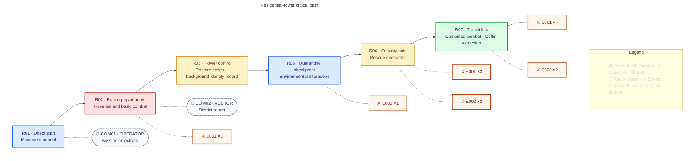

## Purpose

Deploy ROOK into Ashfall District, teach the core controls, and introduce the first background contradiction in the crew's history.

## Mission structure

> **TODO — Room and encounter validation:** Refine E001/E002 roles, placements, counts, encounter sequencing, and room timings through M01 development. Confirm whether the missing R04 ID is intentional; do not infer an extra room from the gap.

ROOK begins directly in the residential tower without a Coffin arrival or pre-Mission Hub. The diagram is the single owner of room order, enemy placements, and radio triggers. Enemy nodes are clickable candidates, not accepted behaviour or art. The power-control terminal's normal interface briefly exposes the identity contradiction without pausing completion.

The primary room colour indicates purpose, not the absence of other activity. Radio nodes open their canonical dialogue entries; enemy nodes open their source pages. Counts are provisional and appear only in this diagram, not a second room table. During R03's ordinary completion flow, ROOK briefly appears under another designation marked killed in action. No camera emphasis, pause, interaction prompt, or spoken reaction draws attention to it.

## Mission layout

> **TODO — Level-design handoff:** Replace the schematic minimap with an artist/level-designer layout that identifies room IDs, traversable connections, player route, exits, and spatial scale without mistaking the narrative graph for level geometry. Review the expanded layout against the same room IDs.

Expand M01 spatial layout

## Mission visual reference

> **TODO — Mission concept:** Add a reviewed screenshot or concept showing the residential tower's level art, backgrounds, tileset treatment, and player/enemy readability; link the approved shared rules from [[Design/Art Direction|Art Direction]] only after cross-Mission review.

