## Purpose

Deploy ROOK into Ashfall District, teach the core controls, and introduce the first background contradiction in the crew's history.

## Mission structure

ROOK begins directly in the residential tower without a Coffin arrival or pre-Mission Hub. The linear tutorial route includes an ordinary objective terminal whose normal completion interface briefly displays the identity contradiction; the record is mandatory to encounter but easy to overlook.

```mermaid
flowchart TB
    subgraph Legend[Legend — primary room purpose]
        L["🟦 Tutorial<br/>🟥 Combat<br/>🟨 Mission objective<br/>🟪 Narrative clue<br/>🟩 Exit<br/>💬 Radio / NPC communication"]
    end

    subgraph Route[ ]
        direction LR
        R01[R01 · Direct start<br/>Movement tutorial] --> R02[R02 · Burning apartments<br/>Traversal and basic combat]
        R02 --> R03[R03 · Power control<br/>Objective terminal + background record]
        R03 --> R05[R05 · Quarantine checkpoint<br/>Environmental interaction]
        R05 --> R06[R06 · Security hold<br/>Rescue encounter]
        R06 --> R07[R07 · Transit link<br/>Final combat and Coffin extraction]

        R01 -.- COM01(["💬 COM01 · OPERATOR · Radio<br/>Issue mission objectives"])
        R02 -.- COM02(["💬 COM02 · VECTOR · Radio<br/>Report from elsewhere in the district"])
    end

    click COM01 href "#/locale/en/dialogue.po?entry=dialogue.m01.com01"
    click COM02 href "#/locale/en/dialogue.po?entry=dialogue.m01.com02"

    classDef tutorial fill:#dbeafe,stroke:#2563eb,color:#1e3a8a,stroke-width:2px;
    classDef combat fill:#fee2e2,stroke:#dc2626,color:#7f1d1d,stroke-width:2px;
    classDef objective fill:#fef3c7,stroke:#d97706,color:#78350f,stroke-width:2px;
    classDef narrative fill:#f3e8ff,stroke:#9333ea,color:#581c87,stroke-width:2px;
    classDef exit fill:#dcfce7,stroke:#16a34a,color:#14532d,stroke-width:2px;
    classDef communication fill:#f8fafc,stroke:#64748b,color:#334155,stroke-width:1px,stroke-dasharray:4 3;
    classDef legend fill:none,stroke:none,color:#ddd,text-align:left;

    class R01,R05 tutorial;
    class R02 combat;
    class R03,R06 objective;
    class R07 exit;
    class COM01,COM02 communication;
    class L legend;
    linkStyle 5,6 stroke:#64748b,stroke-width:12px,stroke-dasharray:1 22,stroke-linecap:round;
    style Route fill:none,stroke:none;
```

Color identifies each room’s primary purpose; room labels note secondary functions. Rounded `COM` nodes and dotted connectors mark communication triggered within a room, not additional spaces or traversal. Select a `COM` node to open its canonical dialogue entries. Their delivery overlaps the room timing.

The critical path introduces one mechanic per room before combining them in the rescue and exit encounters. During R03's ordinary completion flow, the terminal briefly lists ROOK under another designation as killed in action. There is no camera emphasis, pause, interaction prompt, or spoken reaction from OPERATOR, VECTOR, or ROOK.

## Room timing assumptions

Times and enemy counts assume a first-time player who reads prompts, explores the critical path, and retries no encounters. Repeated IDs identify the same enemy archetype; a quantity appears before the linked ID when more than one instance is present.

| ID | Room | Primary function | Enemies | Assumed time |
| --- | --- | --- | --- | ---: |
| R01 | Direct start | Movement tutorial | — | 0:30 |
| R02 | Burning apartments | Traversal and basic combat | (3)[[Enemies/E001|E001]] | 1:15 |
| R03 | Power control | Interaction tutorial, power restoration, and background record | — | 1:00 |
| R05 | Quarantine checkpoint | Positioning and environmental interaction | [[Enemies/E002|E002]] | 1:15 |
| R06 | Security hold | Rescue and defensive encounter | (3)[[Enemies/E001|E001]] (2)[[Enemies/E002|E002]] | 1:30 |
| R07 | Transit link | Combined combat and Coffin extraction | (4)[[Enemies/E001|E001]] (2)[[Enemies/E002|E002]] | 1:00 |
|  | **Critical-path total** |  |  | **6:30** |
