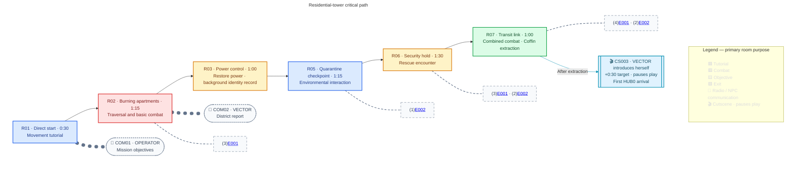

## Purpose

Deploy ROOK into Ashfall District, teach the core controls, and introduce the first background contradiction in the crew's history.

## Mission structure

> **TODO — Room and encounter validation:** Refine E001/E002 roles, placements, counts, encounter sequencing, and room timings through M01 development. Confirm whether the missing R04 ID is intentional; do not infer an extra room from the gap.

ROOK begins directly in the residential tower without a Coffin arrival or pre-Mission Hub. Enemy placements are the working layout; E001/E002 behaviour still needs reconciliation with this Mission, and their concept images are not final assets. The power-control terminal's normal interface briefly exposes the identity contradiction without pausing completion. See [[Wiki Rules?section=mission-room-graphs|Mission room graphs]] for diagram conventions.

```mermaid
flowchart TB
    subgraph Legend[Legend — primary room purpose]
        L["🟦 Tutorial<br/>🟥 Combat<br/>🟨 Objective<br/>🟩 Exit<br/>💬 Radio / NPC communication<br/>🎬 Cutscene · pauses play"]
    end

    subgraph Route[Residential-tower critical path]
        direction LR
        R01["R01 · Direct start · 0:30<br/>Movement tutorial"] --> R02["R02 · Burning apartments · 1:15<br/>Traversal and basic combat"]
        R02 --> R03["R03 · Power control · 1:00<br/>Restore power · background identity record"]
        R03 --> R05["R05 · Quarantine checkpoint · 1:15<br/>Environmental interaction"]
        R05 --> R06["R06 · Security hold · 1:30<br/>Rescue encounter"]
        R06 --> R07["R07 · Transit link · 1:00<br/>Combined combat · Coffin extraction"]

        R01 -.- COM01(["💬 COM01 · OPERATOR<br/>Mission objectives"])
        R02 -.- COM02(["💬 COM02 · VECTOR<br/>District report"])

        R02 -.- R02EN["(3)<a href='#/enemies/e001'>E001</a>"]
        R05 -.- R05EN["(1)<a href='#/enemies/e002'>E002</a>"]
        R06 -.- R06EN["(3)<a href='#/enemies/e001'>E001</a> · (2)<a href='#/enemies/e002'>E002</a>"]
        R07 -.- R07EN["(4)<a href='#/enemies/e001'>E001</a> · (2)<a href='#/enemies/e002'>E002</a>"]
        R07 -->|After extraction| CS003[["🎬 CS003 · VECTOR introduces herself<br/>+0:30 target · pauses play<br/>First HUB0 arrival"]]
    end

    click CS003 href "#/cutscenes/cs003"
    click COM01 href "#/locale/en/dialogue.po?entry=dialogue.m01.com01"
    click COM02 href "#/locale/en/dialogue.po?entry=dialogue.m01.com02"

    classDef tutorial fill:#dbeafe,stroke:#2563eb,color:#1e3a8a,stroke-width:2px;
    classDef combat fill:#fee2e2,stroke:#dc2626,color:#7f1d1d,stroke-width:2px;
    classDef objective fill:#fef3c7,stroke:#d97706,color:#78350f,stroke-width:2px;
    classDef exit fill:#dcfce7,stroke:#16a34a,color:#14532d,stroke-width:2px;
    classDef communication fill:#f8fafc,stroke:#64748b,color:#334155,stroke-width:1px,stroke-dasharray:4 3;
    classDef cutscene fill:#e0f2fe,stroke:#0891b2,color:#164e63,stroke-width:2px;
    classDef roomContent fill:#f8fafc,stroke:#64748b,color:#334155,stroke-width:1px,stroke-dasharray:7 5;
    classDef legend fill:none,stroke:none,color:#ddd,text-align:left;

    class R01,R05 tutorial;
    class R02 combat;
    class R03,R06 objective;
    class R07 exit;
    class COM01,COM02 communication;
    class R02EN,R05EN,R06EN,R07EN roomContent;
    class CS003 cutscene;
    class L legend;
    linkStyle 11 stroke:#0891b2,stroke-width:1px;
    linkStyle 5,6 stroke:#64748b,stroke-width:12px,stroke-dasharray:1 22,stroke-linecap:round;
    linkStyle 7,8,9,10 stroke:#64748b,stroke-width:2px,stroke-dasharray:7 5;
    style Route fill:none,stroke:none;
```

During R03's ordinary completion flow, ROOK briefly appears under another designation marked killed in action. No camera emphasis, pause, interaction prompt, or spoken reaction draws attention to it.

## Post-Mission cutscene

> **TODO — First-Hub handoff:** Review entry/exit staging and timing on [[Cutscenes/CS003|CS003]]. For now its graph node follows the last room; this represents the post-extraction arrival at HUB0, not a new playable room.

> **Accepted — Introduction:** [[Cutscenes/CS003|CS003 — VECTOR Introduces Herself]] plays before ordinary first-Hub preparation. The scene page owns the storyboard and unapproved opening exchange; [[Missions/HUB0|HUB0]] owns docking and Character-selection availability.

## Critical-path timing

> **TODO — Playtest timing:** Measure each room from entry to exit in first-time critical-path runs, without retries or optional detours. Record the median and sample size after playtesting; revise the working targets above when the route and encounters are validated.

The graph shows the working per-room targets, restored from the earlier M01 timing assumptions. Dialogue plays during room traversal rather than adding time. This table keeps the targets scannable alongside future measurements; it does not repeat room functions or enemy counts. Measure the total from deployment to extraction separately rather than adding room medians.

| Room | Target | Observed median | Runs |
|---|---:|---:|---:|
| R01 | 0:30 | — | — |
| R02 | 1:15 | — | — |
| R03 | 1:00 | — | — |
| R05 | 1:15 | — | — |
| R06 | 1:30 | — | — |
| R07 | 1:00 | — | — |
| **Critical-path total** | **6:30** | — | — |

### Post-Mission scene time

> **TODO — Measured scene duration:** Review CS003's working duration target and measure actual playback. Keep it separate from M01's deployment-to-extraction timing; future Hub organization must not add it again.

| Planned component | Target |
|---|---:|
| M01 route through extraction | 6:30 |
| [[Cutscenes/CS003|CS003]] first-Hub introduction | +0:30 |
| **M01 sequence including post-Mission scene** | **7:00** |

The scene page owns the duration target; graph/table values consume it. These are unskipped planning sums, excluding reading/loading/other transition overhead, not measured wall-clock durations.

## Mission layout

> **TODO — Level-design handoff:** Replace the schematic minimap with an artist/level-designer layout that identifies room IDs, traversable connections, player route, exits, and spatial scale without mistaking the narrative graph for level geometry. Review the expanded layout against the same room IDs.

Expand M01 spatial layout

## Mission visual reference

> **TODO — Visual review:** Compare these two exploratory concepts at gameplay scale against [[Characters/Rook#appearance|ROOK's refined reference]], E001/E002 concept designs, and a reviewed level layout. The older security-gate scene approximates ROOK's helmet and armour; its machines do not match the current E001/E002 references. The new Ashfall style study instead tests the [[Design/Art Direction#aspirational-gameplay-references|aspirational M01 screenshot]] with those actual concept references. Neither image approves room geometry, encounter counts, rendering implementation, HUD, or final Character/Enemy sprites.

### Earlier security-gate concept

### Ashfall style study with E001 and E002

The new study uses the aspirational M01 screenshot for scene treatment, the existing E001/E002 concept images for bot silhouettes, and ROOK's modelling turnaround for the enclosed helmet and dark armour. The displayed two E001 and one E002 are a readability sample, **not** an authored placement or a revision to the room graph.
