## Purpose

Investigate a sealed hospital, introduce Character selection and Character-owned optional routes, and uncover unexplained neurological corruption behind the apparent outbreak without identifying its cause.

## Act I role

| Constraint | Current direction |
|---|---|
| Availability | Select ROOK or VECTOR in HUB0; selection remains fixed during the Mission. |
| Critical path | Fully completable by either Character. |
| Optional access | ROOK and VECTOR expose different optional routes without revealing their contents in advance. |
| Narrative shift | Hospital evidence points to neurological corruption behind the apparent outbreak, but does not identify its cause or name Imprints. M02 contains no collectible Imprints; [[Missions/M05|M05]] introduces their discovery and progression. |

## Mission structure

> **TODO — Route and encounter validation:** The accepted route shape and critical-path encounter sequence below establish the design direction, not validated playable staging. Define reusable Enemy behaviour, exact placements, branch contents and rewards, interactions, and dialogue; validate room geometry and time targets. Do not reuse M01's E001/E002 simply because they are the only drafted Enemies. No Imprint or Imprint-derived reward belongs in M02.

> **Accepted — Route shape:** One shared critical path through the hospital is completable by either selected Character. Separate ROOK-only and VECTOR-only optional branches rejoin the shared path before the required neurological evidence. Neither branch is required to complete the Mission, and their contents are not revealed in advance. The Character-specific access verbs are [[Characters/Rook#moves-and-animations|ROOK's Combat Slide]] and [[Characters/Vector#shared-movement|VECTOR's Wall Run]].

> **Accepted — Threat identity:** M02's hostile threats are automated hospital containment/security machines responding to the deployed Character as an unauthorized intruder. Affected patients are not combat targets. The machines' hostility does not establish the cause of the neurological corruption.

> **Accepted — Combat lesson:** M02 develops timing and positioning against clearly telegraphed containment attacks, rather than escalating through enemy count alone. Every required encounter supports ordinary evasion by either ROOK or VECTOR; Combat Slide and Wall Run may offer alternatives but are not required combat solutions. Threats must communicate attack commitment and a usable recovery window.

> **Accepted — Threat roles:** M02 needs two containment-machine roles, introduced separately before being combined: a stationary **containment sentry** that telegraphs a horizontal shot and pauses after firing, and a mobile **containment patrol** that approaches, telegraphs a short-range strike, commits, and recovers. These are role descriptions, not final Enemy names or complete specifications. Shields, flight, and Machine Profiles are not requirements of these roles.

> **Accepted — Critical-path encounter sequence:** R01 provides a safe Coffin exit and briefing; R02 introduces one containment sentry; R03 introduces one containment patrol before the optional-route choice; R04 combines one sentry and one patrol; R05 provides a safe required evidence interaction; R06 provides safe extraction without a surprise wave. M02 has no Boss. These counts define the encounter sequence; exact positions and combat geometry still need review.

> **Accepted — Combat completion:** Critical-path combat is avoidable by either Character. Progress depends on navigating the hospital and reaching the required records, not destroying every machine; no kill-count locks gate the route. Defeating threats makes passage safer, while ordinary traversal interactions may still gate movement. Threats cannot pursue into R05 or interrupt its evidence interaction; R01 and R06 remain safe as specified above.

> **Accepted — Sentry firing cycle and mounting:** The containment sentry is stationary but may mount on floors, walls, or ceilings. It detects the Character in its firing lane, signals targeting with a visible light and rising audio cue, locks aim, fires one straight projectile, and visibly cools down before targeting again. It does not track after aim lock, use a sweeping beam, or deal instant contact damage. Placement must preserve ordinary evasion and a cooldown opportunity to cross or counterattack. All floor, wall, and ceiling mounts retain horizontal fire along the gameplay plane; mounting changes placement, not firing direction. Ceiling-mounted units need a lowered firing assembly positioned to threaten the traversable lane while preserving ordinary evasion. Vertical and diagonal fire are outside M02's sentry role.

> **Accepted — Sentry facing:** Where its mounting permits, the sentry may choose left or right during targeting, before aim lock. It commits to that direction through the shot and may turn again only after cooldown. Crossing behind after aim lock does not cause retargeting or mid-shot reversal. A wall placement may restrict it to one direction. Vertical aiming remains outside this role.

> **Accepted — Sentry vulnerability:** The exposed firing assembly is vulnerable throughout the firing cycle. Mounting hardware is scenery, not protective armour; the sentry has no shield or cooldown-only damage gate. Cooldown offers the safest counterattack opportunity, not the only damage window. Every authored placement, including ceiling mounts, must keep the assembly reachable by both Characters' available baseline attacks.

> **Accepted — Patrol attack cycle:** The containment patrol is grounded. It approaches, stops within short range, visibly winds up, strikes forward once, then visibly recovers before moving again. Its facing and attack position lock during wind-up; it cannot turn or chase mid-strike. It has no leap, grab, ranged attack, or body-contact damage. Both Characters must be able to escape with ordinary movement; crossing behind it rewards positioning.

> **Accepted — Patrol body collision:** The patrol's body does not block Character passage or deal contact damage. Either Character may cross through it using ordinary movement, without Phase Shift or another Character-specific move. Its active strike remains damaging; crossing behind during wind-up does not cancel its committed forward strike or recovery.

> **Accepted — Patrol vulnerability:** The patrol is vulnerable throughout its cycle from either side, without a shield, rear-only weak point, or recovery-only damage gate. Recovery is the safest counterattack opportunity, not the only damage window. Ordinary hits do not automatically cancel its committed strike; explicit stagger and stun effects remain separate, subject to the shared combat rules.

> **Accepted — Required evidence interaction:** In safe R05, either Character uses the same ordinary hospital records-terminal interaction. A brief report shows recurring neurological abnormalities across patients without establishing transmission, an external controller, or a cause. Closing the report registers the evidence, immediately enables extraction, and starts the selected Character's response followed by OPERATOR's reply over resumed movement. Progress does not wait for dialogue playback to finish. There is no hacking minigame, item pickup, or timed defence; the report is not an Imprint. The report and evidence-response dialogue are authored below.

> **Accepted — Coffin delivery:** M02 uses installed hospital service rail for both R01 deployment and R06 extraction, without randomized delivery variants. At R01 the selected Character's Coffin arrives, docks upright, opens, and releases the Character. At R06 the Coffin arrives and docks, the Character enters, and it departs for HUB0. Rail routing, docking geometry, and animation timing remain to be authored; delivery offers no damage or tactical advantage.

> **Accepted — Deployment and extraction control:** Player control begins as soon as the selected Character finishes stepping out of the Coffin onto R01's safe floor. COM01 then plays over movement without a dialogue lock. At R06, entering the open Coffin requires an explicit extraction interaction; passing it does not end the Mission. Control locks only when the entry sequence begins.

> **Accepted — Record reading:** The required terminal and optional logs open paused reading panels that the player closes manually, without an auto-dismiss timer. Closing R05's report registers its evidence and enables extraction immediately, then starts COM02 over resumed movement. Optional logs do not trigger radio dialogue. Playback cannot delay the extraction unlock; the dialogue policy below governs interruption, skipping, and replay.

> **Accepted — Pursuit and persistence:** Each containment patrol detects and pursues locally within its authored room, never through walls. Leaving that room breaks pursuit and the machine returns to its patrol area; it cannot enter optional detours, R05, or R06. R03's patrol therefore cannot join R04's authored combination. Destroyed enemies do not respawn during the deployment. Exact room boundaries, detection ranges, and return behaviour remain to be tuned.

> **Accepted — Backtracking:** Earlier rooms and the selected Character's accessible detour remain reachable until the player enters the extraction Coffin. Reading R05 does not seal the route; missed optional logs may be revisited before extraction. Each detour needs a safe return path without reversing Combat Slide or requiring VECTOR to cling during Wall Run. Steam keeps cycling and destroyed machines remain destroyed. Return geometry still needs layout review.

> **Accepted — Enemy rewards:** M02's containment machines drop no loot. Destroying them makes passage safer, but evasion forfeits no progression reward. They provide no Data Fragments, Equipment, currency, or consumables in M02; later Mission use may author its own rewards under the shared acquisition rules.

> **Accepted — Threat visual identities:** The sentry is a compact institutional turret with one horizontal barrel, a readable targeting lamp, and a bracket adapted to its floor, wall, or ceiling mount. The patrol is a low wheeled hospital-security machine with a clearly visible forward striking arm, not a humanoid guard or medical worker. Both use maintained but worn hospital hardware; attack parts must remain readable at gameplay scale. No finished Enemy art is approved yet.

> **Accepted — R04 encounter geometry:** The combined encounter needs a readable structural sightline break that blocks the sentry's detection and projectiles. The patrol can approach around it, so cover helps without solving the encounter by itself. Both threats must be visible before the Character enters their attack ranges, and neither may attack into safe R05. The partition's footprint, patrol path, firing lane, and safe-room boundary remain to be laid out and validated for both Characters.

> **Accepted — Hospital setting:** M02 occupies a structurally sound part of the tower, not an exposed, collapsed exterior. The city can appear through intact windows as a distant background; lockdown and age need not mean the hospital building is broken open.

ROOK or VECTOR deploys from HUB0 into the sealed hospital. R03's two Character-gated detours are alternatives to the direct R03 → R04 connection; both rejoin before the mandatory R05 evidence. R05's hospital records indicate neurological corruption without naming a cause. The graph owns proposed room order and routes, not literal hospital geometry. See [[Wiki Rules?section=mission-room-graphs|Mission room graphs]] for the shared notation. The accepted encounter sequence below defines room-level threat counts. Linked room-content blocks will follow when the reusable Enemy specifications and local staging are authored; fixed pickups remain unresolved.

```mermaid
flowchart TB
    subgraph Legend[Legend — primary room purpose]
        L["🟦 Investigation / traversal<br/>🟥 Encounter staging<br/>🟨 Objective / evidence<br/>🟪 Character-only optional route<br/>🟩 Exit<br/>💬 Radio / NPC communication"]
    end

    subgraph Route[Sealed-hospital route proposal]
        direction LR
        R01["R01 · Hospital entry · 0:45<br/>Deploy from HUB0"] --> R02["R02 · Triage · 1:15<br/>Investigate the apparent outbreak"]
        R02 --> R03["R03 · Isolation ward · 1:45<br/>Shared route and optional entrances"]
        R03 --> R04["R04 · Diagnostics · 1:15<br/>Shared route resumes"]
        R04 --> R05["R05 · Hospital records · 1:15<br/>Required neurological evidence"]
        R05 --> R06["R06 · Extraction · 0:45<br/>Coffin return to HUB0"]

        R03 -->|ROOK · Combat Slide| R03A["R03A · Low-access passage<br/>Optional · +1:00 target"]
        R03A --> R04
        R03 -->|VECTOR · Wall Run| R03B["R03B · Elevated passage<br/>Optional · +1:00 target"]
        R03B --> R04

        R01 -.- COM01(["💬 COM01 · OPERATOR<br/>Deployment briefing"])
        R05 -.- COM02(["💬 COM02 · OPERATOR<br/>Evidence response"])
    end

    classDef investigation fill:#dbeafe,stroke:#2563eb,color:#1e3a8a,stroke-width:2px;
    classDef encounter fill:#fee2e2,stroke:#dc2626,color:#7f1d1d,stroke-width:2px;
    classDef objective fill:#fef3c7,stroke:#d97706,color:#78350f,stroke-width:2px;
    classDef optional fill:#ede9fe,stroke:#7c3aed,color:#4c1d95,stroke-width:2px;
    classDef exit fill:#dcfce7,stroke:#16a34a,color:#14532d,stroke-width:2px;
    classDef communication fill:#f8fafc,stroke:#64748b,color:#334155,stroke-width:1px,stroke-dasharray:4 3;
    classDef legend fill:none,stroke:none,color:#ddd,text-align:left;

    class R01,R04 investigation;
    class R02,R03 encounter;
    class R05 objective;
    class R06 exit;
    class R03A,R03B optional;
    class COM01,COM02 communication;
    class L legend;
    linkStyle 9,10 stroke:#64748b,stroke-width:12px,stroke-dasharray:1 22,stroke-linecap:round;
    style Route fill:none,stroke:none;
```

### Critical-path encounters

| Room | Authored threat count / safe beat | Purpose |
|---|---|---|
| R01 · Hospital entry | Safe Coffin exit and briefing | Establish the deployment before combat |
| R02 · Triage | 1 containment sentry | Learn the horizontal firing cycle |
| R03 · Isolation ward | 1 containment patrol before route choice | Learn the committed short-range strike |
| R04 · Diagnostics | 1 containment sentry + 1 containment patrol | Combine timing and positioning lessons |
| R05 · Hospital records | Safe required evidence interaction | Examine the neurological evidence without combat interruption |
| R06 · Extraction | Safe return; no surprise wave | Conclude the investigation |

Enemy identities, exact coordinates, line-of-fire constraints, and the geometry of room-bounded pursuit remain unresolved. Encounters do not require enemy destruction to permit progression. There is no Boss encounter.

> **Accepted — Optional-route challenge:** Both Character-only detours are free of enemy encounters. Their challenge centres on Character-owned traversal and may include damaging environmental obstacles; Timed steam vents provide the environmental hazard as defined below; exact geometry and cycle tuning remain unresolved. Each route offers its own optional hospital log as defined below. Both routes still rejoin before the R04 combined encounter.

> **Accepted — Detour hazards:** Both detours use intermittent steam from hospital service pipes. R03A places a vent across a short section of ROOK's low-access lane; R03B places a vent across a landing between VECTOR's Wall Run sections. Each vent visibly and audibly signals pressure before releasing damaging steam, then provides a clear safe interval. Safe waiting areas precede the hazard; VECTOR never needs to cling to a wall. Damage comes from entering active steam, not an unavoidable traversal animation. Traversal distances and vent cycles must permit safe passage with the available Character configuration.

> **Accepted — Detour rewards:** R03A offers ROOK an optional maintenance log showing that containment remained active after staff access was revoked. R03B offers VECTOR an optional ward observation log showing similar neurological symptoms across otherwise unrelated patients. These are environmental hospital records, not Imprints, inventory collectibles, Equipment, or Blueprint rewards. They add perspective without identifying the corruption's cause, replacing R05's mandatory evidence, or becoming completion requirements. Their contents are not revealed before entering the respective route; Text is authored below; inspecting each record opens a paused, manually closed reading panel. Exact interaction affordances remain unresolved. Neither log triggers an additional radio exchange.

The optional-route labels indicate access, not promised discoveries. COM01 and COM02 have authored Mission-local text below and matching gettext entries. Neither links to the M01 dialogue file. R05's accepted records-terminal interaction provides the required evidence; it is not a collectible Imprint.

## Dialogue

> **Accepted — Playback policy:** Dialogue never blocks progress. Skipping COM01 or COM02 dismisses the exchange without changing objectives. Opening a reading panel pauses an active radio exchange; closing it resumes playback. Starting extraction ends unfinished radio playback. Each exchange triggers once per deployment; retrying begins a fresh deployment.

Approved player-facing text is recorded in [[locale/en/dialogue.po?entry=dialogue.m02|M02's gettext entries]]. Other language catalogues carry matching IDs awaiting translation.

### COM01 · Deployment briefing

> **Accepted — Text:** Trigger during safe R01 after the deployed Character exits the Coffin. Play only the selected Character's response. Control is already available and the exchange plays over movement under the playback policy above.

**OPERATOR:** “Hospital lockdown remains active. Reach the records room. We need to establish what happened to the patients.”

**ROOK:** “Records first. I’ll find a way through.”

**VECTOR:** “Understood. Going in.”

### COM02 · Evidence response

> **Accepted — Text:** Trigger after reading R05's required report. Play only the selected Character's line, followed by OPERATOR's shared response. Closing the report enables extraction immediately; the exchange plays over resumed movement without gating progress. The playback policy above governs skipping and interruptions.

**ROOK:** “Different symptoms. Same pattern in the readings.”

**VECTOR:** “The symptoms vary. The pattern repeats.”

**OPERATOR:** “Cause remains undetermined. Bring the records back for review. Proceed to extraction.”

### R05 · Required hospital report

> **Accepted — Text:** Display at the required hospital records terminal; this is written evidence, not a spoken line or an Imprint.

> **Clinical review — restricted**
>
> Multiple patients exhibit recurring neurological abnormalities. Presenting symptoms vary; recorded neural activity follows a similar pattern across cases.
>
> Cause undetermined. The available records do not establish a transmission route.
>
> Clinical review remains incomplete. Containment restrictions remain in force.

### Optional hospital logs

> **Accepted — Text:** Inspecting the relevant environmental record is the detour reward. Neither log triggers an additional radio exchange.

**R03A · Maintenance log**

> Staff access revoked. Automated containment remains active. Local maintenance requests cannot suspend enforcement.

**R03B · Ward observation log**

> Patients admitted for unrelated conditions now exhibit similar neurological abnormalities. No common cause has been established. Further observation required.

## Critical-path timing

> **TODO — Playtest timing:** These are planning estimates, not observed level durations. Measure room entry to exit across first-time no-retry runs, recording median and sample size separately for ROOK and VECTOR. Revise the targets when route length, encounters, and interactions are designed.

The graph shows provisional targets for the direct shared route. Dialogue overlaps traversal. An optional detour adds a provisional minute to its Character's run; a player cannot take both detours in the same deployment. Measure deployment-to-extraction totals separately rather than summing room medians. `—` means not yet measured, not zero.

| Route segment | Target | ROOK observed median | VECTOR observed median | Runs per Character |
|---|---:|---:|---:|---:|
| R01 | 0:45 | — | — | — |
| R02 | 1:15 | — | — | — |
| R03 | 1:45 | — | — | — |
| R04 | 1:15 | — | — | — |
| R05 | 1:15 | — | — | — |
| R06 | 0:45 | — | — | — |
| **Direct critical-path total** | **7:00** | — | — | — |
| R03A · ROOK-only detour (extra) | +1:00 | — | Not accessible | — |
| R03B · VECTOR-only detour (extra) | +1:00 | Not accessible | — | — |
| **With accessible detour (estimate)** | **8:00** | — | — | — |

## Mission layout

> **TODO — Level-design handoff:** The schematic minimap shows route connectivity, not accepted floor geometry. Replace it with a reviewed hospital layout showing room footprints, elevations, barriers, playable traversal, gated entrances, return paths, scale, and extraction. Keep both branch IDs aligned with the graph and verify neither branch bypasses R05.

Expand M02 spatial layout

## Mission visual reference

> **TODO — Visual review:** Compare both exploratory hospital scenes with [[Characters/Vector#appearance|VECTOR's preferred modelling turnaround]], the [[Missions/M01#ashfall-style-study-with-e001-and-e002|M01 Ashfall style study]], and a reviewed playable layout at gameplay scale. Both depict one possible VECTOR deployment, not simultaneous playable crew members. An earlier style attempt's broken exterior was rejected; the revised study instead shows an intact tower with the city beyond windows. Upper levels, medical props, lighting, Coffin staging, and Character likeness remain proposals, not accepted room geometry, final art direction, route access, or evidence presentation. No enemies, fixed pickups, or Imprints are specified by either scene.

### Earlier hospital concept

### Ashfall hospital style study

The revised study tests M01's dense side-on treatment in a cooler, structurally sound hospital setting, using VECTOR's modelling turnaround as the sole Character likeness reference. The open Coffin at the left tests arrival readability only. Installed rail is the accepted delivery method, but the image does not establish the rail route, exact docking position, or handoff animation. The upper floor does **not** establish the R03B route or a shortcut to required evidence.
