## Purpose

Investigate a sealed hospital, introduce Character selection and Character-owned optional routes, and uncover unexplained neurological corruption behind the apparent outbreak without identifying its cause.

## Act I role

| Constraint | Reviewed direction |
|---|---|
| Deployment | Select ROOK or VECTOR in HUB0; selection stays fixed for the Mission. |
| Required route | Either selected Character can complete it using ordinary traversal and evasion. |
| Narrative | Records establish recurring neurological abnormalities, not their cause, transmission, or an external controller. |
| Reveal boundary | No Imprints or Imprint-derived rewards; [[Missions/M05|M05]] introduces them. |
| Return | Extraction returns the deployed Character to HUB0. |

## Mission structure

> **TODO — Spatial and combat validation:** The route, room-level counts, interactions, and player-facing text are reviewed design decisions, not a validated playable level. Resolve actual geometry, attack reach, pursuit boundaries, numerical tuning, steam cycles, and pacing. This consolidated page remains `stage-1` pending full-page review.

> **Accepted — Route:** One shared critical path, with separate ROOK Combat Slide and VECTOR Wall Run detours from R03 that rejoin at R04 before mandatory R05 evidence. Neither detour is required. The main route stays mostly on one continuous hospital floor; R03A dips into lower services and R03B rises into upper maintenance. No mandatory lift or new traversal system.

The graph owns room order, Enemy counts, and communication triggers, not literal dimensions. [[Wiki Rules?section=mission-room-graphs|Mission room graphs]] defines the notation. Grey blocks link to reusable Enemy specifications; record interactions are objectives, not item pickups.

```mermaid
flowchart TB
    subgraph Legend[Legend — primary room purpose]
        L["🟦 Investigation / traversal<br/>🟥 Encounter staging<br/>🟨 Objective / evidence<br/>🟪 Character-only optional route<br/>🟩 Exit<br/>💬 Radio / NPC communication"]
    end

    subgraph Route[Sealed-hospital route · working version]
        direction LR
        R01["R01 · Hospital entry · 0:45<br/>Safe rail arrival from HUB0"] --> R02["R02 · Triage · 1:15<br/>Investigate the apparent outbreak"]
        R02 --> R03["R03 · Isolation ward · 1:45<br/>Shared route and optional entrances"]
        R03 --> R04["R04 · Diagnostics · 1:15<br/>Combined timing encounter"]
        R04 --> R05["R05 · Hospital records · 1:15<br/>Required neurological evidence"]
        R05 --> R06["R06 · Extraction · 0:45<br/>Coffin return to HUB0"]

        R03 -->|ROOK · Combat Slide| R03A["R03A · Low-access passage<br/>Steam + maintenance log · +1:00 target"]
        R03A --> R04
        R03 -->|VECTOR · Wall Run| R03B["R03B · Elevated passage<br/>Steam + ward log · +1:00 target"]
        R03B --> R04

        R01 -.- COM01(["💬 COM01 · OPERATOR<br/>Deployment briefing"])
        R05 -.- COM02(["💬 COM02 · OPERATOR<br/>Evidence response"])
        R02 -.- C02["(1)<a href='#/enemies/e003'>E003</a>"]
        R03 -.- C03["(1)<a href='#/enemies/e004'>E004</a>"]
        R04 -.- C04["(1)<a href='#/enemies/e003'>E003</a> · (1)<a href='#/enemies/e004'>E004</a>"]

        click COM01 href "#/locale/en/dialogue.po?entry=dialogue.m02.com01"
        click COM02 href "#/locale/en/dialogue.po?entry=dialogue.m02.com02"
    end

    classDef investigation fill:#dbeafe,stroke:#2563eb,color:#1e3a8a,stroke-width:2px;
    classDef encounter fill:#fee2e2,stroke:#dc2626,color:#7f1d1d,stroke-width:2px;
    classDef objective fill:#fef3c7,stroke:#d97706,color:#78350f,stroke-width:2px;
    classDef optional fill:#ede9fe,stroke:#7c3aed,color:#4c1d95,stroke-width:2px;
    classDef exit fill:#dcfce7,stroke:#16a34a,color:#14532d,stroke-width:2px;
    classDef communication fill:#f8fafc,stroke:#64748b,color:#334155,stroke-width:1px,stroke-dasharray:4 3;
    classDef roomContent fill:#f8fafc,stroke:#64748b,color:#334155,stroke-width:1px,stroke-dasharray:7 5;
    classDef legend fill:none,stroke:none,color:#ddd,text-align:left;

    class R01 investigation;
    class R02,R03,R04 encounter;
    class R05 objective;
    class R06 exit;
    class R03A,R03B optional;
    class COM01,COM02 communication;
    class C02,C03,C04 roomContent;
    class L legend;
    linkStyle 9,10 stroke:#64748b,stroke-width:12px,stroke-dasharray:1 22,stroke-linecap:round;
    linkStyle 11,12,13 stroke:#64748b,stroke-width:2px,stroke-dasharray:7 5;
    style Route fill:none,stroke:none;
```

### Encounter staging

> **Accepted — Local constraints:** Introduce [[Enemies/E003|E003's]] horizontal timing lesson before [[Enemies/E004|E004's]] committed-strike lesson, then combine them. Either Character may fight or evade; there are no kill-count locks and no Boss.

| Room | Local staging requirement |
|---|---|
| R01 | Safe deployment floor; briefing overlaps movement. |
| R02 | Floor-mounted sentry; readable first firing cycle and ordinary evasion space. |
| R03 | Patrol encounter precedes the optional-route choice; both entrances visible, interiors concealed. |
| R04 | Wall-mounted sentry and room-local patrol; readable structural cover blocks sentry detection and shots, but allows the patrol to approach around it. Both threats are visible before entering their attack ranges. |
| R05 | Safe required records interaction; threats cannot pursue or attack into the room. |
| R06 | Safe extraction dock; no surprise wave or enemy-clear requirement. |

The Enemy pages own cycles, facing, vulnerability, collision, and visual identity. In M02:
- Every sentry assembly remains reachable by both Characters' available baseline attacks; no ceiling mount is authored.
- Patrol pursuit stays inside its assigned room, detects no Character through walls, and returns locally when pursuit ends. It cannot enter detours, R05, or R06; R03's patrol cannot join R04.
- Sentry shots pass through patrols without damaging them; structural cover stops the shots. This is a Mission-local rule, not a shared friendly-fire policy.
- Destroyed machines do not respawn. Machines drop no loot, including Data Fragments, Equipment, currency, or consumables.
- There are no fixed item pickups in this pass. A recovery issue found in playtesting requires explicit review, not an invented health item.

### Hospital setting

> **Accepted** — The hospital occupies a structurally sound tower section, not a collapsed exposed edge. City scenery is visible through intact windows. Age and lockdown do not imply structural ruin.

A few living patients appear behind sealed observation glass outside the playable lane. Subtle movement and monitors establish occupancy. They are environmental characters, not combat targets, rescue objectives, or speaking NPCs. Records communicate their neurological abnormalities without grotesque mutations or supernatural effects. Automated hospital security treats the deployed Character as an unauthorized intruder; this hostility does not establish the corruption's cause.

## Optional routes

> **TODO — Traversal blockout:** Review entrance affordances, safe waiting areas, return geometry, vent placement and timing, and record-interaction reach. Neither detour may bypass R05 or require a move its selected Character lacks.

> **Accepted** — Both routes are enemy-free. Their challenges are Character-owned traversal and timed steam; each offers one environmental hospital log, not an inventory collectible, Imprint, Equipment, Blueprint, or completion requirement.

| Route | Traversal and hazard | Environmental reward |
|---|---|---|
| R03A · ROOK | Combat Slide low entrance into lower services; steam crosses a short low-access lane. | Maintenance record: containment stayed active after staff access was revoked. |
| R03B · VECTOR | Wall Run upper entrance; steam crosses a landing between Wall Run sections. | Ward record: similar neurological abnormalities across unrelated admissions, with no established cause. |

**Steam:** visible and audible pressure warning → damaging release → clear safe interval. Waiting areas precede hazards; VECTOR never needs to cling. Available traversal must permit safe passage rather than damage during an unavoidable animation. Brief accidental contact causes one standard hit, not rapid frame-by-frame stacking; steam is not a heavy hazard or a one-hit kill from full Integrity. Exiting and re-entering active steam may cause another hit. Damage and hit-protection tuning follow [[Gameplay/Gameplay Math|the shared model]].

**Backtracking:** earlier rooms and the usable detour remain reachable until Coffin entry, including after reading R05. Both detours need safe returns without reversing Combat Slide or requiring wall-clinging. Steam continues cycling; destroyed machines stay destroyed.

### Tutorial access feedback

> **Accepted** — Apply [[Gameplay/Progression#mission-compatibility|the shared route-feedback rule]]. With tutorials enabled, first approaching the deployed Character's usable entrance shows its own move prompt once per deployment, before an attempt. Do not repeat on backtracking.

Both entrances are visible from R03, but neither interior nor log is revealed. The other entrance stays silent: no icon, label, camera focus, required-Character indicator, or suggestion to return as someone else. This diagram is designer-facing, not a player-facing map.

## Deployment, records, and extraction

> **TODO — Delivery handoff:** Block out hospital service rail and upright docking at R01/R06; tune arrival, opening, step-out, and entry animations. The rail diagrams do not approve a physical transport route.

> **Accepted** — Installed rail delivers the selected Character's Coffin at both ends, without randomized variants or tactical advantage.

| Beat | Trigger and control |
|---|---|
| R01 arrival | Coffin arrives, docks upright, opens, and releases the selected Character. Control begins after step-out onto the safe floor. COM01 plays over movement without a dialogue lock. |
| Optional log | Ordinary interaction opens a paused reading panel; manual close resumes play. No radio response. |
| R05 evidence | Same ordinary terminal interaction for either Character. Paused report closes manually, without an auto-dismiss timer. No hacking minigame, item pickup, or timed defence. |
| Report closed | Register evidence, immediately unlock extraction and call the Coffin to R06; start COM02 over resumed movement. Do not wait for speech to finish. |
| R06 before evidence | Room remains accessible but dock is empty; no locked door or kill requirement. |
| R06 after arrival | Coffin docks and opens. Explicit interaction starts entry and locks control; merely passing the Coffin does not extract. The player may keep exploring before entry. |
| Return | Character enters; Coffin departs for HUB0. |

## Dialogue and game text

> **Accepted — Text ownership:** [[locale/en/dialogue.po?entry=dialogue.m02|M02's gettext entries]] own the approved English wording. Other 11 language catalogues contain matching IDs awaiting translation. This page owns triggers and Character selection, not duplicate versions of the text.

| Entry | Use |
|---|---|
| [[locale/en/dialogue.po?entry=dialogue.m02.com01|COM01 · Deployment briefing]] | Safe R01 after step-out: shared OPERATOR briefing, then only the deployed Character's response. |
| [[locale/en/dialogue.po?entry=dialogue.m02.com02|COM02 · Evidence response]] | Closing the required report: only the deployed Character's observation, then OPERATOR's shared reply. No premature explicit suspicion or explanation of the cause. |
| [[locale/en/dialogue.po?entry=dialogue.m02.records|Required clinical report]] | R05 terminal; establishes recurring abnormalities without establishing transmission or cause. |
| [[locale/en/dialogue.po?entry=dialogue.m02.log.r03a|Maintenance log]] | Optional R03A environmental record; not revealed at the entrance. |
| [[locale/en/dialogue.po?entry=dialogue.m02.log.r03b|Ward observation log]] | Optional R03B environmental record; not revealed at the entrance. |
| [[locale/en/dialogue.po?entry=dialogue.m02.tutorial.slide|ROOK move prompt]] | Only ROOK approaching the usable R03A entrance with tutorials enabled. |
| [[locale/en/dialogue.po?entry=dialogue.m02.tutorial.wallrun|VECTOR move prompt]] | Only VECTOR approaching the usable R03B entrance with tutorials enabled. |

**Playback:** dialogue never blocks progress. Skipping COM01/COM02 dismisses that exchange without altering objectives. Reading panels pause an active radio exchange and closing resumes it. Extraction entry ends unfinished radio playback. Each exchange triggers once per deployment; retrying starts a fresh deployment.

## Critical-path timing

> **TODO — Playtest timing:** These are planning estimates, not observed level durations. Measure room entry to exit across first-time no-retry runs, excluding paused reading and recording median and sample size separately for ROOK and VECTOR. Record total wall-clock duration, including reading, separately. Revise the targets when route length, encounters, and interactions are designed.

> **Accepted — Timing definition:** The working 7:00 direct and 8:00 detour targets exclude paused reading. They include active traversal, combat or evasion, interactions, and Coffin sequences; radio overlaps movement. Track deployment-to-extraction wall-clock duration separately, including time spent reading. Neither target is an observed result.

The graph shows working targets for the direct shared route. Dialogue overlaps traversal. An optional detour adds a working minute to its Character's run; a player cannot take both detours in the same deployment. Measure deployment-to-extraction totals separately rather than summing room medians. `—` means not yet measured, not zero.

| Route segment | Target | ROOK observed median | VECTOR observed median | Runs per Character |
|---|---:|---:|---:|---:|
| R01 | 0:45 | — | — | — |
| R02 | 1:15 | — | — | — |
| R03 | 1:45 | — | — | — |
| R04 | 1:15 | — | — | — |
| R05 | 1:15 | — | — | — |
| R06 | 0:45 | — | — | — |
| **Direct critical-path total** | **7:00** | — | — | — |
| R03A · ROOK-only detour (extra) | +1:00 | — | Not accessible | — |
| R03B · VECTOR-only detour (extra) | +1:00 | Not accessible | — | — |
| **With accessible detour (estimate)** | **8:00** | — | — | — |

## Mission layout

> **TODO — Level-design handoff:** The revised schematics reflect reviewed relationships and relative elevations, not accepted footprints, collision, measurements, or build-ready positions. Validate barriers, gated entrances, safe returns, attack sightlines, scale, and service-rail docking; neither branch bypasses R05. Symbol locations are working staging, not measured positions.

Expand M02 spatial review schematic

## Mission visual reference

> **TODO — Visual review:** Compare both exploratory hospital scenes with [[Characters/Vector#appearance|VECTOR's preferred modelling turnaround]], the [[Missions/M01#ashfall-style-study-with-e001-and-e002|M01 Ashfall style study]], and a reviewed playable layout at gameplay scale. Both depict one possible VECTOR deployment, not simultaneous playable crew members. An earlier style attempt's broken exterior was rejected; the revised study instead shows an intact tower with the city beyond windows. Upper levels, medical props, lighting, Coffin staging, and Character likeness are working visual references, not measured room geometry, final assets, route changes or authored evidence. No enemies, fixed pickups, or Imprints are specified by either scene.

### Earlier hospital concept

### Ashfall hospital style study

The revised study tests M01's dense side-on treatment in a cooler, structurally sound hospital setting, using VECTOR's modelling turnaround as the sole Character likeness reference. The open Coffin at the left tests arrival readability only. Installed rail is the accepted delivery method, but the image does not establish the rail route, exact docking position, or handoff animation. The upper floor does **not** establish the R03B route or a shortcut to required evidence.

## Remaining review issues

- Validate the working layout: cover, firing-assembly reach, patrol boundaries, patient bays, docks, and safe-room protection for both Characters.
- Block out both detours: gate readability, vent cycles, safe waiting and return paths, and hidden log placement.
- Tune enemy detection, attack timing, damage, Integrity, destruction feedback, and explicit control effects on the Enemy pages; do not invent Mission-specific equations.
- Review record/prompt interaction affordances and delivery animations, including paused-radio handling and extraction during COM02.
- Measure active and wall-clock durations separately. Seven/eight minutes remain hypotheses, not requirements to pad with empty traversal.
- Compare gameplay-scale art with the blockout; patients, rails, and enemies are not established by the scene image.
- Review translations in the other languages before treating them as complete.
