## Purpose

Investigate a sealed hospital, introduce Character selection and Character-owned optional routes, and uncover unexplained neurological corruption behind the apparent outbreak without identifying its cause.

## Act I role

| Constraint | Current direction |
|---|---|
| Availability | Select ROOK or VECTOR in HUB0; selection remains fixed during the Mission. |
| Critical path | Fully completable by either Character. |
| Optional access | ROOK and VECTOR expose different optional routes without revealing their contents in advance. |
| Narrative shift | Hospital evidence points to neurological corruption behind the apparent outbreak, but does not identify its cause or name Imprints. M02 contains no collectible Imprints; [[Missions/M05|M05]] introduces their discovery and progression. |

## Mission structure

> **Accepted — Route shape:** One shared critical path through the hospital is completable by either selected Character. Separate ROOK-only and VECTOR-only optional branches rejoin the shared path before the required neurological evidence. Neither branch is required to complete the Mission, and their contents are not revealed in advance. The Character-specific access verbs are [[Characters/Rook#moves-and-animations|ROOK's Combat Slide]] and [[Characters/Vector#shared-movement|VECTOR's Wall Run]].

> **Accepted — Hospital setting:** M02 occupies a structurally sound part of the tower, not an exposed, collapsed exterior. The city can appear through intact windows as a distant background; lockdown and age need not mean the hospital building is broken open.

> **TODO — Route and encounter validation:** The six-room spine, branch entrances and rejoin point, room purposes, communications, and time targets below are provisional staging for review. Define actual enemy roles and counts, branch contents and rewards, interactions, and dialogue before calling them authored placements. In particular, do not reuse M01's E001/E002 simply because they are the only drafted Enemies. No Imprint or Imprint-derived reward belongs in M02.

ROOK or VECTOR deploys from HUB0 into the sealed hospital. R03's two Character-gated detours are alternatives to the direct R03 → R04 connection; both rejoin before the mandatory R05 evidence. R05's hospital records indicate neurological corruption without naming a cause. The graph owns proposed room order and routes, not literal hospital geometry. See [[Wiki Rules?section=mission-room-graphs|Mission room graphs]] for the shared notation. No enemy or fixed-pickup blocks appear until specific placements have been designed.

```mermaid
flowchart TB
    subgraph Legend[Legend — primary room purpose]
        L["🟦 Investigation / traversal<br/>🟥 Encounter staging<br/>🟨 Objective / evidence<br/>🟪 Character-only optional route<br/>🟩 Exit<br/>💬 Radio / NPC communication"]
    end

    subgraph Route[Sealed-hospital route proposal]
        direction LR
        R01["R01 · Hospital entry · 0:45<br/>Deploy from HUB0"] --> R02["R02 · Triage · 1:15<br/>Investigate the apparent outbreak"]
        R02 --> R03["R03 · Isolation ward · 1:45<br/>Shared route and optional entrances"]
        R03 --> R04["R04 · Diagnostics · 1:15<br/>Shared route resumes"]
        R04 --> R05["R05 · Hospital records · 1:15<br/>Required neurological evidence"]
        R05 --> R06["R06 · Extraction · 0:45<br/>Coffin return to HUB0"]

        R03 -->|ROOK · Combat Slide| R03A["R03A · Low-access passage<br/>Optional · +1:00 target"]
        R03A --> R04
        R03 -->|VECTOR · Wall Run| R03B["R03B · Elevated passage<br/>Optional · +1:00 target"]
        R03B --> R04

        R01 -.- COM01(["💬 COM01 · OPERATOR<br/>Deployment briefing · draft"])
        R05 -.- COM02(["💬 COM02 · OPERATOR<br/>Evidence response · draft"])
    end

    classDef investigation fill:#dbeafe,stroke:#2563eb,color:#1e3a8a,stroke-width:2px;
    classDef encounter fill:#fee2e2,stroke:#dc2626,color:#7f1d1d,stroke-width:2px;
    classDef objective fill:#fef3c7,stroke:#d97706,color:#78350f,stroke-width:2px;
    classDef optional fill:#ede9fe,stroke:#7c3aed,color:#4c1d95,stroke-width:2px;
    classDef exit fill:#dcfce7,stroke:#16a34a,color:#14532d,stroke-width:2px;
    classDef communication fill:#f8fafc,stroke:#64748b,color:#334155,stroke-width:1px,stroke-dasharray:4 3;
    classDef legend fill:none,stroke:none,color:#ddd,text-align:left;

    class R01,R04 investigation;
    class R02,R03 encounter;
    class R05 objective;
    class R06 exit;
    class R03A,R03B optional;
    class COM01,COM02 communication;
    class L legend;
    linkStyle 9,10 stroke:#64748b,stroke-width:12px,stroke-dasharray:1 22,stroke-linecap:round;
    style Route fill:none,stroke:none;
```

The optional routes have no assigned contents yet; their labels indicate access, not promised discoveries. COM01/COM02 are proposed beats, not authored dialogue entries, so they do not link to the M01 dialogue file. Whether the evidence is found through a routine records interaction or a different playable presentation still needs review; it is not a collectible Imprint.

## Critical-path timing

> **TODO — Playtest timing:** These are planning estimates, not observed level durations. Measure room entry to exit across first-time no-retry runs, recording median and sample size separately for ROOK and VECTOR. Revise the targets when route length, encounters, and interactions are designed.

The graph shows provisional targets for the direct shared route. Dialogue overlaps traversal. An optional detour adds a provisional minute to its Character's run; a player cannot take both detours in the same deployment. Measure deployment-to-extraction totals separately rather than summing room medians. `—` means not yet measured, not zero.

| Route segment | Target | ROOK observed median | VECTOR observed median | Runs per Character |
|---|---:|---:|---:|---:|
| R01 | 0:45 | — | — | — |
| R02 | 1:15 | — | — | — |
| R03 | 1:45 | — | — | — |
| R04 | 1:15 | — | — | — |
| R05 | 1:15 | — | — | — |
| R06 | 0:45 | — | — | — |
| **Direct critical-path total** | **7:00** | — | — | — |
| R03A · ROOK-only detour (extra) | +1:00 | — | Not accessible | — |
| R03B · VECTOR-only detour (extra) | +1:00 | Not accessible | — | — |
| **With accessible detour (estimate)** | **8:00** | — | — | — |

## Mission layout

> **TODO — Level-design handoff:** The schematic minimap shows route connectivity, not accepted floor geometry. Replace it with a reviewed hospital layout showing room footprints, elevations, barriers, playable traversal, gated entrances, return paths, scale, and extraction. Keep both branch IDs aligned with the graph and verify neither branch bypasses R05.

Expand M02 spatial layout

## Mission visual reference

> **TODO — Visual review:** Compare both exploratory hospital scenes with [[Characters/Vector#appearance|VECTOR's preferred modelling turnaround]], the [[Missions/M01#ashfall-style-study-with-e001-and-e002|M01 Ashfall style study]], and a reviewed playable layout at gameplay scale. Both depict one possible VECTOR deployment, not simultaneous playable crew members. An earlier style attempt's broken exterior was rejected; the revised study instead shows an intact tower with the city beyond windows. Upper levels, medical props, lighting, Coffin staging, and Character likeness remain proposals, not accepted room geometry, final art direction, route access, or evidence presentation. No enemies, fixed pickups, or Imprints are specified by either scene.

### Earlier hospital concept

### Ashfall hospital style study

The revised study tests M01's dense side-on treatment in a cooler, structurally sound hospital setting, using VECTOR's modelling turnaround as the sole Character likeness reference. The open Coffin at the left tests arrival readability only; its exact M02 position, delivery variant, and control handoff remain to be authored. The upper floor does **not** establish the R03B route or a shortcut to required evidence.
