## Purpose

Assault an abandoned command center, encounter an obsolete unit connected to the crew organization, and bring RAM back to the crew.

## Act I role

| Constraint | Established direction |
|---|---|
| Availability | Select ROOK or VECTOR in HUB0; RAM is not selectable. Selection remains fixed. |
| Critical path | Fully completable by either selected Character until the authored intervention. |
| RAM introduction | RAM appears as scripted breaching support during the climax, not as a playable control transfer. |
| Hub result | RAM returns in his Coffin, fills the third docking station, and becomes selectable. |
| Narrative shift | The obsolete unit complicates the crew's institutional history without proving that the active crew are replacements. |
| Reveal boundary | No Imprints, Overdrive reveal, or Blueprint-system introduction before [[Missions/M05|M05]]. |

[[Missions/A01|Crew Assembly]] owns these campaign constraints. Below is a **first-pass proposal**, not newly accepted encounter, narrative, or dialogue content. `stage-1` records a reconciled outline with explicit handoffs; it does not approve the options.

## Mission structure

> **TODO — Route and encounter review:** Validate the proposed sequence with both Characters. Confirm the obsolete unit's form, RAM's trigger, optional routes, room-local placements, and whether a mandatory Boss defeat is wanted. [[Characters/Overview#accepted-roster|The roster overview]] calls RAM's entrance the “second boss Encounter,” but M01 has no authored Boss and M02 explicitly has none. Boss ordinal remains unresolved; this draft does not add an earlier Boss to satisfy that wording.

**Proposed operational benefit:** disable a still-active command lockdown and reopen a district service-rail connection. The abandoned center has no resident command staff, but its automated security remains powered. Restoring usable access gives the operation a genuine local benefit without proving who originally issued the lockdown.

The graph owns proposed room order, counts, and communication triggers, not geometry. All placements and times below are provisional. [[Wiki Rules?section=mission-room-graphs|Mission room graphs]] defines the notation. The obsolete unit is an unassigned Boss candidate, not an invented Enemy ID.

```mermaid
flowchart TB
    subgraph Legend[Legend — primary room purpose]
        L["🟦 Investigation / traversal<br/>🟥 Combat / climax<br/>🟨 Objective / evidence<br/>🟪 Character-only optional route<br/>🟩 Exit<br/>💬 Radio / crew communication"]
    end

    subgraph Route[Abandoned-command-center route proposal]
        direction LR
        R01["R01 · Service dock · 0:45<br/>Safe Coffin arrival from HUB0"] --> R02["R02 · Security approach · 1:00<br/>Reapply horizontal timing"]
        R02 --> R03["R03 · Operations floor · 1:15<br/>Patrol and optional entrances"]
        R03 --> R04["R04 · Duty archive · 1:15<br/>Required roster contradiction"]
        R04 --> R05["R05 · Command lock · 2:30<br/>Obsolete unit · RAM intervention"]
        R05 --> R06["R06 · Rail control · 1:00<br/>Release lockdown and restore access"]
        R06 --> R07["R07 · Return dock · 0:45<br/>Separate Coffins return to HUB0"]

        R03 -->|ROOK · Combat Slide| R03A["R03A · Cable trench<br/>Optional dispatch record · +0:45 target"]
        R03A --> R04
        R03 -->|VECTOR · Wall Run| R03B["R03B · Observation gallery<br/>Optional duty record · +0:45 target"]
        R03B --> R04

        R01 -.- COM01(["💬 COM01 · OPERATOR<br/>Legitimate access-restoration brief"])
        R04 -.- COM02(["💬 COM02 · Deployed Character / OPERATOR<br/>Report the record mismatch"])
        R05 -.- COM03(["💬 COM03 · RAM / deployed Character<br/>Independent arrival and breach"])
        R06 -.- COM04(["💬 COM04 · OPERATOR / crew<br/>Access restored · return arranged"])

        R02 -.- C02["(1)<a href='#/enemies/e003'>E003</a>"]
        R03 -.- C03["(1)<a href='#/enemies/e004'>E004</a>"]
        R05 -.- C05["(1) obsolete unit<br/>Boss candidate · ID unassigned"]
    end

    classDef investigation fill:#dbeafe,stroke:#2563eb,color:#1e3a8a,stroke-width:2px;
    classDef combat fill:#fee2e2,stroke:#dc2626,color:#7f1d1d,stroke-width:2px;
    classDef objective fill:#fef3c7,stroke:#d97706,color:#78350f,stroke-width:2px;
    classDef optional fill:#ede9fe,stroke:#7c3aed,color:#4c1d95,stroke-width:2px;
    classDef exit fill:#dcfce7,stroke:#16a34a,color:#14532d,stroke-width:2px;
    classDef communication fill:#f8fafc,stroke:#64748b,color:#334155,stroke-width:1px,stroke-dasharray:4 3;
    classDef roomContent fill:#f8fafc,stroke:#64748b,color:#334155,stroke-width:1px,stroke-dasharray:7 5;
    classDef legend fill:none,stroke:none,color:#ddd,text-align:left;

    class R01 investigation;
    class R02,R03,R05 combat;
    class R04,R06 objective;
    class R03A,R03B optional;
    class R07 exit;
    class COM01,COM02,COM03,COM04 communication;
    class C02,C03,C05 roomContent;
    class L legend;
    linkStyle 10,11,12,13 stroke:#64748b,stroke-width:12px,stroke-dasharray:1 22,stroke-linecap:round;
    linkStyle 14,15,16 stroke:#64748b,stroke-width:2px,stroke-dasharray:7 5;
    style Route fill:none,stroke:none;
```

### Encounter staging

> **TODO — Enemy reuse:** Confirm that E003/E004's institutional containment roles fit command-center security. Their accepted behaviour remains on their Enemy pages; do not recolour them into new archetypes or import M02-only rules silently. E001/E002 remain less-defined alternatives, not additional placements.

| Room | Proposed local requirement |
|---|---|
| R01 | Safe arrival floor; threats cannot fire or pursue into it. |
| R02 | Floor-mounted [[Enemies/E003|E003]] with visible warning, reachable firing assembly, and ordinary evasion space for either Character. |
| R03 | Room-local [[Enemies/E004|E004]] before the optional-route choice; neither entrance lies inside an unavoidable attack commitment. |
| R04 | Safe record interaction. No pursuit from R03; closing the record opens forward access rather than starting attacks inside the reading room. |
| R05 | A single focused climax without adds; both Characters can evade and contribute before RAM arrives. RAM enters through a separate service barrier, not the player entrance. |
| R06 | Safe terminal after the obsolete unit is disabled. No timed defence or hacking requirement. |
| R07 | Safe rail dock with room for two upright Coffins; no extraction wave. |

**Proposed local policy:** ordinary security can be fought or evaded, with no kill-count locks. Destroyed machines stay destroyed during the deployment; no enemy loot or fixed item pickups are authored. R05 alone requires resolving its encounter. Damage, recovery, and combat tuning remain with the actor pages and [[Gameplay/Gameplay Math|shared math]].

### Climax and RAM intervention

> **TODO — Boss and support handoff:** Choose the unit concept below, then author its tactical specification on a dedicated [[Bosses/Overview|Boss page]]. Validate telegraphs, melee reach, camera framing, support choreography, interruption handling, and retry behaviour. No damage values, phase thresholds, or RAM escort AI are approved here.

| Beat | Recommended first-pass staging |
|---|---|
| Engage | The unit blocks access to rail control. Present readable pressure and a counteraction available to both ROOK and VECTOR. No RAM-required action is assigned to the player. |
| Earn intervention | Completing the first counteraction exposes the command lock's protected connection and triggers RAM once. This is player-earned progress, not an invisible survival timer or low-Integrity rescue. |
| Breach | RAM independently reaches the service side and breaks the protected barrier/connection in his default Impact configuration. This demonstrates [[Characters/Ram#shared-route-capability|Breach]] without switching control or revealing Overdrive. |
| Finish | The selected Character remains responsible for disabling the exposed unit. RAM opens the opportunity rather than delivering an automatic victory. |
| Aftermath | RAM joins the return route as authored support. No separate RAM Integrity bar, escort objective, or support-death fail condition in this proposal. |

The initial counteraction and final vulnerability must work with either deployed Character's baseline kit. Any brief control lock for the breach must suspend hostile damage; skippable presentation must preserve the same completed world state. RAM's entrance is a scripted introduction exception, not a new shared rule making Breach mandatory on ordinary critical paths.

## Optional routes

> **TODO — Access blockout:** Confirm whether another paired-route lesson earns its space after M02. Recommended draft includes short, enemy-free detours with no additional steam system. Validate entrances, safe returns, hidden interiors, and ordinary interaction reach.

| Route | Proposed access | Optional environmental evidence |
|---|---|---|
| R03A · ROOK | Combat Slide into a low cable trench; ordinary exit at R04. | Dispatch history shows the center continued issuing lockdown traffic after its staffed operations ended. |
| R03B · VECTOR | Wall Run to an upper observation gallery; ordinary descent at R04. | A duty record ties the obsolete unit to the same organizational designation found in the required archive. |

Neither record resolves the contradiction or bypasses R04/R05. These are paused reading interactions, not inventory collectibles or progression rewards. Recommended backtracking remains available until explicit Coffin entry; RAM's breached opening does not create a new reward route.

Use [[Gameplay/Progression#mission-compatibility|shared access feedback]]: tutorials may teach only the deployed Character's own usable move. The other entrance remains silent and its contents concealed. RAM-only optional gates are omitted because RAM cannot be selected or revisited here during this campaign.

## Evidence and dialogue

> **TODO — Narrative and localization pass:** Review evidence strength, the obsolete unit's communication, RAM's independent reason for being here, and ROOK/VECTOR variants. After approval, place exact English text in gettext with matching IDs across configured languages. No uncreated catalogue entries are linked from this draft.

| Beat | Proposed content and boundary |
|---|---|
| COM01 · R01 | OPERATOR asks for lockdown release and service access. Routine operational support, not a knowingly deceptive recruitment trap. |
| Required archive · R04 | An archived Zero Division deployment closure reports no survivors logged; the obsolete unit carries a matching organizational marker. The record's completeness and relationship to the current crew remain unproven. |
| COM02 · Report closed | The deployed Character reports a mismatch. OPERATOR directs the immediate access task without explaining the crew's origin or insisting the record is false. |
| Unit · R05 | Institutional identification or stale authorization makes the organizational connection readable. It does not reliably identify the deployed Character as an original, clone, or replacement. |
| COM03 · Breach | RAM is already pursuing his own route through the facility and offers practical help. ROOK responds operationally; VECTOR notices the route he used. Do not establish that OPERATOR summoned or remotely controls RAM. |
| COM04 · R06 | Acknowledge the restored connection and arrange two returns. RAM's familiarity with OPERATOR remains a review choice, not invented shared history. |

“No survivors logged” describes a record, **not** objective proof that everyone died. Avoid copying M01's personal killed-in-action beat: this draft escalates to organizational continuity while leaving identity unresolved. No Cradle, Imprint Zero reference-template, or replacement-body explanation belongs here.

## Deployment, completion, and return

> **TODO — Delivery and failure review:** Validate two-Coffin rail capacity, RAM's independent arrival logistics, and the join-event registration point. Recommended registration is successful return to HUB0; confirm it before implementation, including interruption during extraction.

| Trigger | Proposed result |
|---|---|
| R01 arrival | Selected Character's Coffin docks upright by installed rail; control starts on the safe floor after step-out. |
| Required report closed | Register local evidence and enable the R05 approach. COM02 overlaps movement; speech completion is not a gate. |
| R05 resolved | Open R06. RAM remains non-playable for this deployment. |
| R06 terminal | Ordinary paused interaction releases the lockdown and enables return. Manual close resumes play and calls both Coffins to R07. |
| R07 before completion | Accessible dock, but no extraction interaction. |
| Explicit Coffin entry | Selected Character enters their own Coffin; RAM boards his separately through authored staging. Mere proximity does not end exploration. |
| Successful HUB0 return | Register RAM's availability and third docking station. Starter equipment follows [[Characters/Ram#loadout-structure|RAM's loadout owner]], not a field pickup or Boss loot drop. Proceed toward [[Missions/M04|M04]]. |
| Deployed Character defeated before return | Follow [[Gameplay/Progression#death-and-mission-retry|shared HUB0 death/retry rules]]. Reset this Mission's encounter/support state; RAM is not newly registered from an incomplete attempt under the proposed join timing. |

**Playback proposal:** each exchange triggers once per deployment and never gates movement or objectives. Reading panels pause active radio; closing resumes it. Skipping dialogue changes no encounter state. Coffin entry ends unfinished playback. No mid-Mission checkpoint or persistent shortcut is introduced by this draft.

## Critical-path timing

> **TODO — Playtest timing:** Measure first-time room entry-to-exit and the complete deployment-to-extraction route for each Character. Record sample sizes and medians; separate active time from paused reading, arrival, and presentation time. These targets are planning hypotheses, not padding requirements.

| Room | Active target | Observed median | Runs |
|---|---:|---:|---:|
| R01 | 0:45 | — | — |
| R02 | 1:00 | — | — |
| R03 | 1:15 | — | — |
| R04 | 1:15 | — | — |
| R05 | 2:30 | — | — |
| R06 | 1:00 | — | — |
| R07 | 0:45 | — | — |
| **Critical-path total** | **8:30** | — | — |
| Selected Character's optional detour | **+0:45** | — | — |

Measure full-run medians separately rather than adding measured room medians. The climax gets the largest provisional allocation because it must establish both the obsolete unit and RAM without replacing play with exposition.

## Mission layout

> **TODO — Level-design handoff:** Replace the schematic with reviewed room footprints, elevations, scale, sightlines, and rail connections. Check both baseline kits, detour returns, safe archive/control rooms, RAM's service-side breach, and two-Coffin departure. Neither diagram approves playable geometry.

Expand M03 spatial review schematic

## Mission visual reference

> **TODO — Visual review:** Review the command-center composition against [[Design/Art Direction|Art Direction]], [[Missions/M01#ashfall-style-study-with-e001-and-e002|M01's Ashfall study]], both deployable Characters, and [[Characters/Ram#appearance|RAM's silhouette]]. Select the obsolete unit before commissioning its likeness. The handoff does not approve a Boss design, encounter geometry, or final sprites.

## Choices for the next review

> **TODO — Choose direction:** The recommended column is the working draft above. Alternatives are not simultaneous content; selecting one may require graph, layout, and timing revisions. None is marked accepted by this pass.

| Choice | Recommended draft | Alternatives |
|---|---|---|
| Obsolete unit | **A · Armoured command-security machine:** institutional marker links it to Zero Division; RAM breaks its protected connection. Strong physical contrast with the deployed Character. | **B · Fixed command emplacement:** machinery and stale command traffic carry the history; easier arena scope, less personal silhouette. **C · Former human/synthetic officer:** more direct confrontation, but requires substantially more identity, voice, and personhood review. |
| RAM's reason for arrival | **Independent access attempt:** he has reached the service side separately and the player's counteraction creates the opportunity to help. | Recovering stranded equipment, or pursuing a blocked transport route. Neither establishes an OPERATOR-sent rescue. |
| Optional scope | **Two short Character-owned record detours**, no new hazards. | Omit both for a tighter climax-led Mission; keep the required contradiction unchanged. |
| Evidence delivery | **Required roster archive plus the unit's matching marker.** | Put the mandatory record at the command-lock interface instead; then R04 needs a distinct gameplay purpose or removal. |
| RAM and OPERATOR | **Leave familiarity unstated for now.** | RAM recognizes the voice, or treats it as unfamiliar operational support. Either needs authored dialogue review. |

First review priorities: choose A/B/C, resolve the Boss ordinal wording, and confirm the player-earned RAM trigger. Then refine the reusable threats/Boss, player-facing text, and playable blockout without promoting proposals into accepted facts.
