## Purpose

Clear a gang's occupied command-center base, defeat its leader, end its rail-and-electricity extortion, and return to HUB0 with RAM.

## Act I role

| Constraint | Direction |
|---|---|
| Availability | ROOK or VECTOR selected in HUB0; selection stays fixed. RAM is scripted support, not playable here. |
| Mission identity | Assault / extermination of the occupying hostile gang, ending with its leader as the final Boss. |
| Immediate benefit | Remove the gang's toll enforcement and restore civilian goods, traffic, and electricity access. |
| RAM introduction | RAM enters during the Boss fight through the healing-cover side; [[Bosses/Tollkeeper|the Boss page]] owns the trigger and healing cycle. |
| Hub result | Both Characters return in separate Coffins; RAM fills the third station and becomes selectable. |
| Reveal boundary | No Imprints, Overdrive reveal, or Blueprint-system introduction before [[Missions/M05|M05]]. |

> **Accepted — Revised premise:** This is an occupied gang base, not an empty facility guarded by an obsolete organizational unit. The gang leader replaces that earlier Boss candidate. The gang occupation, extortion, healing-cover beat, and RAM entrance are confirmed direction; names, Enemy specifications, counts, and unconfirmed staging below remain proposals.

## Occupation and faction

> **TODO — Naming and setting review:** Choose the faction name and visual language; confirm whether “Ash tower” names [[Biomes/B12|Ashfall Spire]] or a broader inhabited tower complex. Until then, the page names affected residents without establishing a new location or exposing B12's hidden control levels.

| Element | Established local role |
|---|---|
| Original center | Backup command/control point left behind after routine routing became automated. “Abandoned” describes its former institutional use, not its present occupancy. |
| Gang base | The occupiers discovered the backup chokepoint and now live in and operate the center. |
| Leverage | Intercept or withhold goods and rail traffic; use the center's electricity controls to enforce payment. Electrical distribution is controlled here, not transported as cargo inside Coffins. |
| Civilian consequence | Residents must pay the gang to keep supplies, traffic, and electricity functioning. |
| Shared infrastructure | [[Gameplay/Rail Network|The rail network]] carries mail, goods, and Character Coffins around the city and tower. Its existence does not identify who controls the wider system. |

**Working name: the Tollkeepers** — an extortion racket dressed up as an essential public service. This is a proposal, not an approved faction name. M03 owns this faction's local occupation and racket; Enemy pages own its reusable combat roles.

| Name option | Emphasis |
|---|---|
| **Tollkeepers · recommended** | “Pay us and the city keeps moving.” Clear connection to the racket without generic “bandits.” |
| Switchmen | Appropriated rail-worker identity; technical, grounded, less overtly criminal. |
| Lineholders | Possession of routes and supply lines; broader than railway control. |
| Cutwire Crew | Electricity sabotage and rough criminal identity; less institutional. |

## Mission structure

> **TODO — Route and encounter review:** Validate mandatory camp-clearing encounters with both Characters, gate affordances, optional returns, and Boss pacing. [[Characters/Overview#accepted-roster|The roster overview]] still calls RAM's entrance the “second boss Encounter,” but M01 has no authored Boss and M02 explicitly has none. Do not invent an earlier Boss to satisfy that ordinal.

The graph owns provisional placements and room order, not geometry. [[Wiki Rules?section=mission-room-graphs|Mission room graphs]] defines notation. This pass proposes three gang Enemy archetypes instead of reusing hospital machines. Counts are a first blockout target, not accepted balance.

```mermaid
flowchart TB
    subgraph Legend[Legend — primary room purpose]
        L["🟦 Deployment / traversal<br/>🟥 Camp clearing / Boss<br/>🟨 Objective<br/>🟪 Character-only optional route<br/>🟩 Exit<br/>💬 Radio / crew communication"]
    end

    subgraph Route[Occupied-command-center assault proposal]
        direction LR
        R01["R01 · Service dock · 0:45<br/>Safe Coffin arrival from HUB0"] --> R02["R02 · Toll checkpoint · 1:30<br/>First gang firefight"]
        R02 --> R03["R03 · Freight floor · 2:00<br/>Ranged and close-pressure combination"]
        R03 --> R04["R04 · Backup control hall · 2:00<br/>Clear command access · toll records"]
        R04 --> R05["R05 · Gang leader's room · 4:00<br/>Healing cover · RAM intervention"]
        R05 --> R06["R06 · Distribution control · 1:00<br/>Release rail and electricity holds"]
        R06 --> R07["R07 · Return dock · 0:45<br/>Separate Coffins return to HUB0"]

        R03 -->|ROOK · Combat Slide| R03A["R03A · Cable trench<br/>Optional dispatch record · +0:45 target"]
        R03A --> R04
        R03 -->|VECTOR · Wall Run| R03B["R03B · Observation gallery<br/>Optional toll record · +0:45 target"]
        R03B --> R04

        R01 -.- COM01(["💬 COM01 · OPERATOR<br/>Clear the camp · restore civilian access"])
        R04 -.- COM02(["💬 COM02 · Deployed Character / OPERATOR<br/>Report the gang's control point"])
        R05 -.- COM03(["💬 COM03 · RAM / deployed Character<br/>Healing-cover interruption"])
        R06 -.- COM04(["💬 COM04 · OPERATOR / crew<br/>Extortion ended · return arranged"])

        R02 -.- C02["(3)<a href='#/enemies/e005'>E005</a>"]
        R03 -.- C03["(2)<a href='#/enemies/e005'>E005</a> · (2)<a href='#/enemies/e006'>E006</a>"]
        R04 -.- C04["(2)<a href='#/enemies/e005'>E005</a> · (2)<a href='#/enemies/e006'>E006</a> · (1)<a href='#/enemies/e007'>E007</a>"]
        R05 -.- C05["(1)<a href='#/bosses/tollkeeper'>Gang leader</a>"]
    end

    classDef deployment fill:#dbeafe,stroke:#2563eb,color:#1e3a8a,stroke-width:2px;
    classDef combat fill:#fee2e2,stroke:#dc2626,color:#7f1d1d,stroke-width:2px;
    classDef objective fill:#fef3c7,stroke:#d97706,color:#78350f,stroke-width:2px;
    classDef optional fill:#ede9fe,stroke:#7c3aed,color:#4c1d95,stroke-width:2px;
    classDef exit fill:#dcfce7,stroke:#16a34a,color:#14532d,stroke-width:2px;
    classDef communication fill:#f8fafc,stroke:#64748b,color:#334155,stroke-width:1px,stroke-dasharray:4 3;
    classDef roomContent fill:#f8fafc,stroke:#64748b,color:#334155,stroke-width:1px,stroke-dasharray:7 5;
    classDef legend fill:none,stroke:none,color:#ddd,text-align:left;

    class R01 deployment;
    class R02,R03,R04,R05 combat;
    class R06 objective;
    class R03A,R03B optional;
    class R07 exit;
    class COM01,COM02,COM03,COM04 communication;
    class C02,C03,C04,C05 roomContent;
    class L legend;
    linkStyle 10,11,12,13 stroke:#64748b,stroke-width:12px,stroke-dasharray:1 22,stroke-linecap:round;
    linkStyle 14,15,16,17 stroke:#64748b,stroke-width:2px,stroke-dasharray:7 5;
    style Route fill:none,stroke:none;
```

### Camp-clearing encounters

> **TODO — Combat blockout:** Validate sightlines, readable introductions, target reach, active-threat limits, pursuit boundaries, and ammo/recovery needs for both Characters. No new health pickup or ammo system is invented here.

| Room | Proposed local staging |
|---|---|
| R01 | Safe deployment; gang fire and pursuit cannot enter the dock. |
| R02 | Introduce [[Enemies/E005|E005's ranged role]] in staggered positions, not simultaneous unreadable fire. Visible structural cover. |
| R03 | Introduce [[Enemies/E006|E006's close-pressure role]] before combining it with ranged opponents. Freight piles provide cover, but neither detour entrance is inside an unavoidable strike. |
| R04 | Introduce [[Enemies/E007|E007's frontal defence]] alone in view before activating the combined encounter. Safe records interaction after clearing. |
| R05 | Gang leader only in this draft; no adds obscuring the retreat/healing lesson. |
| R06 | Safe completion terminal after the leader's defeat; no timed defence. |
| R07 | Safe dock with two upright Coffins; no final surprise wave. |

**Proposed extermination scope:** defeat all authored hostile gang combatants in R02–R04 and the leader in R05. Each combat room's forward access opens on its local clear; detours cannot bypass this requirement. Gates must visibly belong to gang-held access rather than unexplained arena force fields. No global kill counter, hidden combatant hunt, civilian targets, fleeing noncombatant objective, or reinforcement respawn is proposed.

Enemies remain room-local and cannot enter detours or safe rooms; cleared rooms stay cleared for the deployment. No gang loot or fixed item pickups are authored yet. Friendly fire, collision, damage, stagger, and tuning need actor/shared-model review rather than importing M02-only policies.

### Boss-room staging and RAM

> **TODO — Spatial and support handoff:** Block out the leader's retreat path, lower-right healing cover, off-screen right service approach, breach framing, and post-breach player attack access. [[Bosses/Tollkeeper#healing-and-ram-intervention|The Boss page]] owns the healing threshold, attempt counter, and unresolved early-kill handling; do not maintain a second version here.

> **Accepted — Local composition:** The healing spot is in the **bottom-right corner of R05**. RAM enters from the opposite/service side of that cover, **off-screen right**, during the fight. The player sees the leader use cover and recover before RAM breaks the repeated pattern.

Recommended breach destroys the cover/healing access, not the Boss or player control role. The selected Character then finishes the fight. RAM stays scripted support in default Impact; no Overdrive, playable switch, separate RAM Integrity bar, or escort objective is proposed. Any brief cinematic control lock must suspend hostile damage; skipping preserves the same completed breach state.

## Optional routes

> **TODO — Access blockout:** Keep short enemy-free detours only if they support the heavier assault pace. Both require safe ordinary returns and conceal their interiors until entered. No new steam hazard is proposed.

| Route | Proposed access | Environmental record |
|---|---|---|
| R03A · ROOK | Combat Slide into a low cable trench; ordinary exit at R04. | Automated dispatch history establishes that the staffed center was retained as backup. |
| R03B · VECTOR | Wall Run into the upper gallery; ordinary descent at R04. | A toll ledger shows withheld deliveries and electricity holds released after payment. |

Logs are paused reading interactions, not inventory collectibles or progression rewards. Neither detour bypasses mandatory combat or grants RAM access. Backtracking remains available until explicit Coffin entry. Use [[Gameplay/Progression#mission-compatibility|shared access feedback]]: tutorial prompts teach only the deployed Character's usable move; the other entrance stays silent. No RAM-only optional route is authored.

## Evidence and dialogue

> **TODO — Narrative and localization pass:** Write OPERATOR's assault brief, Character variants, the gang leader's voice, and RAM's entry exchange. Decide whether to retain an archival identity contradiction for the existing title. Exact approved text belongs in gettext with matching IDs across configured languages; no uncreated entries are linked here.

| Beat | Direction / proposed content |
|---|---|
| COM01 · R01 | Clear the gang and end its control over civilian services. The threat and immediate benefit are real; OPERATOR is not presented as openly malicious. |
| Records · cleared R04 | Proposed seized-delivery ledger and backup-control status make the extortion concrete. Optional legacy roster evidence may retain the “No Survivors Logged” identity thread, but is not treated as proof about the gang or current crew. |
| COM02 · R04 clear | Confirm the gang is operating the backup chokepoint. Speech does not hold the Boss approach closed. |
| Leader · R05 | Proposed possessive “service provider” framing; recovery behind cover communicates self-preservation, not invincible military-template identity. |
| COM03 · RAM entrance | Practical intervention from the other side. RAM's independent arrival motive and familiarity with OPERATOR remain unresolved. |
| COM04 · R06 | Confirm restored traffic/electricity and arrange two returns. No wider network authority or crew-origin explanation. |

The gang leader is not the obsolete Zero Division unit from the earlier outline. The old organizational-recognition reveal is withdrawn; keeping a separate archival clue requires review. No Cradle, template, clone, or replacement-body explanation belongs here.

## Deployment, completion, and return

> **TODO — Delivery and failure review:** Validate a safe initial rail approach despite gang control, two-Coffin departure, RAM's arrival logistics, and registration on successful HUB0 return. Do not assume the gang owns every line or can automatically intercept death recovery.

| Trigger | Proposed result |
|---|---|
| R01 arrival | Selected Character's Coffin docks by installed rail; control starts after safe step-out. |
| R02–R04 local clear | Open that room's forward access; optional routes remain unable to skip the clear. |
| Leader defeated | Open R06; RAM remains non-playable. |
| R06 terminal | Remove gang-authored holds on traffic and electrical distribution, leaving functioning automation rather than destroying the chokepoint. Manual report close resumes play and calls both Coffins. |
| R07 before completion | Dock is accessible but has no extraction interaction. |
| Explicit Coffin entry | Selected Character enters their own Coffin; RAM boards his separately. Mere proximity does not extract. |
| Successful HUB0 return | Register RAM and the third station. Starter gear follows [[Characters/Ram#loadout-structure|RAM's loadout owner]], not Boss loot. Continue toward [[Missions/M04|M04]]. |
| Defeat before return | [[Gameplay/Progression#death-and-mission-retry|Shared HUB0 recovery/retry]]. Reset local clears, Boss healing count, cover, and RAM entrance. No new RAM registration from an incomplete attempt under the proposed timing. |

Playback proposal: each exchange triggers once per deployment, never gating progress. Reading panels pause radio; closing resumes it. Skipping changes no combat/objective state. Coffin entry ends unfinished playback. No mid-Mission checkpoint is introduced.

## Critical-path timing

> **TODO — Playtest timing:** The expanded camp fights and repeated-healing Boss replace the shorter legacy-unit outline. Measure both Characters, active and paused/presentation time separately. Revise targets rather than forcing three long health-bar repetitions.

| Room | Active target | Observed median | Runs |
|---|---:|---:|---:|
| R01 | 0:45 | — | — |
| R02 | 1:30 | — | — |
| R03 | 2:00 | — | — |
| R04 | 2:00 | — | — |
| R05 | 4:00 | — | — |
| R06 | 1:00 | — | — |
| R07 | 0:45 | — | — |
| **Critical-path total** | **12:00** | — | — |
| Selected Character's optional detour | **+0:45** | — | — |

Measure full-run medians separately rather than adding measured room medians. These are provisional estimates, not observed durations.

## Mission layout

> **TODO — Level-design handoff:** Replace the schematic with scaled room footprints, traversable connections, gang gates, sightlines, ordinary returns, and installed rails. Preserve R05's lower-right healing corner and RAM's off-screen right approach. Neither diagram approves geometry.

Expand M03 spatial review schematic

## Mission visual reference

> **TODO — Visual review:** Review the occupied institutional interior against [[Design/Art Direction|Art Direction]], [[Missions/M01#ashfall-style-study-with-e001-and-e002|M01's Ashfall study]], deployable Character references, and [[Characters/Ram#appearance|RAM]]. Gang occupancy should read through seized freight, bedding, toll desks, improvised wiring, and repurposed controls—not a new military-template machine. Names, enemy likenesses, and final sprites remain open.

## Next review choices

> **TODO — Remaining decisions:** Confirm the faction name, ordinary enemy roles/counts, room-clear gates, healing completion amount and interruptibility, and early-kill handling. The Boss page records those encounter decisions. This page remains Stage 1.

| Choice | Working draft | Still open |
|---|---|---|
| Faction name | Tollkeepers | Switchmen / Lineholders / Cutwire Crew |
| Camp roster | Ranged collector, close-pressure hookhand, shield enforcer | Readability, counts, weapons, stagger and shield counterplay |
| Leader | Resident gang leader abusing the backup controls | Personal name, appearance, baseline attacks, healing equipment |
| Title / identity evidence | Keep “No Survivors Logged” pending narrative review | Retain a separate legacy archive clue, or rename M03 around the racket |
| RAM arrival | Right-side healing-cover intervention | Why RAM was on that side, and whether he recognizes OPERATOR |
