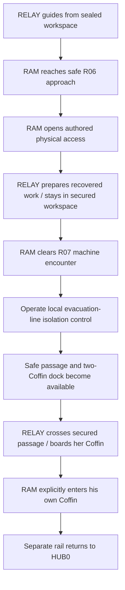

## Purpose

Deploy RAM alone into Helix Foundry, reach RELAY's sealed workspace, secure their extraction, and encounter manufactured bodies that resemble the crew without proving their origin.

## Act I role

| Constraint | Direction |
|---|---|
| Availability | RAM only, fixed from HUB0 deployment through extraction; default [[Characters/Ram#c31|Impact]] is the introductory configuration. No playable RELAY switch. |
| New Biome | First deployment into [[Biomes/B02|B02 — Helix Foundry]], an operating automated biotechnology plant rather than another Ashfall occupation. |
| Gameplay role | Introduce RAM's deliberate movement, frontal defence, committed advances and destructive environmental interaction through his [[Characters/Ram|Character-owned kit]]. |
| Rescue | RELAY is an existing crew member who deliberately sealed her workspace against the machines while researching; she remains an active technical contributor. |
| Narrative role | Manufacturing evidence makes a constructed-body origin plausible, not conclusive; it does not explain Coffin recovery. |
| Hub result | RAM and RELAY return separately; RELAY fills the fourth HUB0 station and becomes selectable as Wire. Her starter-content ownership remains with [[Characters/Relay#machine-arsenal-ownership|RELAY]] and [[Machine Profiles/Overview#starting-profiles|Starting profiles]]. |
| Reveal boundary | No Overdrive activation/reveal, Imprint acquisition, Blueprint UI or Research Terminal activation; [[Missions/M05|M05]] owns those introductions. |

> **Accepted — Mission vision:** A RAM-only rescue through an active production facility. RELAY supplies intermittent technical guidance from her sealed refuge; RAM supplies physical access. The finale secures an extraction route without turning RELAY into a fragile escort. Enemy behaviour, counts, exact rescue blocking and hazard mechanics remain proposals.

## Mission structure

> **TODO — Route and encounter review:** Validate RAM's low jump, acceleration, turning, attack reach, shield handling and commitment against every room. Confirm the introductory Breach interactions and final shutdown sequence in a playable blockout.

[[Wiki Rules?section=mission-room-graphs|Mission room graphs]] owns diagram notation. The graph is a first blockout target, not geometry or approved balance. Hostile archetypes have Enemy pages; their persistent research mappings remain on separate Machine Profile pages.

```mermaid
flowchart TB
    subgraph Legend[Legend — primary room purpose]
        L["🟦 Arrival / teaching<br/>🟥 Machine encounter<br/>🟨 Evidence / rescue / controls<br/>🟩 Extraction<br/>💬 Radio / crew communication"]
    end
    subgraph Route[Helix rescue critical-path proposal]
        direction LR
        R01["R01 · Receiving dock · 0:45<br/>RAM Coffin arrival · establish working plant"] --> R02["R02 · Assembly intake · 2:00<br/>First machine threat · controlled Breach lesson"]
        R02 --> R03["R03 · Transport lane · 2:00<br/>Committed movement against transport pressure"]
        R03 --> R04["R04 · Inspection gate · 2:00<br/>Security pulse timing · combined encounter"]
        R04 --> R05["R05 · Body-production gallery · 1:15<br/>Manufactured-body resemblance · no origin proof"]
        R05 --> R06["R06 · Sealed workspace · 1:00<br/>Reach RELAY · prepare safe evacuation"]
        R06 --> R07["R07 · Evacuation-line controls · 2:15<br/>Final machine encounter · stop local line"]
        R07 --> R08["R08 · Return dock · 0:45<br/>RAM and RELAY enter separate Coffins"]

        R01 -.- COM01(["💬 COM01 · OPERATOR / RAM<br/>Recover RELAY · establish contact"])
        R02 -.- COM02(["💬 COM02 · RELAY / RAM<br/>Intermittent contact · identify safe access"])
        R05 -.- COM03(["💬 COM03 · RAM / RELAY<br/>Notice production resemblance · no conclusion"])
        R06 -.- COM04(["💬 COM04 · RELAY / RAM<br/>In-person recovery · explain extraction controls"])
        R07 -.- COM05(["💬 COM05 · RELAY / RAM / OPERATOR<br/>Route secured · arrange separate returns"])

        R02 -.- C02["(2)<a href='#/enemies/e008'>E008</a>"]
        R03 -.- C03["(1)<a href='#/enemies/e008'>E008</a> · (2)<a href='#/enemies/e009'>E009</a>"]
        R04 -.- C04["(2)<a href='#/enemies/e008'>E008</a> · (1)<a href='#/enemies/e010'>E010</a>"]
        R07 -.- C07["(1)<a href='#/enemies/e008'>E008</a> · (1)<a href='#/enemies/e009'>E009</a> · (1)<a href='#/enemies/e010'>E010</a>"]
    end
    classDef arrival fill:#dbeafe,stroke:#2563eb,color:#1e3a8a,stroke-width:2px;
    classDef combat fill:#fee2e2,stroke:#dc2626,color:#7f1d1d,stroke-width:2px;
    classDef objective fill:#fef3c7,stroke:#d97706,color:#78350f,stroke-width:2px;
    classDef exit fill:#dcfce7,stroke:#16a34a,color:#14532d,stroke-width:2px;
    classDef communication fill:#f8fafc,stroke:#64748b,color:#334155,stroke-width:1px,stroke-dasharray:4 3;
    classDef roomContent fill:#f8fafc,stroke:#64748b,color:#334155,stroke-width:1px,stroke-dasharray:7 5;
    classDef legend fill:none,stroke:none,color:#ddd,text-align:left;
    class R01 arrival;
    class R02,R03,R04,R07 combat;
    class R05,R06 objective;
    class R08 exit;
    class COM01,COM02,COM03,COM04,COM05 communication;
    class C02,C03,C04,C07 roomContent;
    class L legend;
    linkStyle 7,8,9,10,11 stroke:#64748b,stroke-width:12px,stroke-dasharray:1 22,stroke-linecap:round;
    linkStyle 12,13,14,15 stroke:#64748b,stroke-width:2px,stroke-dasharray:7 5;
    style Route fill:none,stroke:none;
```

### Encounter staging

> **TODO — RAM combat blockout:** Validate active-threat limits, attack reach, forward/rear exposure, protected-target resistance and room-local pursuit. Telegraph machines separately before combining them; do not substitute inflated health for new decisions.

| Room | Proposed local staging |
|---|---|
| R01 | Safe step-out beside installed rails; active production is visible/audible beyond the dock, but hostile attacks cannot enter it. |
| R02 | Introduce [[Enemies/E008|Fabricator]] at ordinary RAM attack height. Demonstrate a clearly readable breakable obstruction after the first safe observation space. |
| R03 | Introduce [[Enemies/E009|Line Runner]] on an unobstructed lane before mixing close pressure. Allow room to reposition; do not make shield-blocking every collision mandatory. |
| R04 | Introduce [[Enemies/E010|Process Warden]] visibly before combining security pulses with close threats. Keep opposing pressure staggered and an escape/recovery space open. |
| R05 | Safe evidence passage through visible assembly cradles/windows; no mandatory scan, collectible, hacking board or enemy surprise during the resemblance beat. |
| R06 | Safe approach to RELAY's workspace after the upstream clear. RAM opens physical access while she prepares the research and extraction controls. |
| R07 | Compact authored machine combination, then one ordinary physical stop/isolation control. No Boss, endless wave, timed defence or fragile-NPC escort in this draft. |
| R08 | Safe two-Coffin dock after the evacuation line is secured; no final surprise attack. |

Proposed encounter-room forward access opens after the local clear. Gates belong to visible industrial safety/access mechanisms, not unexplained force fields. Cleared rooms remain clear; machines cannot pursue into R01, R05, R06 or R08. No respawn farm or factory-wide extermination objective is authored.

### Breach and environmental interaction

> **TODO — Tutorial access and hazard validation:** Block out safe charge run-up, stopping/recovery room, breakable geometry, machinery tells and shutdown affordances. Confirm that later RAM Specializations can express the same authored interactions without an Impact-only route gate.

This controlled RAM introduction may teach his own applicable move under [[Gameplay/Progression#mission-compatibility|the tutorial rules]]. [[Characters/Ram#shared-route-capability|Breach]] owns what breaks; M04 owns the authored obstruction placement. R02 teaches it safely before R06 applies destructive physical access to the rescue. Do not redefine ordinary walls as universally breakable or make later open-campaign critical routes RAM-only.

Use ordinary run/jump for traversal; no required high jump, wall move, airborne reversal or concealed Overdrive. Shield protection is directional and governed by its Equipment owner, not blanket hazard immunity. [[Characters/Ram#shared-movement|RAM's exposure boundary]] distinguishes ambient industrial heat/smoke from damaging active jets, crushing machinery, pools and explosions.

Moving production equipment supplies visual rhythm and proposed local traversal pressure. Damaging crush/jet cycles are not yet authored: add them only with visible tells, safe waiting positions and recovery margins that suit RAM's slow reversal. No unavoidable damage, instant-kill timing puzzle or hidden hazard behind the breach is approved.

## RELAY recovery and extraction

> **TODO — Rescue and logistics handoff:** Validate the sealed-door mechanism, safe meeting positions, how RELAY reaches her dock after the line is secured, and how her Coffin arrives. Neither protection by a closed door nor offscreen transit should imply teleportation or a new universal transport system.

> **Accepted — Active crew recovery:** RELAY isolated her workspace to keep hostile machinery away from her work. She guides RAM intermittently rather than waiting silently to be collected. RAM remains the only playable Character through the operation.

RELAY does not become a combat follower, gain a separate damageable escort bar, or require babysitting during R07. She contributes remote technical direction from the secured workspace; her movement into the safe dock is scripted only after the hostile corridor is clear. Exact travel blocking remains a handoff task, not a licence to walk through active hazards.

The R07 control stops/isolates the **local evacuation production lane**, not Helix's entire plant or research system. Keep the recovered system needed by M05 intact. Successful evacuation neither launches M05 automatically nor turns the entire Foundry into a permanently powered-down location.

## Evidence and communication

> **TODO — Narrative, presentation and localization:** Review production resemblance, RELAY's concise technical interpretation and the radio exchanges. No exact dialogue is approved; add matching gettext entries across languages after wording review. Decide separately whether R06 or the post-return introduction needs a paused cutscene and stable scene page.

| Beat | Local purpose / boundary |
|---|---|
| COM01 · arrival | Establish the rescue objective and RAM's contact attempt; OPERATOR is not an omniscient factory narrator. |
| COM02 · intake | RELAY identifies machinery/access from her workspace. Signal gaps do not invent an extra communications-restoration objective. |
| R05 / COM03 | Unfinished synthetic bodies resemble crew proportions/features. RAM notices; RELAY can offer an uncertain interpretation, not certify an origin. |
| COM04 · workspace | Recovery is a familiar crew interaction, not first recruitment. Explain the practical evacuation problem without presenting the Overdrive lead as a named player system. |
| COM05 · line isolated | Confirm safe passage and separate returns; no early Blueprint rewards or research-screen reveal. |

The evidence is encountered on the mandatory route; no optional collectible is required for the Mission's narrative beat. Exact body designs remain under review: no definitive crew serials, named replacement bodies, fabrication of a Coffin occupant, or demonstration of how death recovery works. The plant's records are evidence, not proof that it made these particular people.

No paused cutscene is authored in this structural pass. The graph's communication beats are live exchanges, not placeholder scene IDs or links to missing catalogue entries. If a cutscene is approved later, give it its own page and separate its time from active traversal.

## Deployment, completion, and retry

> **TODO — State and delivery review:** Validate room gates, line shutdown, separate Capsule delivery, safe boarding and progression registration. Apply shared retry rules without introducing a midpoint checkpoint.

| Trigger | Proposed result |
|---|---|
| Deployment | RAM boards his HUB0 Coffin and arrives safely in R01. Other Characters are unavailable for this Mission; RAM remains selected on retry. |
| Local machine-room clear | Open the room's forward access; preserve backtracking through cleared critical-path rooms. |
| R06 access opened | RELAY is reached but not yet registered as an available Character. No immediate Mission completion or control switch. |
| R07 clear + local line isolated | Open the safe passage to R08 and arrange two Coffins. RELAY transfers/boards only through the secured route. |
| R08 before prerequisites | No extraction interaction; dock proximity alone never completes the rescue. |
| Explicit RAM Coffin entry after RELAY boards | Commit separate returns; do not put both Characters in one Capsule. |
| Successful HUB0 return | Register RELAY and the fourth station; use her existing starter-content owners. Continue ordinary preparation toward M05, without activating its concealed systems early. |
| Defeat before completed return | [[Gameplay/Progression#death-and-mission-retry|Shared HUB0 recovery/retry]]; reset local clears, broken barriers, rescue access and line state. Incomplete rescue never registers RELAY or grants her starter content. |

No enemy-drop Blueprint acquisition or player research interaction is authored here. RELAY already gathered [[Machine Profiles/MP001|Fabricator]], [[Machine Profiles/MP002|Line Runner]] and [[Machine Profiles/MP003|Process Warden]] records during her work; rescuing her preserves that authored starting content rather than requiring RAM to farm these machines. [[Missions/M05|M05]] owns Research Terminal activation and [[Machine Profiles/Overview#starting-profiles|Starting profiles]] owns the import relationship.

## Route scope

> **TODO — Optional-access decision:** This first blockout has one critical route through R01–R08 and no authored side rooms, detour pickups or alternate extraction. Decide optional Breach access separately if it adds more than a second version of the compulsory tutorial lesson.

The rescue does not depend on collecting hidden data, bringing another Character, unlocking another Specialization or finding an unmarked enemy. Backtracking remains available until explicit Capsule entry. RAM's destructive interactions teach this restricted introductory deployment; they do not establish a campaign-wide Character gate on critical paths.

## Critical-path timing

> **TODO — Playtest timing:** Measure first-time RAM runs room-entry to room-exit, excluding retries and paused presentation. Validate the teaching fights and rescue pacing before adopting these provisional targets. Measure full-run medians separately rather than adding room medians.

| Room | Active target | Observed median | Runs |
|---|---:|---:|---:|
| R01 | 0:45 | — | — |
| R02 | 2:00 | — | — |
| R03 | 2:00 | — | — |
| R04 | 2:00 | — | — |
| R05 | 1:15 | — | — |
| R06 | 1:00 | — | — |
| R07 | 2:15 | — | — |
| R08 | 0:45 | — | — |
| **Critical-path total** | **12:00** | — | — |

Communication overlaps traversal/interaction and adds no separate time target. No paused-scene duration is assigned yet. Reading, loading, Capsule transitions and any later cutscene playback remain separately measured overhead; 12:00 is a planning target, not wall-clock evidence.

## Mission layout

> **TODO — Level-design handoff:** Review the dedicated minimap and expanded layout against RAM's movement, machine reach, industrial gates, barrier run-up, safe RELAY staging and installed rails. Replace the schematic footprints with a scaled blockout; neither diagram approves geometry.

Expand M04 spatial review schematic

## Mission visual reference

> **TODO — Visual review:** Compare the structural composition with the [[Design/Art Direction#aspirational-gameplay-references|M04 aspirational mock]], current RAM/RELAY turnarounds and source-machine references. Production rhythm, biotechnology cradles and active institutional machinery should distinguish Helix from M03's gang camp. No final sprites, palette, costume, machinery hazard, HUD or rendering pipeline is approved by this pass.

## Next review choices

> **TODO — Stage 2 decisions:** Review machine cycles/counts, RAM-reactive barrier placement, active hazard inclusion, RELAY's safe transit and final-control affordance before timing and dialogue lock.

| Concern | Working draft | Still open |
|---|---|---|
| Threat roster | Fabricator / Line Runner / Process Warden | Hostile behaviour, protected states, reach, tuning and mixes |
| Finale | Machine encounter plus local production-lane isolation | Exact physical control, machinery feedback and safe passage |
| Rescue | Active RELAY; RAM opens access, no combat escort | Door mechanism, travel blocking and any dedicated cutscene |
| Manufacturing evidence | Mandatory visible resemblance, not origin proof | Body composition, framing and uncertain interpretation |
| Presentation | Live communication beats only | Exact text, paused-scene decision and generated concepts |
