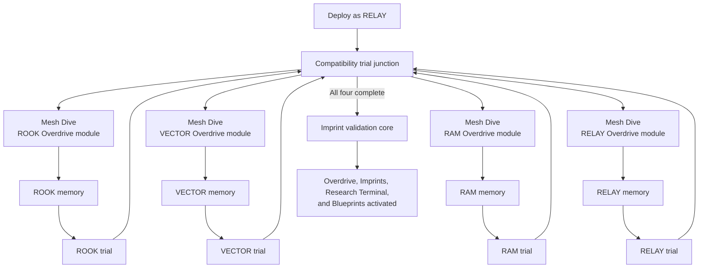

## Purpose

Complete four compatibility trials with the assembled crew, introduce RELAY's Mesh Dive board through Overdrive-module access, reveal Overdrive and Imprints, activate the Research Terminal and Blueprint system, and open the transition to Act II.

## Mission structure

RELAY enters the recovered Helix system and may approach the four crew-specific trials in any order. Control transfers are scripted within each trial.

RELAY opens each sealed Overdrive module through its branch interface. Successful access presents the recipient's brief [[Imprints/Overdrive#memory-revelations|Overdrive memory]] before transferring control to that crew member for the trial. The player immediately uses the capability witnessed in the memory; RELAY's own branch retains control of her. The final validation core remains the collective unlock.

Each access board uses a fixed authored move budget, requires no combat Access buildup, guarantees a valid starting solution, and permits unlimited short-reset retries. The four order-flexible boards teach self-contained variations rather than a fixed sequence. They contain no Data Fragment nodes and ignore Null Hack Modules and Program Execution.

The validation core recognizes compatibility between the four crew profiles and stored Imprints. This destabilizes the crew's understanding of themselves without establishing whether they are original, copied, reconstructed, manufactured, or composite people.
